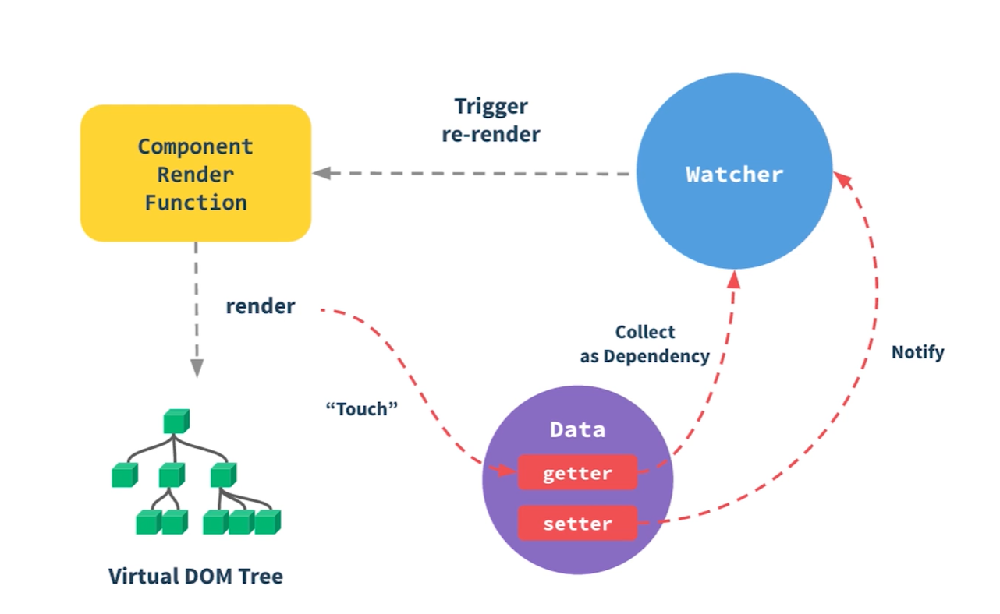

## Vue3 和 Vue2 的区别有哪些？

Vue 3 提供了更现代化、更高性能的架构，通过 `Composition API` 和 `Proxy` 响应式系统等改进提升了开发体验，相比于 Vue 2，它的优势如下:

**性能优化**

- **虚拟 DOM 重构**：Vue3的虚拟DOM采用了更高效的 `Diff算法`，减少了渲染和更新的开销。

- **Tree-shaking 支持**：Vue3的代码结构模块化，支持按需引入，减小了打包体积。

**Composition API**

- Vue3引入了Composition API，使代码更模块化、复用性更强。

- 使用 `setup()` 方法代替了部分选项式 API，通过函数的方式组织逻辑，代码更加清晰简洁。

**响应式系统改进**

- Vue3使用 `Proxy` 实现响应式，解决了 Vue2使用Object.defineProperty实现响应式的一些局限性，如无法监听新增属性和数组索引变化。

**新特性和改进**

- **Teleport**：可以将组件的DOM渲染到指定的DOM节点之外，例如模态框、通知等。

- **Fragment 支持**：Vue3支持组件返回多个根节点，不再需要单一根节点。

- Vue3原生支持 `TypeScript`，提供更完善的类型推导和开发体验。

- Vue3支持为一个组件绑定多个 `v-model`，并且可以自定义 `prop` 和 `event` 名称。

## Vue2 和 Vu3 diff算法的区别？
- Vue2
```js
// 当数据发生改变时，set方法会让调用Dep.notify通知所有订阅者Watcher，订阅者就会调用patch给真实的DOM打补丁.
function patch (oldVnode, vnode) {
    // some code
    if (sameVnode(oldVnode, vnode)) {
        // 值得比较
    	patchVnode(oldVnode, vnode)
    } else {
        // 直接删除旧的元素，插入新元素
    	const oEl = oldVnode.el // 当前oldVnode对应的真实元素节点
    	let parentEle = api.parentNode(oEl)  // 父元素
    	createEle(vnode)  // 根据Vnode生成新元素
    	if (parentEle !== null) {
            api.insertBefore(parentEle, vnode.el, api.nextSibling(oEl)) // 将新元素添加进父元素
            api.removeChild(parentEle, oldVnode.el)  // 移除以前的旧元素节点
            oldVnode = null
    	}
    }
    // some code 
    return vnode
}

// 判断两节点是否值得比较，值得比较则执行 patchVnode
function sameVnode (a, b) {
  return (
    a.key === b.key &&  // key值
    a.tag === b.tag &&  // 标签名
    a.isComment === b.isComment &&  // 是否为注释节点
    // 是否都定义了data，data包含一些具体信息，例如onclick , style
    isDef(a.data) === isDef(b.data) &&  
    sameInputType(a, b) // 当标签是<input>的时候，type必须相同
  )
}

// 比较当前元素
patchVnode (oldVnode, vnode) {
    const el = vnode.el = oldVnode.el
    let i, oldCh = oldVnode.children, ch = vnode.children
    if (oldVnode === vnode) return
    if (oldVnode.text !== null && vnode.text !== null && oldVnode.text !== vnode.text) {
        // 如果只是文本节点不同
        api.setTextContent(el, vnode.text)
    }else {
        updateEle(el, vnode, oldVnode)
    	if (oldCh && ch && oldCh !== ch) {
            // 子元素不同
            updateChildren(el, oldCh, ch)
    	}else if (ch){
            // 新元素存在子元素，但是旧元素没有，直接创建新元素
            createEle(vnode);
    	}else if (oldCh){
             // 旧元素存在子元素，但是新元素没有，直接移除旧元素的子元素
            api.removeChildren(el)
    	}
    }
}

// 子元素采用双端对比策略
updateChildren (parentElm, oldCh, newCh) {
    let oldStartIdx = 0, newStartIdx = 0
    let oldEndIdx = oldCh.length - 1
    let oldStartVnode = oldCh[0]
    let oldEndVnode = oldCh[oldEndIdx]
    let newEndIdx = newCh.length - 1
    let newStartVnode = newCh[0]
    let newEndVnode = newCh[newEndIdx]
    let oldKeyToIdx
    let idxInOld
    let elmToMove
    let before
    while (oldStartIdx <= oldEndIdx && newStartIdx <= newEndIdx) {
        if (oldStartVnode == null) {   // 对于vnode.key的比较，会把oldVnode = null
            oldStartVnode = oldCh[++oldStartIdx] 
        }else if (oldEndVnode == null) {
            oldEndVnode = oldCh[--oldEndIdx]
        }else if (newStartVnode == null) {
            newStartVnode = newCh[++newStartIdx]
        }else if (newEndVnode == null) {
            newEndVnode = newCh[--newEndIdx]
        }else if (sameVnode(oldStartVnode, newStartVnode)) {
            patchVnode(oldStartVnode, newStartVnode)
            oldStartVnode = oldCh[++oldStartIdx]
            newStartVnode = newCh[++newStartIdx]
        }else if (sameVnode(oldEndVnode, newEndVnode)) {
            patchVnode(oldEndVnode, newEndVnode)
            oldEndVnode = oldCh[--oldEndIdx]
            newEndVnode = newCh[--newEndIdx]
        }else if (sameVnode(oldStartVnode, newEndVnode)) {
            patchVnode(oldStartVnode, newEndVnode)
            api.insertBefore(parentElm, oldStartVnode.el, api.nextSibling(oldEndVnode.el))
            oldStartVnode = oldCh[++oldStartIdx]
            newEndVnode = newCh[--newEndIdx]
        }else if (sameVnode(oldEndVnode, newStartVnode)) {
            patchVnode(oldEndVnode, newStartVnode)
            api.insertBefore(parentElm, oldEndVnode.el, oldStartVnode.el)
            oldEndVnode = oldCh[--oldEndIdx]
            newStartVnode = newCh[++newStartIdx]
        }else {
           // 使用key时的比较
            if (oldKeyToIdx === undefined) {
                oldKeyToIdx = createKeyToOldIdx(oldCh, oldStartIdx, oldEndIdx) // 有key生成index表
            }
            idxInOld = oldKeyToIdx[newStartVnode.key]
            if (!idxInOld) {
                api.insertBefore(parentElm, createEle(newStartVnode).el, oldStartVnode.el)
                newStartVnode = newCh[++newStartIdx]
            }
            else {
                elmToMove = oldCh[idxInOld]
                if (elmToMove.sel !== newStartVnode.sel) {
                    api.insertBefore(parentElm, createEle(newStartVnode).el, oldStartVnode.el)
                }else {
                    patchVnode(elmToMove, newStartVnode)
                    oldCh[idxInOld] = null
                    api.insertBefore(parentElm, elmToMove.el, oldStartVnode.el)
                }
                newStartVnode = newCh[++newStartIdx]
            }
        }
    }
    if (oldStartIdx > oldEndIdx) {
        before = newCh[newEndIdx + 1] == null ? null : newCh[newEndIdx + 1].el
        addVnodes(parentElm, before, newCh, newStartIdx, newEndIdx)
    }else if (newStartIdx > newEndIdx) {
        removeVnodes(parentElm, oldCh, oldStartIdx, oldEndIdx)
    }
}
```
- Vue3
```js
// 子元素对比策略上不同：Vue 2 采用双端对比，Vue 3 采用 最长递增子序列（LIS） 优化，提高了列表更新的效率。

// 第一步：从头对比
const patchKeyedChildren = (c1, c2, container, parentAnchor, parentComponent, parentSuspense, isSVG, optimized) => {
  let i = 0
  const l2 = c2.length
  // 旧节点的尾部标记位
  let e1 = c1.length - 1
  // 新节点的尾部标记位
  let e2 = l2 - 1
  // 从头部开始比对
  // (a b) c
  // (a b) d e
  while (i <= e1 && i <= e2) {
    const n1 = c1[i]
    const n2 = (c2[i] = optimized
      ? cloneIfMounted(c2[i] as VNode)
      : normalizeVNode(c2[i]))
    // 如果是 sameVnode 则递归执行 patch  
    if (isSameVNodeType(n1, n2)) {
      patch(n1, n2, container, parentAnchor, parentComponent, parentSuspense, isSVG, optimized)
    } else {
      break
    }
    i++
  }
}
// 第二步：从尾对比
const patchKeyedChildren = (c1, c2, container, parentAnchor, parentComponent, parentSuspense, isSVG, optimized) => {
  let i = 0
  const l2 = c2.length
  // 旧节点的尾部标记位
  let e1 = c1.length - 1
  // 新节点的尾部标记位
  let e2 = l2 - 1
  // 从头部开始比对
  // ...
  // 从尾部开始比对
  // a (b c)
  // d e (b c)
  while (i <= e1 && i <= e2) {
    const n1 = c1[e1]
    const n2 = (c2[e2] = optimized
        ? cloneIfMounted(c2[e2] as VNode)
        : normalizeVNode(c2[e2]))
    // 如果是 sameVnode 则递归执行 patch  
    if (isSameVNodeType(n1, n2)) {
      patch(n1, n2, container, parentAnchor, parentComponent, parentSuspense, isSVG, optimized)
    } else {
      break
    }
    e1--
    e2--
  }
}
// 第三步：新增节点
const patchKeyedChildren = (c1, c2, container, parentAnchor, parentComponent, parentSuspense, isSVG, optimized) => {
  let i = 0
  const l2 = c2.length
  // 旧节点的尾部标记位
  let e1 = c1.length - 1
  // 新节点的尾部标记位
  let e2 = l2 - 1
  // 从头部开始必须
  // ...
  // 从尾部开始比对
  // ...
  // 如果有多余的新节点，则执行新增逻辑
  if (i > e1) {
    if (i <= e2) {
      const nextPos = e2 + 1
      const anchor = nextPos < l2 ? c2[nextPos].el : parentAnchor
      while (i <= e2) {
        // 新增新节点
        patch(null, c2[i], container, anchor, parentComponent, parentSuspense, isSVG)
        i++
      }
    }
  }
}
// 第四步：删除节点
const patchKeyedChildren = (c1, c2, container, parentAnchor, parentComponent, parentSuspense, isSVG, optimized) => {
  let i = 0
  const l2 = c2.length
  // 旧节点的尾部标记位
  let e1 = c1.length - 1
  // 新节点的尾部标记位
  let e2 = l2 - 1
  // 从头部开始比对
  // ...
  // 从尾部开始比对
  // ...
  // 如果有多余的新节点，则执行新增逻辑
  // ...
  // 如果有多余的旧节点，则执行卸载逻辑
  else if (i > e2) {
    while (i <= e1) {
      // 卸载节点
      unmount(c1[i], parentComponent, parentSuspense, true)
      i++
    }
  }
}


// 第五步：未知子序列 - 构造新节点位置映射 keyToNewIndexMap

// 旧子序列开始位置
const s1 = i
// 新子序列开始位置
const s2 = i

// 5.1 构建 key:index 关系索引 map
const keyToNewIndexMap = new Map()
for (i = s2; i <= e2; i++) {
  const nextChild = (c2[i] = optimized
    ? cloneIfMounted(c2[i] as VNode)
    : normalizeVNode(c2[i]))
  if (nextChild.key != null) {
    keyToNewIndexMap.set(nextChild.key, i)
  }
}

// 第五步：未知子序列 - 继续处理旧节点

// 记录新节点已更新的数目
let patched = 0
// 记录新节点还有多少个没有更新
const toBePatched = e2 - s2 + 1
// 标记是否有必要进行节点的位置移动
let moved = false
// 标记是否有节点进行了位置移动
let maxNewIndexSoFar = 0
// 记录新节点在旧节点中的位置数组
const newIndexToOldIndexMap = new Array(toBePatched)
// newIndexToOldIndexMap 全部置为 0
for (i = 0; i < toBePatched; i++) newIndexToOldIndexMap[i] = 0
// 开始遍历旧子节点
for (i = s1; i <= e1; i++) {
  // prevChild 代表旧节点
  const prevChild = c1[i]
  // 还有多余的旧节点，则删除
  if (patched >= toBePatched) {
    unmount(prevChild, parentComponent, parentSuspense, true)
    continue
  }
  // 记录旧节点在新节点中的位置数组
  let newIndex = keyToNewIndexMap.get(prevChild.key)
  
  // 如果旧节点不存在于新节点中，则删除该节点
  if (newIndex === undefined) {
    unmount(prevChild, parentComponent, parentSuspense, true)
  } else {
    // newIndexToOldIndexMap 中元素为 0 表示着新节点不存在于旧节点中
    newIndexToOldIndexMap[newIndex - s2] = i + 1
    // 默认不移动的话，所有相同节点都是增序排列的
    // 如果有移动，必然出现节点降序的情况
    if (newIndex >= maxNewIndexSoFar) {
      maxNewIndexSoFar = newIndex
    } else {
      moved = true
    }
    // 更新节点
    patch(
      prevChild,
      c2[newIndex] as VNode,
      container,
      null,
      parentComponent,
      parentSuspense,
      isSVG,
      slotScopeIds,
      optimized
    )
    // 记录更新的数量
    patched++
  }
}

// 第五步：未知子序列 - 移动和增加新节点

// 根据 newIndexToOldIndexMap 求取最长公共子序列
const increasingNewIndexSequence = moved
  ? getSequence(newIndexToOldIndexMap)
  : EMPTY_ARR
// 最长公共子序列尾部索引  
j = increasingNewIndexSequence.length - 1
// 从尾部开始遍历
for (i = toBePatched - 1; i >= 0; i--) {
  const nextIndex = s2 + i
  const nextChild = c2[nextIndex]
  const anchor = nextIndex + 1 < l2 ? c2[nextIndex + 1].el : parentAnchor
  // 如果新子序列中的节点在旧子序列中不存在，则新增节点
  if (newIndexToOldIndexMap[i] === 0) {
    patch(null, nextChild, container, anchor, parentComponent, parentSuspense, isSVG)
  } else if (moved) {
    // 如果需要移动且
    // 没有最长递增子序列
    // 当前的节点不在最长递增子序列中
    if (j < 0 || i !== increasingNewIndexSequence[j]) {
      move(nextChild, container, anchor, MoveType.REORDER)
    } else {
      j--
    }
  }
}
```
参考文章：
https://juejin.cn/post/6844903607913938951
https://juejin.cn/book/7146465352120008743/section/7148745093858459685

## Vue 组件的通讯方式有哪些？

组件之间的通讯通常分为父子组件通讯和跨组件通讯。要注意，vue3 组件的通讯方式和 vue2 有一定的区别。

**父子组件通信**

- Props：父组件通过 `props` 向子组件传递数据。
- $emit：子组件通过 `$emit` 向父组件发送事件，并可以传递数据。
- 获取组件实例对象，调用属性或方法：
  💡 Vue 2：通过 `this.$parent` 获取父组件实例，或通过 `this.$children` 获取子组件实例。
  💡 Vue 3：通过 `ref` 引用子组件，直接访问其属性和方法。
- Vue 3 组件支持多个 `v-model` 绑定和自定义属性名，父子之间的双向绑定更加灵活。
```vue
// Parent.vue 传送
<template>
    <child :msg="msg" @myClick="onMyClick"></child>
</template>
<script setup>
import child from "./child.vue"

import { ref } from "vue"

const msg = ref('这是传级子组件的信息');

const onMyClick = (msg) => {
    console.log(msg) // 这是父组件收到的信息
}
</script>

// Child.vue 接收
<template>
    // 写法一
    <button @click="emit('myClick')">按钮</buttom>
    // 写法二
    <button @click="handleClick">按钮</buttom>
</template>

<script setup>
const props = defineProps({
    msg1: String
})
console.log(props)

const emit = defineEmits(["myClick"])
// 对应写法二
const handleClick = ()=>{
    emit("myClick", "这是发送给父组件的信息")
}
</script>
```

**跨组件通信**

- Provide / Inject：父组件通过 `provide` 向后代组件传递数据，后代组件使用 `inject` 接收数据，适用于深层嵌套组件间的通信。
```vue
// Parent.vue
<script setup>
    import { provide } from "vue"
    provide("name", "沐华")
</script>

// Child.vue
<script setup>
    import { inject } from "vue"
    const name = inject("name")
    console.log(name) // 沐华
</script>
```
- vuex：通过全局状态管理库 Vuex 共享状态，实现跨组件通信（vue2）。
- pinia：Pinia 是 Vue 3 推荐的全局状态管理库，替代了 Vuex。
- 事件总线（Vue 2）：Vue 2 中可以通过`Event Bus`实现组件间的通信，但在 Vue 3 中不推荐使用。
```vue
// Bus.js
import Vue from "vue"
export default new Vue()

// 在需要向外部发送自定义事件的组件内
<template>
    <button @click="handlerClick">按钮</button>
</template>
<script>
    import Bus from "./Bus.js"
    export default{
        methods:{
            handlerClick(){
                // 自定义事件名 sendMsg
                Bus.$emit("sendMsg", "这是要向外部发送的数据")
            }
        }
    }
</script>

// 在需要接收外部事件的组件内
<script>
    import Bus from "./Bus.js"
    export default{
        mounted(){
            // 监听事件的触发
            Bus.$on("sendMsg", data => {
                console.log("这是接收到的数据：", data)
            })
        },
        beforeDestroy(){
            // 取消监听
            Bus.$off("sendMsg")
        }
    }
</script>
```
- 全局事件处理器：通过在根组件$root或全局对象上监听事件，进行跨组件通信（Vue 3 推荐使用外部库，如 `mitt`）。
```js
// main.js
import Vue from 'vue'
import App from './App.vue'

new Vue({
  el: '#app',
  render: (h) => h(App),
  data: {
    theme: 'light',
  },
  methods: {
    setTheme(newValue) {
      console.log('setTheme triggered with', newValue)
      this.theme = newValue
    },
  },
})
```
```js
// mitt.js
import mitt from 'mitt'
const mitt = mitt()
export default mitt

// 组件 A
<script setup>
import mitt from './mitt'
const handleClick = () => {
    mitt.emit('handleChange')
}
</script>

// 组件 B 
<script setup>
import mitt from './mitt'
import { onUnmounted } from 'vue'
const someMethed = () => { ... }
mitt.on('handleChange',someMethed)
onUnmounted(()=>{
    mitt.off('handleChange',someMethed)
})
</script>
```

## Vue 组件的生命周期

Vue 组件的生命周期是指组件从创建到销毁的整个过程，包括组件的初始化、渲染、更新和销毁等阶段。在Vue2和Vue3中，组件的生命周期有一些区别。

#### Vue2

- **创建阶段**
  -  **beforeCreate**：组件实例刚被创建，数据观测和事件/监听器设置之前。此时无法访问 `data` 、 `computed` 和 `methods` 等。
  - **created**：组件实例已创建，数据观测、事件/监听器设置完成，此时可以访问 `data` 、 `computed` 和 `methods` 等，通常用于数据初始化。

- **挂载阶段**

  - **beforeMount**：在挂载开始之前，模板已编译， `el` 和 `template` 已经确定，但尚未渲染。
  - **mounted**：组件实例挂载到 DOM 上之后，此时可以访问和操作 DOM。

- **更新阶段**

  - **beforeUpdate**：数据发生变化，DOM 尚未更新。可以在这里做一些数据处理，避免不必要的渲染。
  - **updated**：数据变化，DOM 更新后调用。此时组件的 DOM 已经更新，可以访问和操作新的 DOM。

- **销毁阶段**

  - **beforeDestroy**：组件实例销毁之前。可以在此阶段进行清理工作，例如移除事件监听器、定时器等。
  - **destroyed**：组件实例销毁之后。此时，所有的事件监听器和子组件已被销毁。

#### Vue3

- **创建阶段**

  - **onBeforeMount**：等效于 Vue 2 中的 `beforeMount` ，在组件挂载之前调用。
  - **onMounted**：等效于 Vue 2 中的 `mounted` ，在组件挂载之后调用。

- **更新阶段**

  - **onBeforeUpdate**：等效于 Vue 2 中的 `beforeUpdate` ，在数据更新之前调用。
  - **onUpdated**：等效于 Vue 2 中的 `updated` ，在数据更新并渲染之后调用。

- **销毁阶段**

  - **onBeforeUnmount**：等效于 Vue 2 中的 `beforeDestroy` ，在组件卸载前调用。
  - **onUnmounted**：等效于 Vue 2 中的 `destroyed` ，在组件卸载后调用。

#### setup与生命周期

setup 作为 Vue3 的 Composition API 的一部分, 其内部函数的执行时机早于Mounted钩子。

```vue
<script setup>
  import { ref, onMounted } from 'vue';
  console.log("setup");
  onMounted(() => {
    console.log('onMounted');
  });
  // 执行结果:setup onMounted
</script>
```

## Vue 组件在哪个生命周期发送 ajax 请求？

在 Vue中，接口请求一般放在 `created` 或 `mounted` 生命周期钩子中。

**created 钩子**

- 优点：
  ✅ **更快获取数据**：能尽早获取服务端数据，减少页面加载时间。
  ✅ **SSR 支持**：支持服务器端渲染（SSR），在 SSR 环境中不会受到限制。

- 缺点
  ❌ UI 未渲染时发起请求：如果需要操作 DOM 或渲染数据，可能导致闪屏问题

**mounted 钩子**

- 优点：
  ✅ **DOM 可用**：适合需要操作 DOM 或渲染数据后再发起请求的情况，避免闪屏。

- 缺点
  ❌ **请求延迟**：数据请求会稍微延迟，增加页面加载时间。
  ❌ **SSR 不支持**：`mounted` 只在客户端执行，不适用于 SSR 环境。

## Vue 父子组件生命周期调用顺序

1️⃣ 创建阶段

- 父组件：`beforeCreate` ➡️ `created`
- 子组件：`beforeCreate` ➡️ `created`
- 顺序：
  父组件的 `beforeCreate` 和 `created` 先执行 ，子组件的 `beforeCreate` 和 `created` 后执行。
  > 原因：父组件需要先完成自身的初始化（如 data、computed 等），才能解析模板中的子组件并触发子组件的初始化。

2️⃣ 挂载阶段

- 父组件：`beforeMount`
- 子组件：`beforeMount` ➡️ `mounted`
- 父组件：`mounted`
- 顺序：
  父 `beforeMount` → 子 `beforeCreate`→ 子 `created`→ 子 `beforeMount`→ 子 `mounted` → 父 `mounted`
  > 原因：父组件在挂载前（beforeMount）需要先完成子组件的渲染和挂载，因为子组件是父组件模板的一部分。只有当所有子组件挂载完成后，父组件才会触发自身的 mounted。

3️⃣ 更新阶段

- 父组件：`beforeUpdate`
- 子组件：`beforeUpdate` ➡️ `updated`
- 父组件：`updated`
- 顺序：
  父 `beforeUpdate` → 子 `beforeUpdate` → 子 `updated` → 父 `updated`
  > 原因：父组件的数据变化会触发自身更新流程，但子组件的更新必须在父组件更新前完成（因为子组件可能依赖父组件的数据），最终父组件的视图更新完成。

4️⃣ 销毁阶段

- 父组件：`beforeDestroy`
- 子组件：`beforeDestroy` ➡️ `destroyed`
- 父组件：`destroyed`
- 顺序：
  父 `beforeDestroy` → 子 `beforeDestroy` → 子 `destroyed` → 父 `destroyed`
  > 原因：父组件销毁前需要先销毁所有子组件，确保子组件的资源释放和事件解绑，避免内存泄漏。

注：vue3中，`setup()` 替代了 `beforeCreate` 和 `created`，但父子组件的生命周期顺序不变。

## v-show 和 v-if 的区别

- **渲染方式：**
  - v-if：条件为 true 时才会渲染元素，条件为 false 时销毁元素。
  - v-show：始终渲染元素，只是通过 CSS 控制 `display 属性`来显示或隐藏。
- **适用场景：**
  - v-if：适用于条件变化不频繁的场景。
  - v-show：适用于条件变化频繁的场景。

## 为何v-if和v-for不能一起使用？

`v-if` 和 `v-for` 不能直接一起使用的原因，主要是因为它们在 **解析优先级** 和 **逻辑处理** 上存在冲突。

由于`v-for` 的解析优先级高于 `v-if`，同时使用 v-if 和 v-for，Vue 首先会循环创建所有dom元素，然后根据条件来判断是否渲染每个元素，这种方式可能导致 Vue 进行大量的 DOM 操作，性能较差。其次，`v-for` 会为每个循环项创建一个新的作用域，而 `v-if` 的条件如果依赖于这个作用域内的数据，可能导致判断逻辑异常。

为避免上述问题，vue官方推荐我们将 `v-if` 放到 `v-for` 外层，或者将 `v-if` 放置到 `v-for` 内部的单个节点上。

```js
<div v-if="show">
  <div v-for="item in list" :key="item.id">{{ item.name }}</div>
</div>
```

## computed 和 watch 有什么区别

**computed**用于计算基于响应式数据的值，并缓存结果:

```vue
<template>
  <div>
    <p>原始值：{{ count }}</p>
    <p>计算后的数值：{{ doubledCount }}</p>
  </div>
</template>

<script setup>
import { ref, computed } from 'vue'

const count = ref(2)

// 计算属性
const doubledCount = computed(() => count.value * 2)
</>
```

**watch**用于监听数据变化并执行副作用操作

```vue
<template>
  <div>
    <p>原始数值：{{ count }}</p>
    <button @click="count++">增加数值</button>
  </div>
</template>

<script setup>
import { ref, watch } from 'vue'

const count = ref(0)

// 监听器
watch(count, (newVal, oldVal) => {
  console.log(`数值从 ${oldVal} 变为 ${newVal}`)
})
</script>
```

| 特性         | `computed`                                                   | `watch`                                                  |
| ------------ | ------------------------------------------------------------ | -------------------------------------------------------- |
| **用途**     | 用于计算基于响应式数据的值，并缓存结果                       | 用于监听数据变化并执行副作用操作                         |
| **返回值**   | 返回计算结果                                                 | 不返回值，执行副作用                                     |
| **缓存机制** | 只有在访问时才会计算，会缓存计算结果，仅当依赖变化时重新计算 | 数据变化时立即执行回调，不缓存，每次数据变化都会触发回调 |
| **适用场景** | 计算派生数据，避免不必要的重复计算                           | 执行异步操作、处理副作用操作，如 API 请求                |
| **性能**     | 性能较好，避免重复计算                                       | 每次数据变化时都会执行回调函数                           |

## watch 和 watchEffect 的区别

`watch` 和 `watchEffect` 都是 Vue 3 中用于响应式数据变化时执行副作用的 API，它们的使用场景和工作机制存在区别：

- **依赖追踪方式**

`watch` ：需要显式声明依赖，监听指定的数据源；可以监听多个数据源或进行深度监听。

```js
import { watch, reactive } from 'vue'
const state = reactive({
  count: 0,
})
watch(
  () => state.count, // 显式声明监听的依赖
  (newCount, oldCount) => {
    console.log(`新值 ${newCount} 老值 ${oldCount}`)
  }
)
```

`watchEffect` ：会自动追踪 **作用域内所有的响应式依赖**，不需要显式声明依赖。

```js
import { watchEffect, reactive } from 'vue'
const state = reactive({
  count: 0,
})
watchEffect(() => {
  console.log(`Count 变化了: ${state.count}`) // 自动追踪 `state.count`
})
```

- **执行时机**

`watch` ：在监听的响应式数据变化后立即执行。

`watchEffect` ：在 **组件挂载时** 执行一次副作用，并在 **依赖发生变化时** 再次执行。

- **适用场景**

`watch` ：适用于 **监听特定数据** 变化并执行副作用的场景，如 API 请求、保存操作等。适合需要 **访问新值和旧值** 进行比较的场景。

`watchEffect` ：不需要访问旧值，适用于 **自动追踪多个响应式依赖** 的副作用，如渲染、自动保存等。

> Vue官方API： [watchEffect](https://cn.vuejs.org/api/reactivity-core.html#watcheffect)

## Vue3 ref 和 reactive 如何选择？

`ref` 和 `reactive` 都是 Vue 3 中用来创建响应式数据的 API，他们的区别及使用场景如下。

- **reactive的实现：**
  `reactive` 通过 `Proxy` 对对象或数组的每个属性进行深度代理，实现响应式。这种设计使得 `reactive` 能自动追踪所有嵌套属性的变化，但由于 `Proxy` 无法直接处理基本数据类型（如 `number` 、 `string` 、 `boolean` ），因此， `reactive` 不适用于基本数据类型。

- **ref的实现：**
  为了实现基本数据类型的响应式，Vue 设计了 `ref` 。 `ref` 会将基本数据类型封装为一个包含 `value` 属性的对象，通过 `getter` 和 `setter` 实现响应式依赖追踪和更新。当访问或修改 `ref.value` 时，Vue 内部会触发依赖更新。此外，对于复杂数据类型（如对象或数组）， `ref` 的内部实现会直接调用 `reactive` ，将复杂数据类型变为响应式。

**Vue官方建议**使用 `ref()` 作为声明响应式状态的主要，因为 `reactive` 存在以下局限性：

- 有限的值类型：它只能用于对象类型 (对象、数组和如 Map、Set 这样的集合类型)。它不能持有如 string、number 或 boolean 这样的原始类型。
- 不能替换整个对象：由于 Vue 的响应式跟踪是通过属性访问实现的，因此我们必须始终保持对响应式对象的相同引用。这意味着我们不能轻易地“替换”响应式对象，因为这样的话与第一个引用的响应性连接将丢失：

```js
let state = reactive({
  count: 0,
})

// 上面的 ({ count: 0 }) 引用将不再被追踪
// (响应性连接已丢失！)
state = reactive({
  count: 1,
})
```

- 对解构操作不友好：当我们将响应式对象的原始类型属性解构为本地变量时，或者将该属性传递给函数时，我们将丢失响应性连接

```js
const state = reactive({
  count: 0,
})
// 当解构时，count 已经与 state.count 断开连接
let { count } = state
// 不会影响原始的 state
count++

// 该函数接收到的是一个普通的数字
// 并且无法追踪 state.count 的变化
// 我们必须传入整个对象以保持响应性
callSomeFunction(state.count)
```

## 什么是动态组件？如何使用它？

动态组件是 Vue 提供的一种机制，允许我们根据条件动态切换渲染的组件，而不需要手动修改模板。
在Vue中，我们可以通过 ` <component>` 标签的 `:is` 属性指定需要渲染的组件：

```vue
<template>
  <div>
    <!-- 动态渲染组件 -->
    <component :is="currentComponent"></component>

    <!-- 控制组件切换 -->
    <button @click="currentComponent = 'ComponentA'">显示组件A</button>
    <button @click="currentComponent = 'ComponentB'">显示组件B</button>
  </div>
</template>

<script setup>
import { ref } from 'vue'
import ComponentA from './ComponentA.vue'
import ComponentB from './ComponentB.vue'

// 当前显示的组件
const currentComponent = ref('ComponentA')
</script>
```

`<component>` 标签的 `:is` 属性值可以是：

- 被注册的组件名
- 导入的组件对象
- 一般的 HTML 元素

当使用 `<component :is="...">` 来在多个组件间作切换时，被切换掉的组件会被卸载。如果需要保留动态组件状态，使用 `<KeepAlive>` 组件即可。

## 什么是 slot ，有什么应用场景？

slot 是 Vue 中的一种用于 组件内容分发 的机制。它允许父组件向子组件插入内容，从而使组件更加灵活和可复用。

在Vue中，插槽的使用方式可以分为四种：**默认插槽**、**具名插槽**、**条件插槽**和**作用域插槽**。

- **默认插槽**

默认插槽是最简单的插槽形式，它允许我们将组件的内容传递到组件内部的一个占位符中。

子组件 `MyComponent.vue`

```vue
<template>
  <div>
    <p>我是子组件的标题</p>
    <slot></slot>
  </div>
</template>
```

父组件

```vue
<template>
  <MyComponent>
    <p>这是插槽内容，由父组件传入</p>
  </MyComponent>
</template>
```

输出结果：

```html
<div>
  <p>我是子组件的标题</p>
  <p>这是插槽内容，由父组件传入</p>
</div>
```

- **具名插槽**

当子组件需要多个插槽时，可以为插槽命名，并由父组件指定内容放置到哪个插槽。

子组件 `MyComponent.vue`

```vue
<template>
  <slot name="header">默认标题</slot>
  <slot>默认内容</slot>
  <slot name="footer">默认页脚</slot>
</template>
```

父组件

```vue
<template>
  <MyComponent>
    <template v-slot:header>
      <h1>我来组成头部</h1>
    </template>
    <!-- 隐式的默认插槽 -->
    <p>我来组成身体</p>
    <template v-slot:footer>
      <p>我来组成尾部</p>
    </template>
  </MyComponent>
</template>
```

输出结果：

```html
<div>
  <h1>我来组成头部</h1>
  <p>我来组成身体</p>
  <p>我来组成尾部</p>
</div>
```

> `v-slot` 有对应的简写 `#` ，因此 `<template v-slot:header>` 可以简写为 `<template #header>` 。其意思就是“将这部分模板片段传入子组件的 header 插槽中”。

- **条件插槽**

我们可以根据插槽是否存在来渲染某些内容:

子组件 `MyComponent.vue`

```vue
<template>
  <div class="card">
    <div v-if="$slots.header" class="card-header">
      <slot name="header" />
    </div>

    <div v-if="$slots.default" class="card-content">
      <slot />
    </div>

    <div v-if="$slots.footer" class="card-footer">
      <slot name="footer" />
    </div>
  </div>
</template>
```

- **作用域插槽**

作用域插槽可以让子组件在渲染时将一部分数据提供给插槽，从而实现父组件的插槽访问到子组件的状态。

子组件 `MyComponent.vue`

```vue
<template>
  <ul>
    <!-- 定义作用域插槽，并将 items 数据传递给父组件 -->
    <slot :items="items"></slot>
  </ul>
</template>

<script setup>
import { ref } from 'vue'

// 定义数据 items
const items = ref(['华为', '小米', '苹果'])
</script>
```

```vue
<template>
  <MyComponent>
    <!-- 使用作用域插槽，接收子组件传递的 items 数据 -->
    <template #default="{ items }">
      <li v-for="(item, index) in items" :key="index">
        {{ item }}
      </li>
    </template>
  </MyComponent>
</template>

<script setup>
import MyComponent from './MyComponent.vue'
</script>
```

输出结果：

```html
<ul>
  <li>华为</li>
  <li>小米</li>
  <li>苹果</li>
</ul>
```

> Vue官方API： [插槽 Slots](https://cn.vuejs.org/guide/components/slots.html#scoped-slots)

应用场景
- 灵活的组件内容插入：插槽允许我我们将内容插入组件中，而无需修改子组件内部逻辑，极大提高了组件的灵活性。
- 构建通用组件：比如开发卡片、模态框、列表等组件，使用插槽可以轻松实现内容的自定义。模态框组件可通过插槽自定义标题、正文和按钮。
- 减少重复代码：通过插槽，将公共逻辑封装到子组件中，而在父组件中只需插入变化的内容。


## Vue 项目可做哪些性能优化？

在 Vue 项目中，我们可以利用 Vue 特有的功能和机制实现性能优化。

**模板和指令优化**

- 合理的使用 `v-if` 和 `v-show` 指令，避免不必要的渲染。
- 使用 `v-for` 时，尽量提供唯一的 `key` ，避免重复渲染。
- 使用 `v-once` 指令，只渲染一次，避免不必要的计算。
- 使用 `v-memo` 指令，对使用`v-for`生成的列表进行渲染优化。`(vue3.2新增)`

**组件优化**

- 合理使用 `keep-alive` 组件，缓存组件实例，避免重复渲染。
- 使用异步组件加载，减少首屏加载时间。

```js
const AsyncComponent = defineAsyncComponent(() => import('./MyComponent.vue'))
```

- 配合 Vue Router 使用路由懒加载，实现路由页面按需加载。
- 合理划分组件，提升复用性和渲染性能。

**响应式优化**

- 使用 `Object.freeze` 冻结对象，避免不必要的响应式。
- 使用 stop 停止 不必要的watchEffect副作用执行，以减少性能消耗。
- watch的优化

  - 避免滥用深度监听，降低性能开销。

  - 对于频繁触发的响应式数据变化，可以通过防抖和节流优化监听逻辑。

```js
import { debounce } from 'lodash'

watch(
  () => searchQuery,
  debounce((newQuery) => {
    fetchSearchResults(newQuery)
  }, 300)
)
```

- 可以通过返回函数只监听具体的依赖，减少不必要的触发。

```js
watch([() => user.name, () => user.age], ([newName, newAge]) => {
  //...
})
```

- 当监听器在某些条件下不再需要时，可以通过返回的 stop 方法手动停止监听，以节省资源

```js
const stop = watch(
  () => data.value,
  (newValue) => {
    if (newValue === 'done') {
      stop() // 停止监听
    }
  }
)
```

- 当多个监听器的回调逻辑类似时，可以合并监听

```js
watch([() => user.name, () => user.age], ([newName, newAge]) => {
  //...
})
```

## 什么是 nextTick 如何应用它

在 Vue.js 中， `nextTick` 是一个核心工具方法，用于处理 DOM 更新时机问题。它的核心作用是：**在下次 DOM 更新循环结束后执行回调，确保我们能操作到最新的 DOM 状态。**
它的使用场景如下：

- 数据变化后操作 DOM

```vue
<script setup>
async function increment() {
  count.value++
  // DOM 还未更新
  console.log(document.getElementById('counter').textContent) // 0
  await nextTick()
  // DOM 此时已经更新
  console.log(document.getElementById('counter').textContent) // 1
}
</script>

<template>
  <button id="counter" @click="increment">{{ count }}</button>
</template>
```

- 在生命周期钩子中操作 DOM

```vue
<script setup>
import { ref, onMounted, nextTick } from 'vue'
// 创建 DOM 引用
const element = ref(null)

onMounted(() => {
  // 直接访问可能未渲染完成
  console.log(element.value.offsetHeight) // 0 或未定义
  // 使用 nextTick 确保 DOM 已渲染
  nextTick(() => {
    console.log(element.value.offsetHeight) // 实际高度
  })
})
</script>
```

注意，在vue2中和vue3的选项式 API中，我们使用this.$nextTick(callback)的方式调用。

```js
this.$nextTick(() => {
  console.log(this.$refs.text.innerText) // "更新后的文本"
})
```

## $nextTick 原理
* 使用：Vue是异步渲染，data改变之后，DOM不会立刻渲染，会整合一次渲染，this.$nextTick(()=>{})会在DOM渲染之后被触发，以获取最新DOM节点。
* 原理：MutationObserver是HTML5新增的属性，用于监听DOM修改事件，能够监听到节点的属性、文本内容、子节点等的改动。
```js
// MutationObserver的使用方法
var observer = new MutationObserver(function(){
    //这里是回调函数
    console.log('DOM被修改了！');
});
var article = document.querySelector('article');
observer.observer(article);
```

参考文章：
* https://segmentfault.com/a/1190000008589736
* https://juejin.cn/post/7478623802931609600
* https://juejin.cn/post/7021688091513454622

## Vue2 和 Vue3 $nextTick 的区别
Vue2 和 Vue3 的 `nextTick` 在核心功能上相似（都是用于在 DOM 更新后执行回调），但在实现机制和细节上有以下关键区别：

1. **实现原理**
   - **Vue2**：  
     使用 **宏任务（MacroTask）和微任务（MicroTask）结合的降级策略**，按优先级尝试以下方式：  
     - 首选 `Promise`（微任务）
     - 降级到 `MutationObserver`（微任务）
     - 再降级到 `setImmediate`（宏任务）
     - 最后用 `setTimeout(fn, 0)`（宏任务）兜底  
     ❗ 由于降级策略，不同环境下可能使用宏任务或微任务。

   - **Vue3**：  
     **统一使用 `Promise.resolve().then()` 微任务实现**，不再支持降级策略。  
     ✅ 现代浏览器均支持 `Promise`，代码更简洁且行为一致。


2. **执行时机**
   - **Vue2**：  
     回调可能进入 **微任务队列**（如 `Promise`）或 **宏任务队列**（如 `setTimeout`），导致执行时机不一致。  
     ```javascript
     // 示例：Vue2 中可能因降级导致时序问题
     setTimeout(() => console.log('宏任务 1'));
     this.$nextTick(() => console.log('nextTick')); // 可能输出顺序不稳定
     ```

   - **Vue3**：  
     所有回调通过 `Promise.then()` 推入 **微任务队列**，时序严格可预测：  
     ```javascript
     setTimeout(() => console.log('宏任务')); // 后执行
     nextTick(() => console.log('nextTick')); // 先执行（微任务）
     ```

3. **API 使用**
   - **Vue2**：  
     通过组件实例调用：`this.$nextTick(callback)`  
     ```javascript
     methods: {
       updateData() {
         this.message = "更新";
         this.$nextTick(() => {
           console.log("DOM 已更新");
         });
       }
     }
     ```

   - **Vue3**：  
     支持两种方式：  
     - **Composition API**：从 `vue` 导入 `nextTick`  
       ```javascript
       import { nextTick } from 'vue';
       setup() {
         const update = async () => {
           message.value = "更新";
           await nextTick(); // 支持 await
           console.log("DOM 已更新");
         };
       }
       ```
     - **Options API**：保留 `this.$nextTick()`（兼容 Vue2 写法）

4. **与事件循环的交互**
   - **Vue2**：  
     若降级到宏任务（如 `setTimeout`），回调可能被延迟到下一个事件循环，导致：  
     - 在同一个事件循环中修改数据 + `nextTick` 后访问 DOM，可能拿到旧值。  
     - 与宏任务（如 `setTimeout`）混用时顺序不确定。

   - **Vue3**：  
     严格使用微任务，确保：  
     - 在同步代码修改数据后，`nextTick` 回调在 **同一事件循环的微任务阶段** 执行。  
     - 永远在宏任务（如 `setTimeout`、事件回调）之前执行，时序可预测。


5. **性能影响**
   - **Vue3 优化**：  
     移除降级检测逻辑，代码更轻量（源码约 20 行 vs Vue2 的 100+ 行）。  
     统一微任务机制，减少不必要的任务队列切换。

6. **总结对比表**
| **特性**         | **Vue2**                     | **Vue3**                     |
|------------------|------------------------------|------------------------------|
| **实现机制**     | 宏任务/微任务降级策略        | 统一 `Promise` 微任务        |
| **执行时机**     | 可能宏任务或微任务（不稳定） | 始终微任务（稳定可预测）     |
| **API 形式**     | 仅 `this.$nextTick()`        | 支持导入 `nextTick` + `$nextTick` |
| **异步支持**     | 不支持 `await`               | 支持 `await nextTick()`      |
| **时序问题**     | 可能因降级导致延迟           | 严格按微任务时序执行         |


## 使用 Vue3 Composable 组合式函数，实现 useCount

在 Vue 应用的概念中，“**组合式函数**”(Composables) 是一个利用 Vue 的组合式 API 来封装和复用有状态逻辑的函数。它和自定义 `React hooks` 非常相似。

使用组合式函数实现如下需求：useCount 是一个计数逻辑管理的组合式函数，它返回一个 `count` 变量和增加、减少、重置count的方法。

```vue
<script setup>
import { ref } from 'vue'

// 实现 useCount 组合式函数
function useCount() {
  const count = ref(0)
  const increment = () => {
    count.value++
  }
  const decrement = () => {
    count.value--
  }
  const reset = () => {
    count.value = 0
  }
  return {
    count,
    increment,
    decrement,
    reset,
  }
}

// 使用 useCount 组合式函数
const { count, increment, decrement, reset } = useCount()
</script>

<template>
  <div>
    <h2>计数器: {{ count }}</h2>
    <button @click="increment">增加</button>
    <button @click="decrement">减少</button>
    <button @click="reset">重置</button>
  </div>
</template>
```

## 使用 Vue3 Composable 组合式函数，实现 useRequest

```js
const { loading, data, error } = useRequest(url) // 可只考虑 get 请求
```

```ts
import { ref, computed } from 'vue';
import axios from 'axios';

// 实现 useRequest 组合式函数
function useRequest(url) {
  const loading = ref(false); // 请求状态
  const data = ref(null); // 响应数据
  const error = ref(null); // 错误信息

  const fetchData = async () => {
    loading.value = true;
    error.value = null;
    try {
      const response = await axios.get(url); /
      data.value = response.data;
    } catch (err) {
      error.value = err.message || '请求失败'; /
    } finally {
      loading.value = false;
    }
  };

  // 自动触发请求
  fetchData();

  return {
    loading,
    data,
    error,
  };
}

export default useRequest;
```

使用

```vue
<script setup>
import useRequest from './useRequest'
const url = 'https://www.mianshipai.com/'
const { loading, data, error } = useRequest(url)
</script>
<template>
  <div>
    <h2>请求数据</h2>
    <div v-if="loading">加载中...</div>
    <div v-else-if="error">{{ error }}</div>
    <div v-else>
      <p>{{ data }}</p>
    </div>
  </div>
</template>
```

## 自定义组件如何实现 v-model

`v-model` 可以在组件上使用以实现双向绑定。

在vue2中，自定义组件使用 `v-model` ，需要在组件内部定义 `value` prop，然后通过 `this.$emit('input', newValue)` 触发更新即可。

```vue
<!-- CustomInput.vue -->
<template>
  <input :value="value" @input="$emit('input', $event.target.value)" />
</template>

<script>
export default {
  props: ['value'],
}
</script>
```

使用方式：

```vue
<CustomInput v-model="searchText" />
```

与vue2类似，vue3自定义组件使用 `v-model` ，需要在组件内部定义 `modelValue` prop，然后通过 `emit('update:modelValue', newValue)` 触发更新

```vue
<!-- CustomInput.vue -->
<template>
  <input :value="modelValue" @input="$emit('update:modelValue', $event.target.value)" />
</template>

<script setup>
defineProps(['modelValue'])
defineEmits(['update:modelValue'])
</script>
```

使用方式：

```vue
<CustomInput v-model="searchText" />
```

**注意，从 Vue 3.4 开始，官方推荐的实现方式是使用 defineModel() 宏：**

```vue
<!-- Child.vue -->
<script setup>
const model = defineModel()

function update() {
  model.value++
}
</script>

<template>
  <div>父组件的 v-model 值为: {{ model }}</div>
  <button @click="update">Increment</button>
</template>
```

父组件使用 v-model 绑定一个值：

```vue
<!-- Parent.vue -->
<Child v-model="countModel" />
```

`defineModel` 是一个便利宏，其返回的值是一个 `ref` 。它可以像其他 `ref` 一样被访问以及修改，不过它能起到在父组件和当前变量之间的双向绑定的作用：

- 它的 `.value` 和父组件的 `v-model` 的值同步；
- 当它被子组件变更了，会触发父组件绑定的值一起更新。
  根据 `defineModel` 的特性，我们可以用 `v-model` 把这个 `ref` 绑定到一个原生 `input` 元素上：

```vue
<script setup>
const model = defineModel()
</script>

<template>
  <input v-model="model" />
</template>
```

> 此外，v-model 可以接受自定义参数、添加修饰符，组件也可以绑定多个 v-model ，具体用法请参考
> 官网文档：[组件 v-model](https://cn.vuejs.org/guide/components/v-model)

## 如何统一监听 Vue 组件报错

在 Vue 3 中，可以通过 全局错误处理器 `（errorHandler）` 和 生命周期钩子（例如 `onErrorCaptured` ）来统一监听和处理组件中的错误。

- **通过全局错误处理器 `app.config.errorHandler`**

```TypeScript
import { createApp } from 'vue';
const app = createApp(App);
// 设置全局错误处理器
app.config.errorHandler = (err, instance, info) => {
  console.error('捕获到组件错误: ', err);
  console.log('发生错误的组件实例: ', instance);
  console.log('错误信息: ', info);
};

app.mount('#app');
```

- **局部错误捕获（onErrorCaptured）**

`onErrorCaptured` 钩子可以捕获后代组件传递过程中的错误信息

```vue
<script setup>
import { onErrorCaptured } from 'vue'

onErrorCaptured((err, instance, info) => {
  console.error('局部捕获到错误: ', err)
  console.log('错误来源组件: ', instance)
  console.log('错误信息: ', info)

  // 这个钩子可以通过返回 false 来阻止错误继续向上传递。
  return false // 如果需要让错误冒泡到全局，省略或返回 true
})
</script>

<template>
  <div>
    <h2>局部错误捕获示例</h2>
    <ErrorProneComponent />
  </div>
</template>
```

> Vue官方API： [onErrorCaptured](https://cn.vuejs.org/api/composition-api-lifecycle.html#onerrorcaptured)、[errorHandler](https://cn.vuejs.org/api/application.html#app-config-errorhandler)

## [Vuex 原理](https://juejin.cn/post/6855474001838342151)：
1. Vuex本质是一个对象
2. Vuex对象有两个属性，一个是install方法，一个是Store这个类
3. install方法的作用是将store这个实例挂载到所有的组件上，注意是同一个store实例。
4. Store这个类拥有commit，dispatch这些方法，Store类里将用户传入的state包装成data，作为new Vue的参数，从而实现了state 值的响应式。

## Vuex 中 mutation 和 action 有什么区别？

在 Vuex 中， `mutation` 和 `action` 是用于管理状态的两种核心概念。

`mutation` 可以直接修改 `store` 中的 **state**值，它只支持同步操作。 `Action` 不能直接修改 **state**，而是通过调用 `mutation` 来间接修改，它用于处理异步操作。

```js
const store = createStore({
  state: {
    count: 0, // 定义状态
  },
  mutations: {
    // Mutation 示例（同步）
    increment(state, payload) {
      state.count += payload
    },
  },
})

// 组件中调用
this.$store.commit('increment', 5)
```

```js
const store = createStore({
  state: {
    count: 0, // 定义状态
  },
  mutations: {
    // Mutation：同步修改状态
    increment(state, payload) {
      state.count += payload
    },
  },
  actions: {
    // Action：异步操作，延迟1秒后调用 mutation
    asyncIncrement({ commit }, payload) {
      setTimeout(() => {
        commit('increment', payload) // 提交 mutation 修改状态
      }, 1000)
    },
  },
})

// 组件中调用
this.$store.dispatch('asyncIncrement', 5)
```

**总结：**
| 特性 | Mutation | Action |
| --- | --- | --- |
| 是否同步 | ✅ 同步 | ⏳ 异步（也可以处理同步） |
| 是否直接修改 state | ✅ 直接修改 | ❌ 通过调用 mutation 修改 |
| 调用方式 | `commit('mutationName')` | `dispatch('actionName')` |
| 适用场景 | 简单的状态修改 | 异步操作（如 API 调用） |
| 调试支持 | 完全支持，易于追踪 | 依赖于 mutation 的日志 |

为什么要有这样的区分？

- 数据可预测性：通过强制 `Mutation` 同步修改 **State**，使得状态变更可追踪
- 调试友好性：DevTools 可以准确捕捉每次状态快照
- 代码组织：将同步逻辑与异步逻辑分离，提高代码可维护性

参考文章：[VueX用法快速回顾](https://juejin.cn/post/7249033891809329212)

## Vuex 和 Pinia 有什么区别？

`Pinia` 和 `Vuex` 都是 Vue 的专属状态管理库，允许用户跨组件或页面共享状态。

- **区别**

| 特性                | **Vuex**                                | **Pinia**                                       |
| ------------------- | --------------------------------------- | ----------------------------------------------- |
| **版本支持**        | Vue 2 和 Vue 3                          | 仅支持 Vue 3（基于 `Composition API` ）         |
| **API 风格**        | 基于传统的对象式 API                    | 基于 Composition API，类似于 `setup` <br/> 语法 |
| **模块管理**        | 支持模块化（modules），但语法较复杂     | 模块化简单，**每个 store 就是一个独立模块**     |
| **TypeScript 支持** | `TypeScript` 支持不完善，需手动定义类型 | 开箱即用的 `TypeScript` 支持，类型推导更强大    |
| **性能**            | 更适合大型项目，但冗余代码较多          | 更加轻量，性能更好，支持按需加载                |
| **状态持久化**      | 需要额外插件                            | 插件系统更加灵活，支持状态持久化插件            |

- **代码对比**

**vuex**

```javascript
// store.js
import { createStore } from 'vuex'

const store = createStore({
  state: {
    count: 0,
  },
  mutations: {
    increment(state) {
      state.count++
    },
  },
  actions: {
    asyncIncrement({ commit }) {
      setTimeout(() => {
        commit('increment')
      }, 1000)
    },
  },
  getters: {
    doubleCount: (state) => state.count * 2,
  },
})

export default store
```

vue组件中使用

```vue
<script>
export default {
  // 计算属性
  computed: {
    count() {
      return this.$store.state.count
    },
    doubleCount() {
      return this.$store.getters.doubleCount
    },
  },
  methods: {
    // 同步增加
    increment() {
      this.$store.commit('increment')
    },
    // 异步增加
    asyncIncrement() {
      this.$store.dispatch('asyncIncrement')
    },
  },
}
</script>
```

**Pinia**

```typescript
// store.js
import { defineStore } from 'pinia'

export const useCounterStore = defineStore('counter', {
  state: () => ({
    count: 0,
  }),
  actions: {
    increment() {
      this.count++
    },
    async asyncIncrement() {
      setTimeout(() => {
        this.increment()
      }, 1000)
    },
  },
  getters: {
    doubleCount: (state) => state.count * 2,
  },
})
```

组件中使用：

```vue
<script setup>
import { useCounterStore } from './store'
const counter = useCounterStore()
</script>

<template>
  <h1>Count的计算值 {{ counter.count }}</h1>
  <h2>Double的计算值 {{ counter.doubleCount }}</h2>
  <button @click="counter.increment">同步增加</button>
  <button @click="counter.asyncIncrement">异步增加</button>
</template>
```

- **如何选择？**

对于vue3项目，官方推荐使用pinia。因为它**更轻量、TypeScript 支持更好、模块化更简单且拥有更强的 DevTools 支持**。

## Vue-router 导航守卫能用来做什么？

`vue Router` 的**导航守卫**用于在路由跳转过程中对导航行为进行**拦截**和**控制**。这些守卫在路由进入、离开或更新时执行，可以用于多种场景，确保应用的导航逻辑符合预期。以下是常见的用途：

- 认证和授权

用于检查用户的登录状态或权限，防止未授权用户访问受限页面。

```javascript
router.beforeEach((to, from, next) => {
  const isAuthenticated = !!localStorage.getItem('token')
  if (to.meta.requiresAuth && !isAuthenticated) {
    next('/login') // 未登录，跳转到登录页
  } else {
    next() // 已登录，正常导航
  }
})
```

- 数据预加载

在进入路由前预加载必要的数据，确保页面渲染时数据已准备好。

```javascript
router.beforeEach(async (to, from, next) => {
  if (to.name === 'userInfo') {
    await store.dispatch('fetchUserData') // 预加载用户数据
  }
  next()
})
```

- 动态修改页面标题

根据路由信息动态更改浏览器标签页的标题，提升用户体验。

```javascript
router.afterEach((to) => {
  document.title = to.meta.title || '自定义标题'
})
```

- 动画和加载效果

在路由切换时展示加载动画或过渡效果，提升用户体验。

```javascript
router.beforeEach((to, from, next) => {
  store.commit('setLoading', true) // 开始加载动画
  next()
})

router.afterEach(() => {
  store.commit('setLoading', false) // 结束加载动画
})
```

- 日志记录和分析

在路由切换时记录用户行为，用于分析或调试。

```javascript
router.afterEach((to, from) => {
  console.log(`用户从 ${from.fullPath} 跳转到 ${to.fullPath}`)
})
```

- 防止访问不存在的页面

通过守卫检查路由是否存在，避免导航到无效页面。

```javascript
router.beforeEach((to, from, next) => {
  const routeExists = router.getRoutes().some((route) => route.name === to.name)
  if (!routeExists) {
    next('/404') // 跳转到 404 页面
  } else {
    next()
  }
})
```

关联文章：[5min带你快速回顾、学习VueRouter的使用！](https://juejin.cn/post/7359084604663840820)

## Vue-router 原理

1. **hash 实现**
hash 是 URL 中 hash (#) 及后面的那部分，常用作锚点在页面内进行导航，改变 URL 中的 hash 部分不会引起页面刷新。
通过 hashchange 事件监听 URL 的变化，改变 URL 的方式只有这几种：
* 通过浏览器前进后退改变 URL
* 通过<a>标签改变 URL
* 通过window.location改变URL

2. **history 实现**
history 提供了 pushState 和 replaceState 两个方法，这两个方法改变 URL 的 path 部分不会引起页面刷新
history 提供类似 hashchange 事件的 popstate 事件，但 popstate 事件有些不同：
* 通过浏览器前进后退改变 URL 时会触发 popstate 事件
* 通过pushState/replaceState或<a>标签改变 URL 不会触发 popstate 事件。
* 好在我们可以拦截 pushState/replaceState的调用和<a>标签的点击事件来检测 URL 变化
* 通过js 调用history的back，go，forward方法课触发该事件
所以监听 URL 变化可以实现，只是没有 hashchange 那么方便。

## 什么是 MVVM

**MVVM（Model-View-ViewModel）** 是一种用于构建用户界面的架构模式，用于现代的前端开发框架（Vue、Angular）。它通过 **数据绑定** 和 **视图模型** 提供了高效的 UI 更新和数据同步机制。

MVVM 模式主要由 `Model` （模型）、 `View` （视图）、 `ViewModel` （视图模型）三个部分组成。

- `Model`表示程序的核心数据和业务逻辑，它不关心用户界面，只负责数据的获取、存储和处理，并提供与外界交互的接口。
- `View`负责展示数据和用户交互，简单来说他就是我们看到的UI 组件或 HTML 页面。
- `ViewModel`是连接 `View` 和 `Model` 的桥梁，它不直接操作视图或模型，而是通过数据绑定将两者连接起来。

参考下面的示例：

```vue
<div id="app">
  <input v-model="message"/>
  <p>{{ computedValue }}</p>
</div>

<script setup>
const message = ref('Hello, MVVM!')

const computedValue = computed(() => {
  return '用户输入值变为:' + message.value
})
</script>
```

上述代码展示了一个输入框，当用户输入内容的时候，输入框下面的计算值会随之变化。在这个示例中， `message` 变量属于 `Model` ，它包含了应用的核心数据。输入框与页面展示就属于View，负责展示数据和用户交互。 `computed` 和 `v-model语法糖` 作为 `ViewModel` ，用于更新视图和数据。


## 什么是 VDOM 它和 DOM 有什么关系

页面的所有元素、属性和文本都通过 `DOM` 节点表示， `VDOM（Virtual DOM，虚拟 DOM）` 是DOM渲染的一种优化，它是一个内存中的虚拟树，是真实 DOM 的轻量级 JavaScript 对象表示。

VDOM主要用于优化 UI 渲染性能，它的工作流程大致如下：

- **创建虚拟 DOM**：当组件的状态或数据发生变化时，Vue 会重新生成虚拟 DOM。
- **比较虚拟 DOM 和真实 DOM**：Vue 使用一种高效的算法来比较新旧虚拟 DOM 的差异（即 diff 算法）。
- **更新 DOM**：根据差异更新真实的 DOM，仅修改有变化的部分，而不是重新渲染整个 DOM 树。

## 手写 VNode 对象，表示如下 DOM 节点

```html
<div class="container">
  
  <p>hello</p>
</div>
```

> 如果你还不熟悉 `虚拟 DOM` 和 `渲染函数` 的概念的话，请先学习[vue的渲染机制](https://cn.vuejs.org/guide/extras/rendering-mechanism.html)

Vue 模板会被预编译成**虚拟 DOM 渲染函数**，我们也可以直接手写**渲染函数**，在处理高度动态的逻辑时，渲染函数相比于模板更加灵活，因为我们可以完全地使用 `JavaScript` 来构造我们想要的 `vnode` 。

Vue 提供了一个 `h()` 函数用于创建 `vnodes`

```javascript
h(type, props, children)
```

- `type`: 表示要渲染的节点类型（例如 HTML 标签名或组件）。
- `props`: 一个对象，包含该节点的属性（例如 `class`、`style`、`src` 等）。
- `children`: 子节点，可以是文本内容、数组或者其他 VNode。

```javascript
import { h } from 'vue'

export default {
  render() {
    return h(
      'div',
      {
        class: 'container',
      },
      [
        h('img', {
          src: 'x1.png',
        }),
        h('p', null, 'hello'),
      ]
    )
  },
}
```

## Vue 组件初始化的各个阶段都做了什么？

从组件的创建到挂载到页面，再到组件的更新和销毁，每个阶段都有特定的任务和职责。

- 组件实例创建：当我们第一次访问页面时，Vue创建组件实例，解析`props`、`data`、`methods`等属性方法，在组合式API中，执行 `setup()`。

- 响应式系统建立：基于 `Proxy` 实现 `reactive`、`ref`，建立依赖收集和触发更新机制，`props` 传递时自动响应式处理。

- 模板编译与渲染：将 template 编译为渲染函数，Vue 3 通过 静态提升等方式优化性能，Vite 预编译 `SFC（单文件组件）`。

- DOM 挂载：执行渲染函数生成 VNode，通过 `Patch 算法` 转换为真实 DOM 并插入页面，同时初始化子组件。`mounted（Options API`）或 `onMounted（Composition API）`触发，可进行 DOM 操作。

- 响应式更新：状态变更触发 `Diff` 算法 计算最小 DOM 更新，`beforeUpdate`、`updated（Options API）`或 `onBeforeUpdate`、`onUpdated（Composition API）`执行相应逻辑。

- 组件销毁：移除 DOM，清理副作用（解绑事件、销毁 `watcher`、清理 `effect`），递归卸载子组件，触发 `beforeUnmount`、`unmounted（Options API）`或 `onBeforeUnmount`、`onUnmounted（Composition API）`。

> Vue 3 通过 `Proxy` 响应式、编译优化、生命周期调整提升性能，使组件更高效。

## Vue 如何实现双向数据绑定

Vue 实现双向数据绑定的核心是通过**响应式系统**的 **数据劫持**和 **观察者模式**来实现的。

**数据劫持**

Vue 2.x 使用 `Object.defineProperty` 对数据对象的每个属性递归添加 `getter/setter` ，当数据的属性被访问时，触发 `getter` ，当属性被修改时，触发 `setter` 通知视图进行更新。通过这种方式，Vue 可以监控数据的变化，并在数据变化时通知视图更新。

> Vue 3.x 使用 Proxy通过代理对象拦截整个对象的操作，无需递归初始化所有属性，性能更好。

**观察者模式**

Vue 的响应式系统通过 **观察者模式** 来实现数据与视图的同步更新，简化的流程如下：

- **依赖收集**：当 Vue 组件的视图模板渲染时，它会读取数据对象的属性（例如 `{{ message }}`）。在读取属性时，getter方法会将视图组件与该数据属性建立依赖关系。


- **观察者（Watcher）**：每个依赖的数据都会对应一个观察者。观察者的作用是监听数据的变化，一旦数据发生变化，观察者会收到通知，进而触发视图的更新。


- **通知视图更新（Notify View Update）**：当数据通过 `setter` 修改时，Vue 会触发相应的观察者，通知相关的视图组件更新。


通过这种方式，Vue 可以监控数据的变化，并在数据变化时通知视图更新。

## Vue 模板编译的过程

Vue 的模板编译过程是将开发者编写的模板语法（例如 `{{ message }}` 和 `v-bind` 等）转换为 JavaScript 代码的过程。它主要分为三个阶段：**模板解析**、**AST优化** 和 **代码生成**：

1️⃣ **模板解析**

Vue 使用其解析器将 HTML 模板转换为 **抽象语法树（AST）**。在这个阶段，Vue 会分析模板中的标签、属性和指令，生成一颗树形结构。每个节点表示模板中的一个元素或属性。

如：

```javascript
<div>
  <p>{{ message }}</p>
  <button v-on:click="handleClick">点击</button>
</div>
```

被解析成的 AST 类似于下面的结构：

```javascript
{
    type: 1, // 节点类型：1 表示元素节点
    tag: 'div', // 元素的标签名
    children: [ // 子节点（嵌套的 HTML 元素）
        {
            type: 1, // 子节点是一个元素节点
            tag: 'p',
            children: [{
                type: 2, // 2 表示插值表达式节点
                expression: 'message' // 表达式 'message'
            }]
        },
        {
            type: 1, // 另一个元素节点
            tag: 'button',
            events: { // 事件监听
                click: 'handleClick' // 绑定 click 事件，执行 handleClick 方法
            },
            children: [{
                type: 3, // 文本节点
                text: '点击' // 按钮文本
            }]
        }
    ]
}
```

2️⃣ **AST优化**

Vue 在生成渲染函数前，会对 AST 进行优化。优化的核心目标是标记 **静态节点**，在渲染时，Vue 可以跳过这些静态节点，提升性能。

> **静态节点**指所有的渲染过程中都不变化的内容，比如 `某个div标签内的静态文本`

在 `vue3` 中，如果一个节点及其子树都不依赖于动态数据，那么该节点会被提升到渲染函数外部（静态提升），仅在组件初次渲染时创建。

3️⃣ **代码生成**

生成渲染函数是编译的最终阶段，这个阶段会将优化后的 AST 转换成 JavaScript 渲染函数。

例如，像这样的模板：

```html
<div id="app">{{ message }}</div>
```

最终会生成类似这样的渲染函数：

```javascript
function render() {
  return createVNode(
    'div',
    {
      id: 'app',
    },
    [createTextVNode(this.message)]
  )
}
```

渲染函数的返回值是一个 `虚拟 DOM（VDOM）树` ，Vue 会根据 `虚拟 DOM` 来更新实际的 `DOM` 。由于 `渲染函数` 被 Vue 的响应式系统包裹，当数据发生变化时，渲染函数会被重新执行生成新的虚拟 DOM，因此页面也会实时更新。

## Vue 响应式原理

1. **Vue2 部分**
Vue2 是通过 Object.defineProperty 将对象的属性转换成 getter/setter 的形式来进行监听它们的变化，当读取属性值的时候会触发 getter 进行依赖收集，当设置对象属性值的时候会触发 setter 进行向相关依赖发送通知，从而进行相关操作。

由于 Object.defineProperty 只对属性 key 进行监听，无法对引用对象进行监听，所以在 Vue2 中创建一个了 Observer 类对整个对象的依赖进行管理，当对响应式对象进行新增或者删除则由响应式对象中的 dep 通知相关依赖进行更新操作。

Object.defineProperty 也可以实现对数组的监听的，但因为性能的原因 Vue2 放弃了这种方案，改由重写数组原型对象上的 7 个能操作数组内容的变更的方法，从而实现对数组的响应式监听。

2. **Vue3 部分**
Vue3 则是通过 Proxy 对数据实现 getter/setter 代理，从而实现响应式数据，然后在副作用函数中读取响应式数据的时候，就会触发 Proxy 的 getter，在 getter 里面把对当前的副作用函数保存起来，将来对应响应式数据发生更改的话，则把之前保存起来的副作用函数取出来执行。

Vue3 对数组实现代理时，用于代理普通对象的大部分代码可以继续使用，但由于对数组的操作与对普通对象的操作存在很多的不同，那么也需要对这些不同的操作实现正确的响应式联系或触发响应。这就需要对数组原型上的一些方法进行重写。

比如通过索引为数组设置新的元素，可能会隐式地修改数组的 length 属性的值。同时如果修改数组的 length 属性的值，也可能会间接影响数组中的已有元素。另外用户通过 includes、indexOf 以及 lastIndexOf 等对数组元素进行查找时，可能是使用代理对象进行查找，也有可能使用原始值进行查找，所以我们就需要重写这些数组的查找方法，从而实现用户的需求。原理很简单，当用户使用这些方法查找元素时，先去响应式对象中查找，如果没找到，则再去原始值中查找。

另外如果使用 push、pop、shift、unshift、splice 这些方法操作响应式数组对象时会间接读取和设置数组的 length 属性，所以我们也需要对这些数组的原型方法进行重新，让当使用这些方法间接读取 length 属性时禁止进行依赖追踪，这样就可以断开 length 属性与副作用函数之间的响应式联系了。

参考文章：https://juejin.cn/post/7124351370521477128

## 为何 v-for 需要使用 key

在 Vue.js 中，使用 `v-for` 渲染列表时，添加 key 属性是一个重要的最佳实践。

- **提高性能**：当 Vue 更新视图时，它会根据 `key` 来识别哪些元素被修改、添加或移除。如果没有 `key`，Vue 会依赖其默认的算法（基于元素的位置）来比较元素，这样可能导致不必要的 DOM 操作。使用 `key` 后，Vue 能精确地找到每个项，从而减少不必要的 DOM 重排和重绘，提升性能。
- **保持组件状态**：如果渲染的是一个组件（而不是普通的 DOM 元素），使用 `key` 可以确保组件在渲染更新时保持正确的状态。例如，如果列表中有表单输入框，每个输入框都有自己的状态，使用 `key` 可以确保输入框状态不会因列表排序或元素移除而丢失。
- **避免渲染错误**：key 的存在可以帮助 Vue 确保在列表更新时，元素的顺序和内容保持稳定，避免出现不稳定的渲染或顺序错乱。

## Vue diff 算法的过程

Vue的diff算法执行，依赖数据的的响应式系统：当数据发生改变时， `setter` 方法会让调用 `Dep.notify` 通知所有订阅者 `Watcher` ，订阅者会重新执行渲染函数，渲染函数内部通过diff 算法用于比较新旧虚拟 DOM 树的差异，并计算出最小的更新操作，最终更新相应的视图。



diff 算法的核心算法流程如下：

- 节点对比
  如果新旧节点类型相同，则继续比较它们的属性。如果节点类型不同（如元素和文本节点不同），则直接**替换**整个节点。
- 属性更新：
  如果节点类型相同，接下来检查节点的属性。对于不同的属性值进行更新，移除旧属性，添加新属性。
- 子节点比对：
  对于有子节点的元素（如 div），Vue 会使用不同的策略来优化子节点更新：
  🎯 文本节点的更新：如果新旧子节点都是文本节点，直接更新文本内容。
  🎯 数组类型子节点的比对：如果新旧子节点都是数组，Vue 会通过 `LIS 算法` 来优化节点的重新排列，避免过多的 DOM 操作。


## Vue3 diff 算法做了哪些优化？

- 静态标记与动态节点的区分
  Vue3引入了 `静态标记（Static Marking）` 机制，通过在模板编译阶段为静态节点添加标记，避免了对这些节点的重复比较。这使得Vue3能够更高效地处理静态内容，减少不必要的DOM操作。
- 双端对比策略
  Vue3的Diff算法采用了双端对比策略，即从新旧节点的头部和尾部同时开始比较，快速定位无序部分。这种策略显著减少了全量对比的复杂度，提升了性能。
- 最长递增子序列（LIS）优化
  在处理节点更新时，Vue3利用最长递增子序列（LIS）算法来优化对比流程。通过找到新旧节点之间的最长递增子序列，Vue3可以减少不必要的DOM操作，从而提高更新效率。
- 事件缓存与静态提升
  事件缓存：Vue3将事件缓存为静态节点，避免每次渲染时重新计算事件处理逻辑，从而减少性能开销。
  静态提升：对于不参与更新的元素，Vue3将其提升为静态节点，仅在首次创建时进行处理，后续不再重复计算。
- 类型检查与属性对比
  Vue3在Diff算法中增加了类型检查和属性对比功能。如果节点类型不同，则直接替换；如果类型相同，则进一步对比节点的属性，生成更新操作。
- 动态插槽的优化
  Vue3对动态插槽进行了优化，通过动态节点的类型化处理，进一步提升了Diff算法的效率

## Vue diff 算法和 React diff 算法的区别

Vue 和 React 的 Diff 算法均基于虚拟 DOM，但在 `实现策略` 、 `优化手段` 和 `设计哲学` 上存在显著差异：

**1. 核心算法策略对比**

| **维度**     | **React**                      | **Vue 2/3**                          |
| ------------ | ------------------------------ | ------------------------------------ |
| **遍历方式** | 单向递归（同层顺序对比）       | 双端对比（头尾指针优化）             |
| **节点复用** | 类型相同则复用，否则销毁重建   | 类型相同则尝试复用，优先移动而非重建 |
| **静态优化** | 需手动优化（如 `React.memo` ） | 编译阶段自动标记静态节点             |
| **更新粒度** | 组件级更新（默认）             | 组件级 + 块级（Vue3 Fragments）      |

**2. 列表 Diff 实现细节**

**a. React 的索引对比策略**

- **无 key 时**：按索引顺序对比，可能导致无效更新

```jsx
// 旧列表：[A, B, C]
// 新列表：[D, A, B, C]（插入头部）
// React 对比结果：更新索引 0-3，性能低下
```

- **有 key 时**：通过 key 匹配节点，减少移动操作

```jsx
// key 匹配后，仅插入 D，其他节点不更新
```

**b. Vue 的双端对比策略**

分四步优化对比效率（Vue2 核心逻辑，Vue3 优化为最长递增子序列）：

1. **头头对比**：新旧头指针节点相同则复用，指针后移
2. **尾尾对比**：新旧尾指针节点相同则复用，指针前移
3. **头尾交叉对比**：旧头 vs 新尾，旧尾 vs 新头
4. **中间乱序对比**：建立 key-index 映射表，复用可匹配节点

```js
// 旧列表：[A, B, C, D]
// 新列表：[D, A, B, C]
// Vue 通过步骤3头尾对比，仅移动 D 到头部
```

**3. 静态优化机制**

**a. Vue 的编译时优化**

- **静态节点标记**：
  模板中的静态节点（无响应式绑定）会被编译为常量，跳过 Diff

```html
<!-- 编译前 -->
<div>Hello Vue</div>

<!-- 编译后 -->
_hoisted_1 = createVNode("div", null, "Hello Vue")
```

- **Block Tree（Vue3）**：
  动态节点按区块（Block）组织，Diff 时仅对比动态部分

**b. React 的运行时优化**

- **手动控制更新**：
  需通过 `React.memo` 、 `shouldComponentUpdate` 或 `useMemo` 避免无效渲染

```jsx
const MemoComp = React.memo(() => <div>Static Content</div>)
```

**4. 响应式更新触发**

| **框架** | **机制**                   | **Diff 触发条件**                |
| -------- | -------------------------- | -------------------------------- |
| React    | 状态变化触发组件重新渲染   | 父组件渲染 → 子组件默认递归 Diff |
| Vue      | 响应式数据变更触发组件更新 | 依赖收集 → 仅受影响组件触发 Diff |

```javascript
// Vue：只有 data.value 变化才会触发更新
const vm = new Vue({
  data: {
    value: 1,
  },
})

// React：需显式调用 setState
const [value, setValue] = useState(1)
```

**5. 设计哲学差异**

| **维度**     | **React**                  | **Vue**                    |
| ------------ | -------------------------- | -------------------------- |
| **控制粒度** | 组件级控制（开发者主导）   | 细粒度依赖追踪（框架主导） |
| **优化方向** | 运行时优化（Fiber 调度）   | 编译时优化（模板静态分析） |
| **适用场景** | 大型动态应用（需精细控制） | 中小型应用（快速开发）     |

## 简述 Vue 组件异步更新的过程

Vue 组件的异步更新过程是其响应式系统的核心机制，主要通过 **批量更新** 和 **事件循环** 实现高效渲染，具体流程如下：

**一、触发阶段：依赖收集与变更通知**

1. **数据变更**
   当组件内响应式数据（如 `data` 、 `props` ）被修改时，触发 `setter` 通知依赖（Watcher）。

2. **Watcher 入队**
   所有关联的 Watcher 会被推入 **异步更新队列**（ `queueWatcher` ），Vue 通过 `id` 去重，确保每个 Watcher 仅入队一次，避免重复更新。

**二、调度阶段：异步队列处理** 

3. **异步执行**
    Vue 将队列刷新任务放入微任务队列（优先 `Promise.then` ，降级 `setImmediate` 或 `setTimeout` ），等待当前同步代码执行完毕后处理。

```javascript
// 伪代码：nextTick 实现
const timerFunc = () => {
  if (Promise) {
    Promise.resolve().then(flushQueue)
  } else if (MutationObserver) {
    /* 使用 MO */
  } else {
    setTimeout(flushQueue, 0)
  }
}
```

4. **合并更新**
   同一事件循环中的多次数据变更会被合并为一次组件更新（如循环中修改数据 100 次，仅触发 1 次渲染）。

**三、执行阶段：虚拟 DOM 与 DOM 更新** 

5. **组件重新渲染**
    执行队列中的 Watcher 更新函数，触发组件的 `render` 生成新虚拟 DOM（VNode）。

6. **Diff 与 Patch**
   通过 **Diff 算法** 对比新旧 VNode，计算出最小化 DOM 操作，批量更新真实 DOM。

**四、核心优势**

- **性能优化**：避免频繁 DOM 操作，减少重排/重绘。
- **数据一致性**：确保在同一事件循环中的所有数据变更后，视图一次性更新到最终状态。
- **开发者友好**：通过 `Vue.nextTick(callback)` 在 DOM 更新后执行逻辑。

```javascript
export default {
  data() {
    return {
      count: 0,
    }
  },
  methods: {
    handleClick() {
      this.count++ // Watcher 入队
      this.count++ // 去重，仍只一个 Watcher
      this.$nextTick(() => {
        console.log('DOM已更新:', this.$el.textContent)
      })
    },
  },
}
```

点击事件中两次修改 `count` ，但 DOM 仅更新一次， `nextTick` 回调能获取最新 DOM 状态。

**总结流程图**

```
数据变更 → Watcher 入队 → 微任务队列 → 批量执行 Watcher → 生成 VNode → Diff/Patch → DOM 更新
```

通过异步更新机制，Vue 在保证性能的同时，实现了数据驱动视图的高效响应。

参考资料: https://juejin.cn/post/7054488305659805727


## Vue 组件是如何渲染和更新的

Vue 组件的渲染和更新过程涉及从 `模板编译` 到 `虚拟 DOM` 的**构建**、**更新**和最终的实际 DOM 更新。下面是 Vue 组件渲染和更新的主要步骤：

1️⃣ 组件渲染过程
Vue 的组件的渲染过程核心是其[模板编译](./vue-inner/#vue-模板编译的过程)过程，大致流程如下：
首先，Vue会通过其响应式系统完成组件的 `data、computed 和 props` 等数据和模板的绑定，这个过程Vue 会利用 `Object.defineProperty（Vue2）` 或 `Proxy（Vue3）` 来追踪数据的依赖，保证数据变化时，视图能够重新渲染。随后，Vue会将模板编译成渲染函数，这个渲染函数会在每次更新时被调用，从而生成虚拟 DOM。
最终，虚拟DOM被渲染成真实的 DOM 并插入到页面中，组件渲染完成，组件渲染的过程中，Vue 会依次触发相关的生命周期钩子。

2️⃣ 组件更新过程
当组件的状态（如 data、props、computed）发生变化时，响应式数据的 `setter` 方法会让调用Dep.notify通知所有 `订阅者Watcher` ，重新执行渲染函数触发更新。


渲染函数在执行时，会使用 diff 算法（例如：双端对比、静态标记优化等）生成新的虚拟DOM。计算出需要更新的部分后（插入、删除或更新 DOM），然后对实际 DOM 进行最小化的更新。在组件更新的过程中，Vue 会依次触发beforeUpdate、updated等相关的生命周期钩子。

## 如何实现 keep-alive 缓存机制

`keep-alive` 是 Vue 提供的一个内置组件，用来缓存组件的状态，避免在切换组件时重新渲染和销毁，从而提高性能。

```vue
<template>
  <keep-alive>
    <component :is="currentComponent" />
  </keep-alive>
</template>
```

Vue 3 的 keep-alive 的缓存机制原理如下：

- 缓存池：keep-alive 内部使用一个 Map 存储已渲染的组件实例，键通常是组件的 key（或 name）。
- 激活与挂起：如果组件切换时已经缓存，直接复用缓存的组件实例；如果组件未缓存，则渲染并缓存新的组件实例。
  此外，keep-alive 还会激活特殊的钩子函数：
- 当组件被缓存时，会触发 deactivated 钩子。
- 当组件从缓存中恢复时，会触发 activated 钩子。

一个简单的实现如下：

```javascript
const KeepAliveImpl = {
  name: 'KeepAlive',
  // 已缓存的组件实例。
  _cache: new Map(),
  _activeCache: new Map(),

  render() {
    const vnode = this.$slots.default()[0] // 获取动态组件的 vnode
    const key = vnode.key || vnode.type.name

    if (this._cache.has(key)) {
      const cachedVnode = this._cache.get(key)
      this._activeCache.set(key, cachedVnode)
      return cachedVnode
    } else {
      return vnode // 未缓存，直接渲染
    }
  },

  mounted() {
    const key = this.$vnode.key
    if (!this._cache.has(key)) {
      this._cache.set(key, this.$vnode)
    }
  },

  beforeDestroy() {
    const key = this.$vnode.key
    this._cache.delete(key)
  },
}
```

## 为何 ref 需要 value 属性

Vue 3 中， `ref` 之所以需要 `.value` 属性，主要是因为 Vue 3 使用 `Proxy` 实现响应式。 `Proxy` 对对象或数组的每个属性进行深度代理，因此可以追踪嵌套属性的变化。而 `Proxy` 无法直接处理基本数据类型（如 `number` 、 `string` 、 `boolean` ），这使得 `reactive` 无法用于基本数据类型。为了实现基本数据类型的响应式，Vue 设计了 `ref` ，它将基本数据类型封装为一个包含 `value` 属性的对象，并通过 `getter` 和 `setter` 进行依赖追踪和更新。当访问或修改 `ref.value` 时，Vue 会触发依赖更新。

## [Vue和React 的区别](https://juejin.cn/post/7238199999733088313)
参考文章: https://juejin.cn/post/7352556065819918388

## React vs Vue：MVC 与 MVVM 模式对比分析
参考文章：https://blog.csdn.net/weixin_43991457/article/details/148130296

## SSR（服务端渲染）
参考文章: https://juejin.cn/post/7306018529844592692
