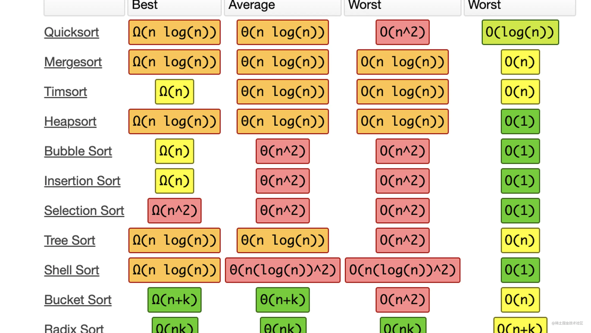

## 如何调试React源码
* [debugReact](https://github.com/bubucuo/DebugReact)

## React中常见的数据结构-Fiber
简而言之，fiber就是v16之后的虚拟DOM（React在遍历的节点的时候，并不是真正的DOM，而是采用虚拟的DOM）

#### 虚拟DOM是如何转化成 Fiber
jsx代码经过babel会编译成React.createElement的形式，之后会走一个beginWork的方法，这个方法会通过tag去判断这段代码的element对象，tag的类型就是判断 element对应那种的 fiber，再之后会调用reconcileChildFibers函数，这个函数就是转化后的fiber结构。
```jsx
const Index = (props)=> {
  return (
    <div>
      Hellow world
    </div>
  );
}

ReactDOM.render(
  <App />,
  document.getElementById('root')
);
```
#### element、fiber和DOM元素 的关系
* element对象就是我们的jsx代码，上面保存了props、key、children等信息
* DOM元素就是最终呈现给用户展示的效果
* fiber就是充当element和DOM元素的桥梁，简单的说，只要elemnet发生改变，就会通过fiber做一次调和，使对应的DOM元素发生改变

#### fiber 保存了什么？
源码部分在 packages/react-reconciler/src/ReactFiber.old.js 中的 FiberNode。
```js
export type Fiber = {
    // 存储一些对应element元素的属性
    tag: WorkTag,  // 组件的类型，判断函数式组件、类组件等（上述的tag）
    key: null | string, // key
    elementType: any, // 元素的类型
    type: any, // 与fiber关联的功能或类，如<div>,指向对应的类或函数
    stateNode: any, // 真实的DOM节点


    // 存储的是关于fiber链表相关的内容和相关的props、state
    return: Fiber | null, // 指向父节点的fiber
    child: Fiber | null, // 指向第一个子节点的fiber
    sibling: Fiber | null, // 指向下一个兄弟节点的fiber
    index: number, // 索引，是父节点fiber下的子节点fiber中的下表

    ref:
    | null
    | (((handle: mixed) => void) & {_stringRef: ?string, ...})
    | RefObject,  // ref的指向，可能为null、函数或对象

    pendingProps: any,  // 本次渲染所需的props
    memoizedProps: any,  // 上次渲染所需的props
    updateQueue: mixed,  // 类组件的更新队列（setState），用于状态更新、DOM更新
    memoizedState: any, // 类组件保存上次渲染后的state，函数组件保存的hooks信息
    dependencies: Dependencies | null,  // contexts、events（事件源） 等依赖
    mode: TypeOfMode, // 类型为number，用于描述fiber的模式 

    // 副作用相关的内容
    flags: Flags, // 用于记录fiber的状态（删除、新增、替换等）
    subtreeFlags: Flags, // 当前子节点的副作用状态
    deletions: Array<Fiber> | null, // 删除的子节点的fiber
    nextEffect: Fiber | null, // 指向下一个副作用的fiber
    firstEffect: Fiber | null, // 指向第一个副作用的fiber
    lastEffect: Fiber | null, // 指向最后一个副作用的fiber

    // 优先级相关的内容
    lanes: Lanes, // 优先级，用于调度
    childLanes: Lanes,
    alternate: Fiber | null,
    actualDuration?: number,
    actualStartTime?: number,
    selfBaseDuration?: number,
    treeBaseDuration?: number,
}
```
#### 链表之间如何连接的？
在 Fiber 中我们看到有return、child、sibling这三个参数，分别指向父级、子级、兄弟，也就是说每个element通过这三个属性进行连接。

## React中常见的数据结构-Flags
在 React 的渲染流程中，render 阶段从根节点开始处理所有的 fiber 节点，收集有副作用的 fiber 节点(即 fiber.flags 大于 1 的节点)，并构建副作用链表。commit 阶段并不会处理所有的 fiber 节点，而是遍历副作用链表，根据 fiber.flags 的标志进行对应的处理。
PerformedWork 是专门提供给 React Dev Tools 读取的。fiber 节点的副作用从 2 开始。0 表示没有副作用。
对于原生的 HTML 标签，如果需要修改属性，文本等，就视为有副作用。对于类组件，如果类实例实现了 componentDidMount、componentDidUpdate 等生命周期方法，则视为有副作用。对于函数组件，如果实现了 useEffect、useLayoutEffect 等 hook，则视为有副作用。以上这些都是副作用的例子。
React 在 render 阶段给有副作用的节点添加标志，并在 commit 阶段根据 fiber flags 执行对应的副作用操作，比如调用生命周期方法，或者操作真实的 DOM 节点。
```js
// 下面两个运用于 React Dev Tools，不能更改他们的值
const NoFlags = 0b000000000000000000;
const PerformedWork = 0b000000000000000001;

// 下面的 flags 用于标记副作用
const Placement = 0b000000000000000010; // 2 移动，插入
const Update = 0b000000000000000100; // 4
const PlacementAndUpdate = 0b000000000000000110; // 6
const Deletion = 0b000000000000001000; // 8
const ContentReset = 0b000000000000010000; // 16
const Callback = 0b000000000000100000; // 32 类组件的 update.callback
const DidCapture = 0b000000000001000000; // 64
const Ref = 0b000000000010000000; // 128
const Snapshot = 0b000000000100000000; // 256
const Passive = 0b000000001000000000; // 512
const Hydrating = 0b000000010000000000; // 1024

const HydratingAndUpdate = 0b000000010000000100; // 1028 Hydrating | Update

// 这是所有的生命周期方法(lifecycle methods)以及回调(callbacks)相关的副作用标志，其中 callbacks 指的是 update 的回调，比如调用this.setState(arg, callback)的第二个参数
const LifecycleEffectMask = 0b000000001110100100; // 932 Passive | Update | Callback | Ref | Snapshot

// 所有 host effects 的集合
const HostEffectMask = 0b000000011111111111; // 2047

// 下面这些并不是真正的副作用标志
const Incomplete = 0b000000100000000000; // 2048
const ShouldCapture = 0b000001000000000000; // 4096
const ForceUpdateForLegacySuspense = 0b000100000000000000; // 16384
```
#### flags 位操作
```js
// 1.移除所有的生命周期相关的 flags
fiber.flags &= ~LifecycleEffectMask;

// 2.只保留 host effect 相关的副作用，移除其他的副作用位
fiber.flags &= HostEffectMask;

// 3.只保留 "插入" 副作用
fiber.flags &= Placement;

// 4.添加一个 “更新” 副作用，注意和第3点保留 “插入” 副作用的区别
fiber.flags |= Update;

// 5.移除 "插入" 副作用，添加 "更新" 副作用
fiber.flags = (fiber.flags & ~Placement) | Update;
```

## React中常见的数据结构-ReactWorkTag
标记组件类型，对应fiber.tag。
```js
export const FunctionComponent = 0;
export const ClassComponent = 1;
export const IndeterminateComponent = 2; // Before we know whether it is function or class
export const HostRoot = 3; // Root of a host tree. Could be nested inside another node.
export const HostPortal = 4; // A subtree. Could be an entry point to a different renderer.
export const HostComponent = 5;
export const HostText = 6;
export const Fragment = 7;
export const Mode = 8;
export const ContextConsumer = 9;
export const ContextProvider = 10;
export const ForwardRef = 11;
export const Profiler = 12;
export const SuspenseComponent = 13;
export const MemoComponent = 14;
export const SimpleMemoComponent = 15;
export const LazyComponent = 16;
export const IncompleteClassComponent = 17;
export const DehydratedFragment = 18;
export const SuspenseListComponent = 19;
export const FundamentalComponent = 20;
export const ScopeComponent = 21;
export const Block = 22;
export const OffscreenComponent = 23;
export const LegacyHiddenComponent = 24;
```

## React中常见的数据结构-React 17&18 Lane
Lane是React中用于表示任务的优先级。优先级分为高优先级与低优先级，当用户操作界面时，为了避免页面卡顿，需要让出线程的执行权，先执行用户触发的事件，这个我们称之为高优先级任务，其它不那么重要的事件我们称之为低优先级任务。
不同优先级的任务间，会存在一种现象：当执行低优先级任务时，突然插入一个高优先级任务，那么会中断低优先级的任务，先执行高优先级的任务，我们可以将这种现象称为任务插队。当高优先级任务执行完，准备执行低优先级任务时，又插入一个高优先级任务，那么又会执行高优先级任务，如果不断有高优先级任务插队执行，那么低优先级任务便一直得不到执行，我们称这种现象为任务饥饿问题。

## 初次渲染
#### 1.const root = createRoot(document.getElementById("root"))， ReactDomRoot 实例化，生成根对象root
* RootType
```js
export type RootType = {
    render(children: ReactNodeList): void,
    unmount(): void,
    _internalRoot: FiberRoot | null,
    ...
}
```
* ReactDOMRoot
```js
function createRoot(container: Element | null): RootType {
    const root = new ReactDOMRoot(container);
    return root;
}

function ReactDOMRoot(internalRoot: FiberRoot) {
    this._internalRoot = internalRoot;
}

ReactDOMHydrationRoot.prototype.render = ReactDOMRoot.prototype.render = function(children: ReactNodeList,): void {
    const root = this._internalRoot;
    updateContainer(children, root, null, null);
} 

ReactDOMHydrationRoot.prototype.unmount = ReactDOMRoot.prototype.unmount = function(): void {
    const root = this._internalRoot;
    if (root !== null) {
        this._internalRoot = null;
        const container = root.containerInfo;
        flushSync(() => {
            updateContainer(null, root, null, null);
        });
        unmarkContainerAsRoot(container);
    }
}
```
#### 2.root.render(jsx)，执行更新，updateContainer(element: ReactNodeList, container: OpaqueRoot, parentComponent: ?React$Component, callback: ?Function)
1. 获取current fiber
```js
const current = container.current;
```
2. 创建一个update：const update = createUpdate(eventTime, lane);
    1. 初始化一个update对象
    ```js
    const update: Update<*> = {
        eventTime,
        lane,
        tag: UpdateState,
        payload: null,
        callback: null,
        next: null,
    };
    ```
    2. 赋值update的payload
```js
const eventTime = requestEventTime;
const lane = requestUpdateLane(current);
const update = createUpdate(eventTime, lane);
update.payload = { element };
```
3. update进入队列：enqueueUpdate(current, update, lane); 生成一个环形链表
4. 处理update更新：scheduleUpdateOnFiber(current, lane, enentTime);发起任务调度：ensureRootlsScheduled(root, eventTime);
    1. 任务调度：unstable_scheduleCallback;后续查看任务调度
    2. 任务：performConcurrentWorkOnRoot
        1. renderRootSync
        2. workLoopSync
        ```js
        function workLoopSync() {
            // Already timed out, so perform work without checking if we need to yield.
            while (workInProgress !== null) {
                performUnitOfWork(workInProgress);
            }
        }
        ```
        3. performUnitOfWork(workInProgress)
            1. 更新自己beginWork：检查子节点是否需要更新：三个条件满足一个就行：props、context、是否有别的pending update
                * 无更新：attemptEarlyBailoutlfNotScheduleUpdate(current, workInProgress, renderLanes)
                * 要更新：组件类型 fiber.tag 为原生标签，调用 updateHostComponent。1.处理context。2.如果只有一个文本，那么文本当做节点的textContent属性，而不另外创建文本节点。否则创建文本节点。3.协调子节点reconcileChildren。
                * 要更新：组件类型 fiber.tag 为类组件，调用 updateClassComponent。1.处理context。2.初次渲染，先初始化并存储实例，后执行render函数。中间再执行声明周期、处理state等。3.协调子节点reconcileChildren。
                * 要更新：组件类型 fiber.tag 为函数组件，调用 updateFunctionComponent。1.处理context。2.函数组件本身，中间需要处理Hooks。3.协调子节点 reconcileChildren。
            2. 更新全局变量workInProgress
5. 处理非紧急更新的 transitions：entangleTransitions(root, current, lane);
#### 3.root.unmount() 卸载函数，不接受callback，如果需要更新前执行callback，请使用useEffect
```js
const root = createRoot(document.getElementById("root"));

function AppWithCallbackAfterRender() {

    useEffect(() => {
        console.log('rendered');
    });

    return jsx
}

root.render(<AppWithCallbackAfterRender/>);
```

## 更新
1. 主动更新 root.render/setState/forceUpdate
    1. root.render：流程同初次渲染的12345
    2. setState
        * 类组件的setState，流程同初次渲染的12345
        * 函数组件的setState
            * useState/useReducer：流程同初次渲染的1234，只是5非紧急更新的处理函数是 entangleTransitionUpdate(root, queue, lane);因为与Hook相关，这里只更新当前函数组件相关，因此处理的queue是来自本函数组件的。
            * useSyncExternalStore：流程同render上1234，没有5，外界的store
    3. 类组件的forceUpdate
2. 被动更新 子组件的props/context value 变化

## 任务调度


#### React中的任务池
其实这不是个纯算法题，说回React，大家肯定听过React中有个任务吧，而且不同的fiber任务有不同的优先级，为了用户体验，React需要先处理优先级高的任务。为了存储这些任务，React中有两个任务池，源码中定义如下：
```js
var taskQueue = [];
var timerQueue = [];
```
askQueue与timerQueue都是数组， 前者存储的是⽴即要执⾏的任务， ⽽后者存的则是可以延 迟执⾏的任务。
源码中任务的初始结构定义如下：
```js
var  newTask = {
    id: taskIdCounter++, // 标记任务id callback, // 回调函数
    priorityLevel, // 任务优先级
    startTime, // 任务开始时间，时间点 expirationTime, // 过期时间，时间点
    sortIndex: -1, // 任务排序，取值来自过期时间，因此值越小，优先级越高
};
```
React中⼀旦来了新任务， 就会先⽤ currentTime 记录当前时间(performance.now()或者Date.now())， 如果任务有delay参数， 那么任务开始执⾏时间 startTime = currentTime + delay; 接下来通过 startTime  >  currentTime 如果成⽴，证明任务是可以延期的，那么任务进⼊timerQueue， 否则进⼊taskQueue。

#### React中的任务调度
那么问题来了， 怎么找到优先级最⾼的任务呢， 以taskQueue为例， 它是动态的任务池， 数据形 式上就是个数组 。Array.sort可⾏ ，但不是最优⽅案， 每次sort， 平均时间复杂度⾼达nlog(n) 。  这个时候我们需要了解个数据结构 ：最⼩堆， 也叫⼩顶堆。

当然可能有⼈问了， 为什么不是最⼤堆呢？这是因为taskQueue的newTask中的排序⽤的是 sortIndex， 这个值取⾃过期时间expirationTime， 也就意味着优先级越⾼的任务越需要⽴⻢执⾏， 那么过期时间⾃然也就越⼩了，换句话说就是， 优先级越⾼， 过期时间越⼩ 。当然有可能两 个任务的过期时间⼀样， 那这个时候就要看是谁先进的任务池了， 也就是newTask中的id嘛， 每 次来了新任务， id都会加1 。因此React源码中任务⽐较优先级的函数如下：
```js
function compare (a, b) {
    // Compare sort index first, then task id.
    const diff = a.sortIndex - b.sortIndex;
    return diff !== 0 ? diff : a.id - b.id;
}
```
其实⽤到最⼩堆，也就是把taskQueue做成最⼩堆的数据结构，然后执⾏任务的时候，取最⼩堆的最⼩任务，如果任务执⾏完毕，那么需要把这个任务从taskQueue中删除，并重新调整剩下的任务池，依然保证它是最⼩堆的数据结构。当然，往taskQueue中插⼊新任务的时候，也要调整taskQueue，保证新的任务池仍然是最⼩堆。

#### 最小堆
是一种经过排序的完全二叉树，其中任一非终端节点的数据值均不大于其左子节点和右子节点的值。


| **数组**             | 3   | 7   | 4   | 10  | 12  | 9   | 6   | 15  | 14  |
|---------------------|-----|-----|-----|-----|-----|-----|-----|-----|-----|
| **深度（depth）**    | 1   | 2   | 2   | 3   | 3   | 3   | 3   | 4   | 4   |
| **数组下标（index）** | 0   | 1   | 2   | 3   | 4   | 5   | 6   | 7   | 8   |

经过观察，发现父子节点下标关系如下：
根据子节点下标推算父节点下标： parentIndex = (childIndex - 1) >>> 1
根据父节点下标推算子节点下标： leftIndex = (index + 1)2 - 1, rightIndex = leftIndex + 1、

至此，我们就可以尝试去实现最小堆的增(push)删(pop)查(peek)函数了：

peek：获取最小堆的堆顶值
```js
export function peek(heap) {
    return heap.length === 0 ? null : heap[0];
}
```

push：往最小堆中添加一个元素，因为taskQueue本身已经是最小堆，并且是数组存储，这时候为了尽可能多的复用原先的结构，我们可以先把新元素插入数组尾部，然后从下往上调整最小堆：
```js
export function push(heap, node) {
    const index = heap.length;
    heap.push(node);
    siftUp(heap, node, index);
}
```
怎么从下往上调整呢？因为最小堆的典型特点就是父节点比左右子节点都小，那这时候除了尾部元素，其他都是满足这个特点的。这个时候我们只需要调整尾部元素以及和尾部元素的祖先就可以了，一直往上调整，直到不再需要调整为止。代码如下：
```js
function siftUp(heap, node, i) {
    let index = i;
    while (index > 0) {
        // 父节点下标
        const parentIndex = (index - 1) >>> 1;
        // 父节点
        const parent = heap[parentIndex];
        if (compare(parent, node) > 0) {
            // parent>node, 不符合最小堆
            heap[parentIndex] = node;
            heap[index] = parent;
            index = parentIndex;
        } else {
            // 已经符合最小堆，上面的祖先本身就是最小堆结构，因此停止调整
            return;
        }
    }
}
```

pop: 删除堆顶元素。即React一个任务执行完了，那么肯定要把这个任务从任务池taskQueue中删除。问题来了，怎么删除呢，堆顶元素其实就是taskQueue[0]，这个位置我们肯定还是要用的，并且和push一样，为了尽可能复用原先的最小堆结构，我们可以采取一个办法：把最后一个元素覆盖堆顶元素，然后从堆顶往下调整最小堆。
```js
export function pop(heap) {
    if (heap.length === 0) {
        return null;
    }
    const first = heap[0];
    const last = heap.pop();
    // 如果堆顶和堆尾元素不相等，证明现在的元素总数>1，需要往下调整
    if (first !== last) {
        heap[0] = last;
        siftDown(heap, last, 0);
    }
    return first;
}
```
关于往下调整，其实就是检查每个子堆的结构，确保最小值在父节点，不满足就交换父与左或者父与右，代码如下，我加了尽可能多的详细注释：
```js
function siftDown(heap, node, i) {
	let index = i;
	const len = heap.length;
	const halfLen = len >>> 1;

	while (index < halfLen) {
		let leftIndex = (index + 1) * 2 - 1;
		let left = heap[leftIndex];
		let rightIndex = leftIndex + 1;
		let right = heap[rightIndex];
		// todo 比较parent与left与right的大小
		// 如果parent不是最小的，那就比较left和right谁最小，然后把最小的和parent交换位置
		// 如果parent是最小的，那就停止
		if (compare(left, node) < 0) {
			// left < parent
			// 为了保证根节点最小，比较left和right
			if (rightIndex < len && compare(right, left) < 0) {
				// right<left, right是最小的，交换parent和right
				heap[index] = right;
				heap[rightIndex] = node;
				index = rightIndex;
			} else {
				// right>left, left是最小的，交换parent和left
				heap[index] = left;
				heap[leftIndex] = node;
				index = leftIndex;
			}
		} else if (rightIndex < len && compare(right, node) < 0) {
			// left > parent
			// 检查right, right<parent
			heap[index] = right;
			heap[rightIndex] = node;
			index = rightIndex;
		} else {
			// parnent最小
			return;
		}
	}
}
```

## 类组件


## 函数组件


## diff原理：reconcileChildren


#### VDOM
在React官网中，对VDOM的描述如下：

狭义一点来说，VDOM在数据形式上就是个js对象，一个描述了DOM节点的js对象。但是我们最终需要的是能够呈现在页面上的DOM，因此最终我们还需要根据VDOM来同步DOM。问题来了，同步DOM？DOM可是用户直观看到的东西，如果大动作更新DOM，那用户的看到的页面可能会延迟更新甚至出现闪烁状态，会造成用户体验极差。那怎么优化呢？我们可不可以通过计算从而以最低成本来更新DOM页面，可以！其实这个计算的过程就是所谓的VDOM DIFF，也是协调的核心。

#### VDOM DIFF
React和Vue中都用到了VDOM，但是因为结构不同，因此都有自己的DIFF实现方式，但其实背后大同小异。今天我们先单独来说说React VDOM DIFF。

#### fiber
了解React VDOM DIFF，首先要清楚React中的VDOM的实现形式是fiber，一个链表，这是和Vue VDOM数据结构上最大的不同，也是造成React和Vue的VDOM DIFF算法不同的一个重要原因。

下图是fiber的结构图：

因为fiber就是VDOM的实现形式，因此从数据形式上来说，fiber就是个对象，源码中的fiber属性较多，下面是我简化之后定义的创建fiber的函数：
```js
export function createFiber(vnode, returnFiber) { 
    const  fiber = {
        // 数据类型，原生标签的type是字符串，函数组件的type则是函数
        type: vnode.type,
        // 定义数据唯一性的字符串key
        key: vnode.key,
        props: vnode.props,
        // 原生标签  DOM
        // class组件  实例
        stateNode: null,
        // 第一个子fiber
        child: null,
        // 下一个兄弟fiber
        sibling: null,
        return: returnFiber,
        // 标记fiber任务类型，节点插入、更新、删除
        flags: Placement,
        index: null,
        // old fiber
        alternate: null, 
    };

    // 判断tag，判断fiber任务节点类型
    const { type } = vnode;
    if (isStr(type)) {
        // 原生标签
        fiber.tag = Hostcomponent;
    } else if (isFn (type)) {
        // 函数组件、类组件
        fiber.tag = type.prototype.isReactComponent
            ? ClassComponent
            : FunctionComponent;
    } else if (isUndefined(type)) {
        fiber.tag = HostText;
        fiber.props = { children: vnode };
    } else {
        fiber.tag = Fragment;
    }

    return fiber;
}
```

#### 节点类型
React中存在多种组件类型，如函数组件、类组件、原生标签、文本节点等等，不同组件的主要的差异性在于组件本身的处理，如函数组件要执行函数本身，类组件是执行实例的render函数（初次渲染还要先创建实例），但是这些组件都有个共同的特点，就是协调的时候先协调自己，然后再协调子组件。

#### 协调节点本身
这个很简单，就是判断节点是否可以复用，在React中，节点复用必须同时满足三大条件：1. 同一层级 2. 组件类型相同 3. key相同。
首先说同一层级下，如下图所示，上面的G节点和下面的G节点就不能复用，因为层级不同。当然如果你非要复用，那么找G节点就需要遍历整棵树，而实际项目中，跨层级变更节点的场景实在太少，因此跨层级复用节点实在不划算。

再说类型，实际项目中很少出现组件类型都变了，但是组件还是同一个的场景，如果还要再继续往下遍历，成本太高，覆盖场景太多，这个买卖不划算，因此不做考虑~
最后来说key，key是一个字符串，相当于组件在当前层级下的唯一id，因为同一层级下，组件类型也经常相同，那这个时候再区分节点，就需要一个唯一的key了。好了，顺便我们解决一道面试题了，key是用于判断是否可以复用新老VDOM节点的，那这个值必须得唯一且稳定的，如果你的key变来变去的，比如用Date.now()定义，那怎么复用节点呢。

#### 协调子节点
React中的协调子节点包括节点的初次渲染以及更新，但是其实背后执行的函数式同一个，都是 ChildReconciler，只是传参不同：
```js
export const reconcileChildFibers = ChildReconciler(true);
export const mountChildFibers = ChildReconciler(false);
```
ChildReconciler是一个wrapper function，核心函数是这个wrapper function返回的reconcileChildFibers，reconcileChildFibers做的事情就是判断新节点newChild的类型，再决定如何协调。

协调过程参见下面源码片段中的4条规则，其中单个子节点非常好理解，因为没有位置移动方面考虑，直接比较类型即可，文本也很好懂，直接替换即可。难点在于2.2与2.3，如果newChild是数组，那么我们需要考虑节点的位置变化，这个很麻烦，接下来我们重点说newChild为数组的情况。2.3是newChild为迭代函数的情况，和2.2算法是一样的，我们接下来只说2.2。
```js
function ChildReconciler(shouldTrackSideEffects) {
	//前面源码片段很长，此处省略一万字...
	// 执行协调子节点的函数
	function reconcileChildFibers(
		returnFiber: Fiber, // 父fiber
		currentFirstChild: Fiber | null, // 老的子fiber，初次渲染为null
		newChild: any, // 新子节点
		lanes: Lanes,
	): Fiber | null {

		const isUnkeyedTopLevelFragment =
			typeof newChild === 'object' &&
			newChild !== null &&
			newChild.type === REACT_FRAGMENT_TYPE &&
			newChild.key === null;
		if (isUnkeyedTopLevelFragment) {
			// 1. 如果是没有的key的Fragment，则本层忽略，直接下一层
			// 因为Fragment最多只有一个key属性，如果连这个都没有，那没法判断是否复用，用户本意就是当个假父级，因此不需要进入diff
			newChild = newChild.props.children;
		}

		// 2. 如果newChild是对象
		if (typeof newChild === 'object' && newChild !== null) {
			// 2.1 单个节点：子节点或者是传送门或者是lazy组件，1比1对比即可
			switch (newChild.$$typeof) {
				case REACT_ELEMENT_TYPE:
					// 单个子节点，1比1对比即可
					return placeSingleChild(
						reconcileSingleElement(
							returnFiber,
							currentFirstChild,
							newChild,
							lanes,
						),
					);
				case REACT_PORTAL_TYPE:
					// 传送门，1比1对比即可
					return placeSingleChild(
						reconcileSinglePortal(
							returnFiber,
							currentFirstChild,
							newChild,
							lanes,
						),
					);
				case REACT_LAZY_TYPE:
					// lazy组件，1比1对比即可
					if (enableLazyElements) {
						const payload = newChild._payload;
						const init = newChild._init;
						// TODO: This function is supposed to be non-recursive.
						return reconcileChildFibers(
							returnFiber,
							currentFirstChild,
							init(payload),
							lanes,
						);
					}
			}

			if (isArray(newChild)) {
				// 2.2. 如果是数组，麻烦大了，因为要考虑节点位置的变化，具体我后面详细说
				return reconcileChildrenArray(
					returnFiber,
					currentFirstChild,
					newChild,
					lanes,
				);
			}

			// 2.3. 迭代器函数，算法同reconcileChildrenArray
			if (getIteratorFn(newChild)) {
				return reconcileChildrenIterator(
					returnFiber,
					currentFirstChild,
					newChild,
					lanes,
				);
			}
			// 2.4 不是以上类型，抛出异常
			throwOnInvalidObjectType(returnFiber, newChild);
		}

		if (
			(typeof newChild === 'string' && newChild !== '') ||
			typeof newChild === 'number'
		) {
			// 3. 文本节点，直接替换
			return placeSingleChild(
				reconcileSingleTextNode(
					returnFiber,
					currentFirstChild,
					'' + newChild,
					lanes,
				),
			);
		}
		// Remaining cases are all treated as empty.
		// 4. 新节点不满足以上条件，则把剩下的老节点全部删除
		return deleteRemainingChildren(returnFiber, currentFirstChild);
	}

	return reconcileChildFibers;
}
```
#### 当新子节点是数组
当新子节点为数组的时候，我们调用的是reconcileChildrenArray这个函数.
注意：组件的初次渲染与更新，调用的都是下面这个函数！还记得ChildReconciler这个函数吧，这个函数接受true代表组件更新，接收false代表组件初次渲染，在下面的函数内部，这个true或者false是通过shouldTrackSideEffects标记的~
接下来下面的代码我写出了非常详细的注释，来看一下吧~
```js
function reconcileChildrenArray(
	returnFiber: Fiber, // 父fiber
	currentFirstChild: Fiber | null, // 老的第一个子fiber
	newChildren: Array <*> , // 新子节点数组
	lanes: Lanes,
): Fiber | null {
	// 本函数要做的事情就是diff新老vdom，在尽可能多的复用老vdom的情况下生成新的vdom，即fiber结构，并返回新的第一个子fiber，
	// 这个新的子fiber就是resultingFirstChild
	let resultingFirstChild: Fiber | null = null;
	// 记录上一个newFiber
	// 因为fiber.sibling是指向下一个fiber，但是在构建过程中下一个fiber得到下一轮才能构建完成，因此要完成fiber与sibling的关系，
	// 就要把上一轮的fiber记录下来，通过previousNewFiber.sibling来完成fiber与sibling的关联~
	let previousNewFiber: Fiber | null = null;

	// 老的第一个子fiber
	let oldFiber = currentFirstChild;
	// 记录上次插入节点的位置，以此判断节点是否需要移动
	let lastPlacedIndex = 0;
	// newChildren是数组，newIdx就是遍历数组用的下标
	let newIdx = 0;
	// 记录下一个oldFiber的值
	let nextOldFiber = null;

	//! step 1: 新老VDOM都是从左边开始遍历，按位比较，如果节点可以复用，那么都往后移一位，否则中止本轮循环
	// 注意下面这个for，只有oldFiber不是null才可以进入，因此初次渲染是跳过这个for的
	for (; oldFiber !== null && newIdx < newChildren.length; newIdx++) {
		// oldFiber的下标大于新的，本轮循环中止
		if (oldFiber.index > newIdx) {
			nextOldFiber = oldFiber;
			oldFiber = null;
		} else {
			// 记录下一个oldFiber
			nextOldFiber = oldFiber.sibling;
		}
		// updateSlot会比较oldFiber与newChildren[newIdx]的key，相等的话初步复用，不相等返回null
		const newFiber = updateSlot(
			returnFiber,
			oldFiber,
			newChildren[newIdx],
			lanes,
		);
		if (newFiber === null) {
			// 不能复用
			if (oldFiber === null) {
				// 如果oldFiber是null，本轮oldFiber没法用，用下一个试试
				oldFiber = nextOldFiber;
			}
			// 还记得刚进来本for的规则么，按照位置比较，不能复用则中止本for
			break;
		}
		if (shouldTrackSideEffects) {
			// 更新阶段，但是没有
			if (oldFiber && newFiber.alternate === null) {
				// oo. 匹配得到的newFiber没有alternate，还是没法复用
				deleteChild(returnFiber, oldFiber);
			}
		}
		// 把newFiber插入到链表中，更新位置，同时根据上次的插入位置，判断newFiber是否需要移动位置
		lastPlacedIndex = placeChild(newFiber, lastPlacedIndex, newIdx);
		if (previousNewFiber === null) {
			// previousNewFiber记录上个fiber，如果previousNewFiber为空，证明是头结点，则赋值给resultingFirstChild即可。
			resultingFirstChild = newFiber;
		} else {
			// 上个fiber的sibling是本次的fiber
			previousNewFiber.sibling = newFiber;
		}
		// 更新previousNewFiber，毕竟本次的fiber是下轮循环的上个fiber了
		previousNewFiber = newFiber;
		// 更新oldFiber
		oldFiber = nextOldFiber;
	}

	//! step2: 如果newIdx === newChildren.length，证明经过上轮for，新节点已经遍历完了，那么如果还有剩下的老节点，删除即可
	if (newIdx === newChildren.length) {
		// We've reached the end of the new children. We can delete the rest.
		deleteRemainingChildren(returnFiber, oldFiber);
		if (getIsHydrating()) {
			const numberOfForks = newIdx;
			pushTreeFork(returnFiber, numberOfForks);
		}
		return resultingFirstChild;
	}

	//! step3: 如果老节点没了，新节点还有，那么新节点逐个新增即可。初次渲染走的就是这里
	// 如果满足本条件，那么后面step4和step5都不用经历了，毕竟没有老节点了，没什么好比较的了
	if (oldFiber === null) {
		// If we don't have any more existing children we can choose a fastpath
		// since the rest will all be insertions.
		for (; newIdx < newChildren.length; newIdx++) {
			const newFiber = createChild(returnFiber, newChildren[newIdx], lanes);
			if (newFiber === null) {
				continue;
			}
			lastPlacedIndex = placeChild(newFiber, lastPlacedIndex, newIdx);
			if (previousNewFiber === null) {
				// TODO: Move out of the loop. This only happens for the first run.
				resultingFirstChild = newFiber;
			} else {
				previousNewFiber.sibling = newFiber;
			}
			previousNewFiber = newFiber;
		}
		if (getIsHydrating()) {
			const numberOfForks = newIdx;
			pushTreeFork(returnFiber, numberOfForks);
		}
		return resultingFirstChild;
	}

	//! step4: 走到现在，新老节点都还有，最麻烦的地方来了，也是React Diff的核心
	// 经过上面的步骤，走到这里的新老vdom都是乱序的，因此接下来遍历新的vdom的时候，需要考虑的事情是如何去老fiber链表里找某个key对应的节点
	// 因为老的fiber链表是单链表，所以如果通过循环的方式去遍历是比较慢的，总不能每次找节点都遍历一次链表吧
	// 可以把老fiber链表生成一个字典，方便接下来的快速查找以及删除字典中节点的操作（关于删除，等下举例子）
	// 生成字典的话，我们可以选择Object或者Map，但是考虑到效率，此处React选择的是Map，背后深究的话可以比较下Object与Map，Map的背后是哈希表，在多节点增删改查的场景下，效率会更高
	// Add all children to a key map for quick lookups.
	const existingChildren = mapRemainingChildren(returnFiber, oldFiber);

	// Keep scanning and use the map to restore deleted items as moves.
	/**
     * 如果下面这段解释你能看明白，那接下来的代码就很清楚了
    举例：接下来新老vdom的情况：
    old: a b c
    new: b c
    old已经是map了，因此接下来可以遍历new，比如找到b和c，那么这个时候我们就知道a要
    被删除，问题是怎么记录下来要删除的节点呢？
    其实这个时候我们可以这样，通过遍历new，去old中找new有的节点，比如找到b复用之
    后，再把b从old的map中删除，c也是同样操作。
    这样的话，遍历完new之后，old的map里只剩下了a，这个时候我们再把这个map剩余的节
    点全部删除就行了。
    */

	//
	// 代码实现：
	for (; newIdx < newChildren.length; newIdx++) {
		// 去map里找能复用的节点
		const newFiber = updateFromMap(
			existingChildren,
			returnFiber,
			newIdx,
			newChildren[newIdx],
			lanes,
		);
		if (newFiber !== null) {
			// 找到了，删掉map中的节点
			if (shouldTrackSideEffects) {
				if (newFiber.alternate !== null) {
					existingChildren.delete(
						newFiber.key === null ? newIdx : newFiber.key,
					);
				}
			}
			// 后面是构建fiber的过程，与前面的一样，不再多余解释了
			lastPlacedIndex = placeChild(newFiber, lastPlacedIndex, newIdx);
			if (previousNewFiber === null) {
				resultingFirstChild = newFiber;
			} else {
				previousNewFiber.sibling = newFiber;
			}
			previousNewFiber = newFiber;
		}
	}

	//! step5: 经历过step4之后，发现老节点中还有没被复用的，全部删除即可
	if (shouldTrackSideEffects) {
		existingChildren.forEach(child => deleteChild(returnFiber, child));
	}

	if (getIsHydrating()) {
		const numberOfForks = newIdx;
		pushTreeFork(returnFiber, numberOfForks);
	}
	return resultingFirstChild;
}
```
经过上面的源码阅读，我们来总结一下：
首先明确下数据结构： 新vdom是数组，即newChildren；老vdom是fiber单链表，即oldFiber。
1. 新老VDOM都是从左边开始遍历的，按位置比较，即第i个老vdom和第i个新vdom比较，如果节点可以复用，那么先复用，然后新老vdom都往后移一位，否则就中止本轮循环。
2. 如果经过step1，新节点已经遍历完了，那么如果还有剩下的老节点，删除即可。
3. 如果经过step1，老节点没了，新节点还有，那么新节点逐个新增即可。初次渲染走的就是这里。
4. 走到现在，新老节点都还有，但是是乱序的。因此可以把oldFiber单链表做成Map，即existingChildren，接下来遍历newChildren，找到能复用的fiber，就复用并且从existingChildren删除这个fiber。
5. 经历过step4之后，发现老节点existingChildren中还有没被复用的，全部删除即可。

#### 对比React 与Vue的 VDOM DIFF
这个问题太常见了，我就遇到了八百次了。回到这个问题的时候，其实重点就在于新子节点是数组的时候，因为单个节点的处理方式都一样，但是如果新子节点是数组，React和Vue的处理是有些许不同的。
首先，根本上在于数据结构的不同，因为Vue的多个新子节点时候，老子节点就是数组，而React中则是单链表。而数组是可以双向查找的，但是单链表却不可以，这就造成了第一个区别，就是Vue中都是从双向按照位置查找节点复用，但是React却只能从左边按照位置查找复用。
其次，React与Vue中为了节点的方便查找，都用到了Map这个结构，只是React是通过老子节点创建了一个Map，而Vue则是通过新子节点创建了Map。
最后，React中的遍历更循规蹈矩一些，而Vue中则通过最长递增子序列计算出了最小次数的节点移动路径。
以下是我画出的关于React与Vue的VDOM DIFF的思维导图：


## Context原理