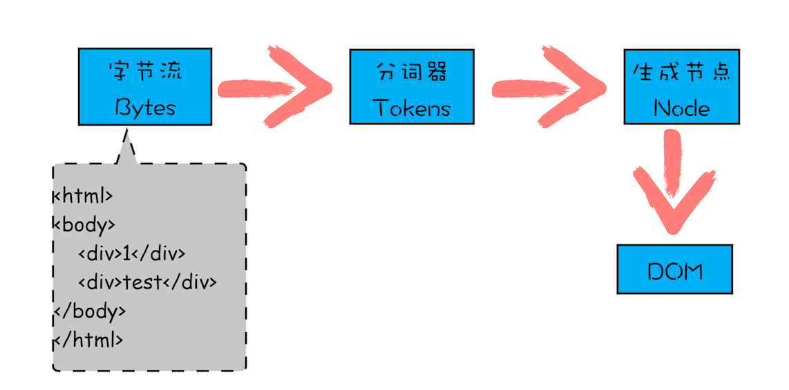
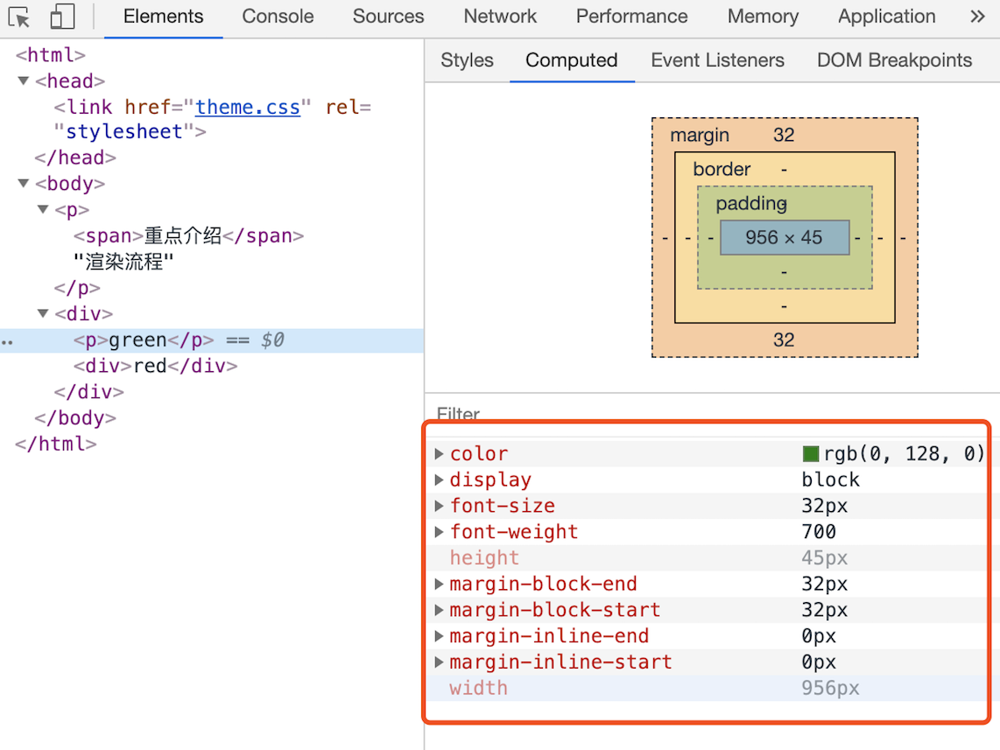
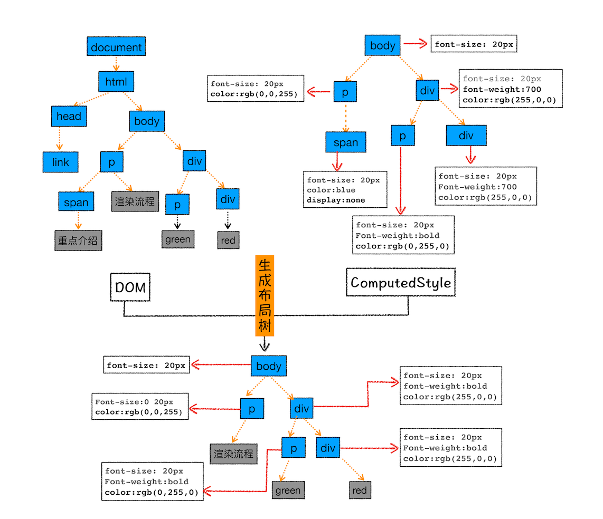
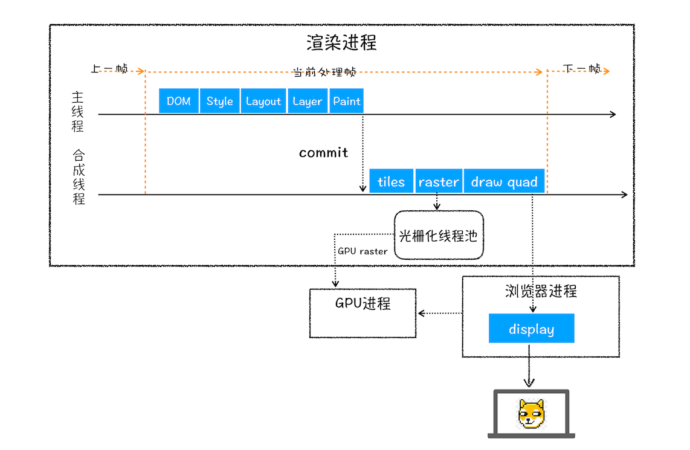
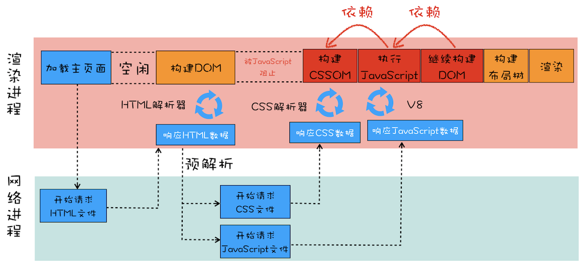
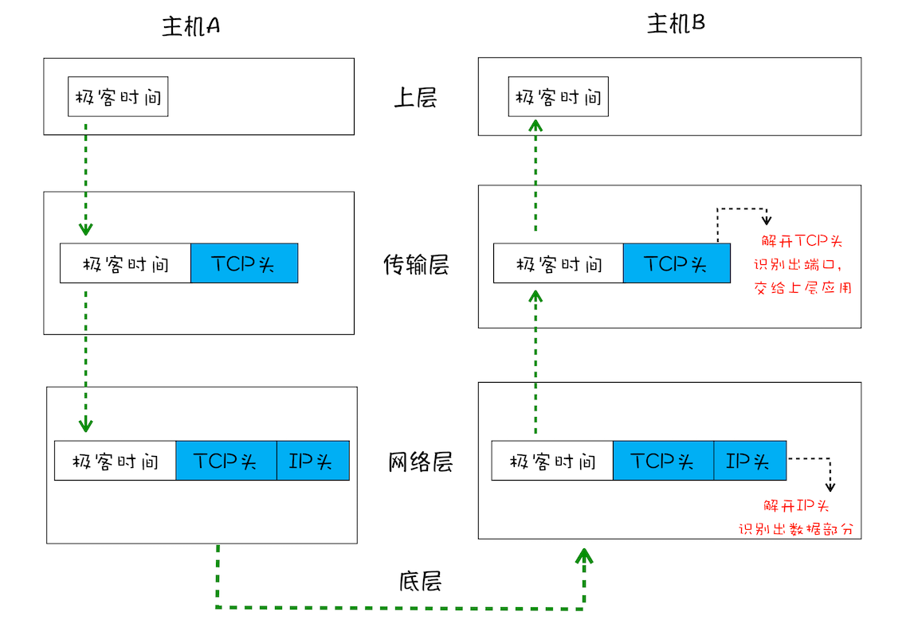

## 从输入URL到页面展示，中间发生了什么？

从图中可以看出，整个过程需要各个进程之间的配合。
* 浏览器进程主要负责用户交互、子进程管理和文件储存等功能。
* 网络进程是面向渲染进程和浏览器进程等提供网络下载功能。
* 渲染进程的主要职责是把从网络下载的 HTML、JavaScript、CSS、图片等资源解析为可以显示和交互的页面。因为渲染进程所有的内容都是通过网络获取的，会存在一些恶意代码利用浏览器漏洞对系统进行攻击，所以运行在渲染进程里面的代码是不被信任的。这也是为什么 Chrome 会让渲染进程运行在安全沙箱里，就是为了保证系统的安全。

所以URL到页面展示的过程，大致描述如下：

1. 首先，浏览器进程接收到用户输入的 URL 请求，浏览器进程便将该 URL 转发给网络进程。
   1. 用户输入URL，浏览器会根据用户输入的信息判断是搜索还是网址，如果是搜索内容，就将搜索内容+默认搜索引擎合成新的URL；如果用户输入的内容符合URL规则，浏览器就会根据URL协议，在这段内容上加上协议合成合法的URL。
   2. 用户输入完内容，按下回车键，浏览器还给了当前页面一次执行 beforeunload 事件的机会，beforeunload 事件允许页面在退出之前执行一些数据清理操作，还可以询问用户是否要离开当前页面，比如当前页面可能有未提交完成的表单等情况，因此用户可以通过 beforeunload 事件来取消导航，让浏览器不再执行任何后续工作。此时浏览器导航栏显示loading状态，但是页面还是呈现前一个页面，这是因为新页面的响应数据还没有获得。
   3. 浏览器进程构建请求行信息，会通过进程间通信（IPC）将URL请求发送给网络进程 GET /index.html HTTP1.1
2. 然后，在网络进程中发起真正的 URL 请求。
   * 细节请看下面的【从URL到 返回 HTTP 报文】
3. 接着网络进程接收到了响应头数据，便解析响应头数据，如果响应头信息 Content-Type 的值是 application/octet-stream，显示数据是字节流类型的，通常情况下，浏览器会按照下载类型来处理该请求，那么该请求会被提交给浏览器的下载管理器，同时该 URL 请求的导航流程就此结束。如果响应头信息 Content-Type 的值是 text/html 那么浏览器则会继续进行导航流程。由于 Chrome 的页面渲染是运行在渲染进程中的，所以接下来就需要准备渲染进程了。
4. 准备渲染进程：根据当前页面B是否是从页面A打开的并且和页面A是否是同一个站点（根域名和协议一样就被认为是同一个站点），如果满足上述条件，就复用之前网页的进程，否则，新创建一个单独的渲染进程。
5. 提交文档/提交导航：所谓提交文档，就是指浏览器进程将网络进程接收到的 HTML 数据提交给渲染进程。
   1. 浏览器进程接收到网络进程的响应头数据之后，发送“提交导航 (CommitNavigation)”消息到渲染进程。
   2. 渲染进程接收到“提交导航”的消息之后，便开始准备接收 HTML 数据，接收数据的方式是直接和网络进程建立数据管道。
   3. 最后渲染进程会向浏览器进程“确认提交”，这是告诉浏览器进程：“已经准备好接受和解析页面数据了”。
   4. 浏览器进程在收到“确认提交”的消息后，会更新浏览器界面状态，包括了安全状态、地址栏的 URL、前进后退的历史状态，并更新 Web 页面。
6. 渲染阶段：对文档进行页面解析和子资源加载，HTML 通过HTM 解析器转成DOM Tree（二叉树类似结构的东西），CSS按照CSS 规则和CSS解释器转成CSSOM TREE，两个tree结合，形成render tree（不包含HTML的具体元素和元素要画的具体位置），通过Layout可以计算出每个元素具体的宽高颜色位置，结合起来，开始绘制，最后显示在屏幕中新页面显示出来。
    * 细节请看下面的【HTML、CSS和JavaScript，是如何变成页面的】 

## 从URL到 返回 HTTP 报文
1. 查找缓存： 浏览器缓存是一种在本地保存资源副本，以供下次请求时直接使用的技术。当浏览器发现请求的资源已经在浏览器缓存中存有副本，它会拦截请求，返回该资源的副本，并直接结束请求，而不会再去源服务器重新下载。这样做的好处有：
   1. 缓解服务器端压力，提升性能（获取资源的耗时更短了）
   2. 对于网站来说，缓存是实现快速资源加载的重要组成部分
2. 建立连接阶段
    1. DNS 域名解析，获取ip地址（应用层）
    2. 通过 IP 协议 寻址找到目标服务器（网络层）
    3. 等待 TCP 队列：Chrome 有个机制，同一个域名同时最多只能建立 6 个 TCP 连接，如果在同一个域名下同时有 10 个请求发生，那么其中 4 个请求会进入排队等待状态，直至进行中的请求完成。
    4. 建立 TCP（传输层通信协议） 连接（传输层）
        * 第一次握手：客户端向服务器端发送一个 SYN 报文，表示开始建立连接。
        * 第二次握手：服务器端回发一个 ACK 报文，表示确认收到第一次握手，同时发送自己的SYN 报文。
            * 客户端确认自己发出的数据能够被服务器端收到。
        * 第三次握手：客户端收到 SYN+ACK 报文之后，会回应一个 ACK 报文。
            * 服务器端确认自己发出的数据能够被客户端收到。
        
3. 发送数据阶段
    1. 建立 SSL 安全连接 HTTPS（传输层）
        * 先使用非对称加密，进行秘钥协商，让通信双方拿到相同的钥匙。
        * 然后使用对称加密，进行加密传输。
    2. 发送 HTTP 请求（应用层）
4. 服务器处理请求并返回 HTTP 报文
5. 断开连接：TCP 四次分手
    1. 第一次挥手：客户端发送一个 FIN 报文。
    2. 第二次挥手：服务端收到 FIN 之后，会发送 ACK 报文，表明已经收到客户端的报文了。
    3. 第三次挥手：如果服务端也想断开连接了，和客户端的第一次挥手一样，发给 FIN 报文。
    4. 第四次挥手：客户端收到 FIN 之后，一样发送一个 ACK 报文作为应答。
    
* 参考：
    * https://mp.weixin.qq.com/s/1FSYt2NR14s_zx_CJl7miA
    * https://juejin.cn/post/6935232082482298911#heading-32

## HTML、CSS和JavaScript，是如何变成页面的？
1. 构建 DOM 树：为什么要构建 DOM 树呢？这是因为浏览器无法直接理解和使用 HTML，所以需要将 HTML 通过 HTML 解析器转换为浏览器能够理解的结构——DOM 树。注意：HTML 解析器并不是等整个文档加载完成之后再解析的，而是网络进程加载了多少数据，HTML 解析器便解析多少数据。
   1. 通过分词器将字节流转换为 Token，通过分词器先将字节流转换为一个个 Token，分为 Tag Token 和文本 Token。
   2. Token 解析为 DOM 节点，并将 DOM 节点添加到 DOM 树中。
   3. 如果解析过程中遇到 script 标签时，渲染引擎判断这是一段脚本，此时 HTML 解析器就会暂停 DOM 的解析，因为接下来的 JavaScript 可能要修改当前已经生成的 DOM 结构。JavaScript 引擎介入，并执行 script 标签中的这段脚本。脚本执行完成之后，HTML 解析器恢复解析过程，继续解析后续的内容，直至生成最终的 DOM。如果不是内嵌的 JavaScript 而是 JavaScript 文件，执行到 JavaScript 标签时，暂停整个 DOM 的解析，需要先下载这段 JavaScript 代码。这里需要重点关注下载环境，因为 JavaScript 文件的下载过程会阻塞 DOM 解析，而通常下载又是非常耗时的，会受到网络环境、JavaScript 文件大小等因素的影响。不过 Chrome 浏览器做了很多优化，其中一个主要的优化是预解析操作。当渲染引擎收到字节流之后，会开启一个预解析线程，用来分析 HTML 文件中包含的 JavaScript、CSS 等相关文件，解析到相关文件之后，预解析线程会提前下载这些文件。
   4. 优化手段：JavaScript 线程会阻塞 DOM，不过也有一些相关的策略来规避，比如使用 CDN 来加速 JavaScript 文件的加载，压缩 JavaScript 文件的体积。另外，如果 JavaScript 文件中没有操作 DOM 相关代码，就可以将该 JavaScript 脚本设置为异步加载，通过 async 或 defer 来标记代码。
   5. 另外，JavaScript 可能会操作 CSSOM，比如 ele.style.color = 'red'， 所以在执行 JavaScript 脚本之前，还需要先解析 JavaScript 语句之上所有的 CSS 样式。所以如果代码里引用了外部的 CSS 文件，那么在执行 JavaScript 之前，还需要 等待外部的 CSS 文件下载完成，并解析生成 CSSOM 对象之后，才能执行 JavaScript 脚本。而 JavaScript 引擎在解析 JavaScript 之前，是不知道 JavaScript 是否操纵了 CSSOM 的，所以渲染引擎在遇到 JavaScript 脚本时，不管该脚本是否操纵了 CSSOM，都会执行 CSS 文件下载，解析操作，再执行 JavaScript 脚本。JavaScript 会阻塞 DOM 生成，而样式文件又会阻塞 JavaScript 的执行，所以在实际的工程中需要重点关注 JavaScript 文件和样式表文件，使用不当会影响到页面性能的。

2. 样式计算
   1. 把 CSS 转换为浏览器能够理解的结构 styleSheets，该结构同时具备了查询和修改功能，这会为后面的样式操作提供基础（可以在 Chrome 控制台中查看其结构，只需要在控制台中输入 document.styleSheets）
   2. 转换样式表中的属性值，使其标准化，CSS 文本中有很多属性值，如 2em、blue、bold，这些类型数值不容易被渲染引擎理解，所以需要将所有值转换为渲染引擎容易理解的、标准化的计算值，这个过程就是属性值标准化。
    
   3. 使用继承规则和层叠规则，计算出 DOM 树中每个节点的具体样式，输出的内容是每个 DOM 节点的样式，并被保存在 ComputedStyle 的结构内。
      * CSS 继承就是每个 DOM 节点都包含有父节点的样式。
      * 层叠是 CSS 的一个基本特征，它是一个定义了如何合并来自多个源的属性值的算法。它在 CSS 处于核心地位，CSS 的全称“层叠样式表”正是强调了这一点。
    
3. 布局阶段：计算出 DOM 树中可见元素的几何位置，这个计算过程叫做布局。
   1. 创建布局树：DOM 树含有很多不可见的元素，比如 head 标签，还有使用了 display:none 属性的元素。所以在显示之前，需要额外地构建一棵只包含可见元素布局树。遍历 DOM 树中的所有可见节点，并把这些节点加到布局树中；而不可见的节点会被布局树忽略掉。
   
   2. 布局计算：计算每个元素的几何坐标位置，并将这些信息保存在布局树。
4. 分层：因为页面中有很多复杂的效果，如一些复杂的 3D 变换、页面滚动，或者使用 z-indexing 做 z 轴排序等，为了更加方便地实现这些效果，渲染引擎还需要为特定的节点生成专用的图层，并生成一棵对应的图层树（LayerTree）。
5. 绘制：为每个图层生成绘制列表，并将其提交到合成线程。渲染引擎实现图层的绘制，会把一个图层的绘制拆分成很多小的绘制指令，然后再把这些指令按照顺序组成一个待绘制列表。
6. 栅格化（raster）：合成线程将图层分成图块，并在光栅化线程池中将图块转换成位图。通常一个页面可能很大，但是用户只能看到其中的一部分，我们把用户可以看到的这个部分叫做视口（viewport）。在有些情况下，有的图层可以很大，比如有的页面你使用滚动条要滚动好久才能滚动到底部，但是通过视口，用户只能看到页面的很小一部分，所以在这种情况下，要绘制出所有图层内容的话，就会产生太大的开销，而且也没有必要。基于这个原因，合成线程会将图层划分为图块（tile），这些图块的大小通常是 256x256 或者 512x512。然后合成线程会按照视口附近的图块来优先生成位图，实际生成位图的操作是由栅格化来执行的。所谓栅格化，是指将图块转换为位图。
7. 合成和显示：一旦所有图块都被光栅化，合成线程就会生成一个绘制图块的命令——“DrawQuad”，然后将该命令提交给浏览器进程。浏览器进程里面有一个叫 viz 的组件，用来接收合成线程发过来的 DrawQuad 命令，然后根据 DrawQuad 命令，将其页面内容绘制到内存中，最后再将内存显示在屏幕上。

相关概念：
* 重排：通过 JavaScript 或者 CSS 修改元素的几何位置属性，例如改变元素的宽度、高度等，那么浏览器会触发重新布局，解析之后的一系列子阶段，这个过程就叫重排。无疑，重排需要更新完整的渲染流水线，所以开销也是最大的。
* 重绘：修改了元素的背景颜色，那么布局阶段将不会被执行，因为并没有引起几何位置的变换，所以就直接进入了绘制阶段，然后执行之后的一系列子阶段，这个过程就叫重绘。相较于重排操作，重绘省去了布局和分层阶段，所以执行效率会比重排操作要高一些。
* 合成：使用了 CSS 的 transform 来实现动画效果，这可以避开重排和重绘阶段，直接在非主线程上执行合成动画操作。这样的效率是最高的，因为是在非主线程上合成，并没有占用主线程的资源，另外也避开了布局和绘制两个子阶段，所以相对于重绘和重排，合成能大大提升绘制效率。

## css JavaScript 对 DOM 的阻塞
```css
//theme.css
div{ 
    color : coral;
    background-color:black
}
```
```js
//foo.js
console.log('time.geekbang.org')
```
```html
<html>
<head>
    <link href="theme.css" rel="stylesheet">
</head>
<body>
    <div>geekbang com</div>
    <script src='foo.js'></script>
    <div>geekbang com</div>
</body>
</html>
```
HTML 文件中包含了 CSS 的外部引用和 JavaScript 外部文件，那它们的渲染流水线是怎样的呢？

从图中可以看出来，在接收到 HTML 数据之后的预解析过程中，HTML 预解析器识别出来了有 CSS 文件和 JavaScript 文件需要下载，然后就同时发起这两个文件的下载请求，需要注意的是，这两个文件的下载过程是重叠的，所以下载时间按照最久的那个文件来算。后面的流水线就和前面是一样的了，不管 CSS 文件和 JavaScript 文件谁先到达，都要先等到 CSS 文件下载完成并生成 CSSOM，然后再执行 JavaScript 脚本，最后再继续构建 DOM，构建布局树，绘制页面。

白屏时间的优化策略：
通常情况下的瓶颈主要体现在下载 CSS 文件、下载 JavaScript 文件和执行 JavaScript。
* 通过内联 JavaScript、内联 CSS 来移除这两种类型的文件下载，这样获取到 HTML 文件之后就可以直接开始渲染流程了。
* 但并不是所有的场合都适合内联，那么还可以尽量减少文件大小，比如通过 webpack 等工具移除一些不必要的注释，并压缩 JavaScript 文件。
* 还可以将一些不需要在解析 HTML 阶段使用的 JavaScript 标记上 async 或者 defer。
* 对于大的 CSS 文件，可以通过媒体查询属性，将其拆分为多个不同用途的 CSS 文件，这样只有在特定的场景下才会加载特定的 CSS 文件。

参考文章：https://juejin.cn/post/7262263050102095929

## Http的状态码

* 1xx：服务端收到请求
* 2xx：请求成功，200（成功）
* 3xx：重定向，301（永久重定向，配合location，浏览器自动处理）302（临时重定向）304（资源未被修改）
* 4xx：客服端错误，404（资源没有找到）403（没有权限）
* 5xx：服务端错误，500（服务器错误）503（服务端暂时错误，稍后重试）504（网关超时）

## http常见header
* Request header
    * Accept 浏览器可接受的数据格式
    * Accept-Encoding 浏览器可接受的压缩算法，如gzip
    * Accept-Language 浏览器可接受的语言，如zh-CN
    * Connection:keep-alive 一次TCP链接重复使用
    * cookie
    * Host
    * User-Agent（简称UA）浏览器信息
    * Content-type 发送数据格式，如application/json
* Response header
    * Content-type 返回数据的格式，如application/json
    * Content-length 返回数据的大小，多少字节
    * Content-Encoding 返回数据的压缩算法，如gzip
    * Keep-Alive:timeout=20 长连接超时时间
* 缓存相关
    * Cache-Control: max-age/no-cache/no-store/private/public（Expires也是控制缓存过期，现被cache-control取代）
    * Last-Modified If-modified-Since
    * Etag If-None-Match

## http请求中的8种请求方法
* 简单请求
    * HEAD：类似于 get 请求，只不过返回的响应中没有具体的内容，用户获取报头
    * GET：获取数据
    * POST：新建数据
* 复杂请求
    * PUT：更新数据
    * DELETE：删除数据
    * OPTIONS：允许客户端查看服务器的性能，比如说服务器支持的请求方式，或者当前是否允许跨域等

## HTTP和HTTPS的[区别](https://mp.weixin.qq.com/s/UE7Zw0aSbxLuFFSraSUIOQ)
* HTTP：是互联网上应用最为广泛的一种网络协议，是一个客户端和服务器端请求和应答的标准（TCP），用于从WWW服务器传输超文本到本地浏览器的传输协议，它可以使浏览器更加高效，使网络传输减少。
* HTTPS：是以安全为目标的HTTP通道，简单讲是HTTP的安全版，即HTTP下加入SSL层，HTTPS的安全基础是SSL，因此加密的详细内容就需要SSL。（早期是SSL，最新是TLS加密通道）
* HTTPS协议的主要作用可以分为两种：一种是建立一个信息安全通道，来保证数据传输的安全；另一种就是确认网站的真实性。 
* 区别
    * https协议需要到ca申请证书，一般免费证书较少，因而需要一定费用。
    * http是超文本传输协议，信息是明文传输，https则是具有安全性的ssl加密传输协议。
    * http和https使用的是完全不同的连接方式，用的端口也不一样，前者是80，后者是443。
    * http的连接很简单，是无状态的；HTTPS协议是由SSL+HTTP协议构建的可进行加密传输、身份认证的网络协议，比http协议安全。

## [HTTP1、HTTP2、HTTP3](https://juejin.cn/post/6855470356657307662)
* HTTP1.1
    * 持久连接：keep-alive
    * 提供虚拟主机的支持：在HTTP/1.0中，每个域名绑定了一个唯一的IP地址，因此一个服务器只能支持一个域名。但是随着虚拟主机技术的发展，需要实现在一台物理主机上绑定多个虚拟主机，每个虚拟主机都有自己的单独的域名，这些单独的域名都公用同一个IP地址。 因此，HTTP/1.1的请求头中增加了Host字段，用来表示当前的域名地址，这样服务器就可以根据不同的Host值做不同的处理。
    * 客戶端Cookie
* HTTP2
    * 多路复用：通过在协议栈中添加二进制分帧层来实现的，有了二进制分帧层还能够实现请求的优先级、服务器推送、头部压缩等特性，从而大大提升了文件传输效率。
* HTTP3
    * 基于QUIC协议：解决TCP的队头阻塞、建立TCP连接的延时、TCP协议 僵化等问题


##  GET 和 POST 的区别
* get 参数通过 url 传递，post 放在 request body 中。
* get 请求在 url 中传递的参数是有长度限制的，而 post 没有。
* get 比 post 更不安全，因为参数直接暴露在 url 中，所以不能用来传递敏感信息。
* get 请求只能进行 url 编码，而 post 支持多种编码方式
* get 请求会浏览器主动 cache，而 post 支持多种编码方式。
* get 请求参数会被完整保留在浏览历史记录里，而 post 中的参数不会被保留。
* GET 和 POST 本质上就是 TCP 链接，并无差别。但是由于 HTTP 的规定和浏览器/服务器的限制，导致他们在应用过程中体现出一些不同。
* GET 产生一个 TCP 数据包；POST 产生两个 TCP 数据包。

## [TCP和UDP](https://juejin.cn/post/6972027657047244837#heading-12)
UDP（User Datagram Protocol，用户数据报协议）

- 无连接协议：UDP 是一种无连接协议，发送数据前不需要建立连接。
- 不提供错误恢复：UDP 不提供错误恢复机制，如果数据包丢失，不会进行重传。
- 传输速度快：由于没有错误检查和连接建立的过程，UDP 传输速度更快，延迟更低。
- 应用场景：适用于对速度要求高且允许偶尔数据丢失的应用，如直播流媒体、在线游戏和语音通话（VoIP）。

TCP（Transmission Control Protocol，传输控制协议）

- 面向连接协议：TCP 在发送数据前需要建立连接，确保通信的可靠性。
- 提供错误恢复：TCP 提供错误检查，确保数据按顺序且无误地传输。
- 传输速度较慢：由于需要建立连接和进行错误检查，TCP 的传输速度相对较慢。
- TCP 引入了数据包排序机制，用来保证把乱序的数据包组合成一个完整的文件。
- 应用场景：适用于对数据完整性和顺序有严格要求的应用，如网页浏览、电子邮件和文件传输。

总结：

* TCP向上层提供面向连接的可靠服务 ，UDP向上层提供无连接不可靠服务。
* 虽然 UDP 并没有 TCP 传输来的准确，但是也能在很多实时性要求高的地方有所作为
* 对数据准确性要求高，速度可以相对较慢的，可以选用TCP


补充：
* 互联网中的数据是通过数据包来传输的，数据包在传输过程中容易丢失或出错。
* IP 负责把数据包送达目的主机。
* UDP 负责把数据包送达具体应用。
* 而 TCP 保证了数据完整地传输，它的连接可分为三个阶段：建立连接、传输数据和断开连接。


## HTTP 和 TCP 的关系

HTTP协议和TCP协议都是TCP/IP协议簇的子集。

HTTP协议属于应用层，TCP协议属于传输层，HTTP协议位于TCP协议的上层。

请求方要发送的数据包，在应用层加上HTTP头以后会交给传输层的TCP协议处理，应答方接收到的数据包，在传输层拆掉TCP头以后交给应用层的HTTP协议处理。建立 TCP 连接后会顺序收发数据，请求方和应答方都必须依据 HTTP 规范构建和解析HTTP报文。

## 浏览器多个标签页之间的通信

* websocket通讯
* 定时器（setInterval）+ cookie
* 使用localstorage
* html5浏览器的新特性SharedWorker

## 缓存

* DNS缓存
* CDN缓存
* 浏览器缓存
* 服务器缓存

## 浏览器缓存

#### 什么是缓存
保存资源副本并在下次请求时直接使用该副本的技术。当Web缓存发现请求的资源已经被存储，它会拦截请求，返回该资源的拷贝，而不会去源服务器重新下载。
#### 为什么需要缓存
* 减少不必要的网络请求,使得页面加载更快;
* 网络请求是不稳定,加大了页面加载的不稳定性;
* 网络请求的加载相比于cpu加载 & 页面渲染都要慢

#### 哪些资源可以被缓存

静态资源 js css img容易被缓存，因为静态资源加上hash名打包后是一般是不会修改的。

#### 强制缓存（初次请求后，不再请求服务器，直接读取本地缓存）

Response Headers中控制强制缓存的逻辑，例如cache-Control:max-age=315336000


#### 协商缓存（对比缓存）

服务器端缓存策略，服务器判断客户端资源是否和服务器端一致，一致返回304，否则返回200和最新的资源。在response header中有两种资源标识，Last-modified（资源最后修改事件）和Etag（资源唯一标识，一个字符串，类似人的指纹），优先使用Etag，因为Last-Modified只能精确到秒级，另外如果资源被重复生成，但是内容不变，Etag也不会改变，依然可以返回304。


#### 刷新页面对http缓存的影响

* 正常操作：地址栏输入url，跳转链接，前进后退，强制缓存有效，协商缓存有效
* 手动刷新：F5，点击刷新按钮，点击菜单刷新，强制缓存失效，协商缓存有效
* 强制刷新：ctrl+F5，强制缓存失效，协商缓存失效

#### 强制缓存和协商缓存


### 跨域解决方案

* JSONP
```html
<script>
    window.abc = function (data) {
        console.log(data)
    }
</script>
<script src="http://localhost:8002/jsonp.js?username=xxx&callback=abc"></script>
```
* CORS（需服务端设置http-header）

* web服务nginx代理
* [document.domain](https://blog.csdn.net/zhuchunyan_aijia/article/details/51426220)

## TCP 是如何建立连接的，三次握手，四次挥手

三次握手

- 客户端向服务端发送建立连接请求，客户端进入 SYN-SEND 状态
- 服务端收到建立连接请求后，向客户端发送一个应答，服务端进入 SYN-RECEIVED 状态
- 客户端接收到应答后，向服务端发送确认接收到应答，客户端进入 ESTABLISHED 状态

四次挥手

- 客户端向服务端发送断开连接请求
- 服务端收到断开连接请求后，告诉应用层去释放 tcp 连接
- 服务端向客户端发送最后一个数据包 FINBIT ，服务端进入 LAST-ACK 状态
- 客户端收到服务端的断开连接请求后，向服务端确认应答

> 三次握手四次挥手，客户端都是主动方，服务端都是被动方。在状态方面：三次握手的客户端和服务端都是由原来的 closed 变为 established，四次挥手的客户端和服务端都是由原来的 established 变为 closed。

参考资料: https://juejin.cn/post/7350107540327022601

## HTTP 几个版本的区别

#### HTTP/0.9 - 单行协议

- 只有 GET 请求行，无请求头和请求体
- 只能传输 HTML 文件，以 ASCII 字符流返回
- 无响应头

#### HTTP/1.0 - 多类型支持

- 支持多种文件类型传输，不限于 ASCII 编码
- 引入请求头和响应头( key-value 形式)
- 每个请求都需要建立新的 TCP 连接

#### HTTP/1.1 - 持久连接

- 引入持久连接( keep-alive )：一个 TCP 连接可传输多个 HTTP 请求
- 默认开启 keep-alive，通常限制 6-8 个并发连接
- 存在队头阻塞问题：前面的请求阻塞会影响后续请求
- 引入 Host 字段，支持虚拟主机
- 引入 Chunk transfer 机制处理动态内容长度

#### HTTP/2.0 - 多路复用

- 一个域名只使用一个 TCP 长连接
- 引入二进制分帧层，实现多路复用
- 可对请求设置优先级
- 引入 HTTPS(HTTP + TLS) 加密

#### HTTP/3.0 - QUIC 协议

- 基于 UDP 协议而非 TCP
- 实现了类似 TCP 的流量控制和可靠传输
- 集成 TLS 加密
- 实现多路复用
- 解决 TCP 队头阻塞问题

参考资料: https://juejin.cn/post/7350520171611652147

## HTTP 常见的状态码

- 200 请求成功，请求在服务端被正确处理
- 204 响应成功，没有数据
- 205 服务器处理成功，浏览器应重置文档视图
- 206 服务器成功处理了部分get请求
- 301 资源永久重定向
- 302 资源临时重定向
- 303 让你查看其他地址
- 304 请求的资源没有修改，服务端不会返回任何资源，协商缓存
- 400 请求语法错误，服务器看不懂
- 401 请求没有携带信息，比如 token 认证失败
- 403 请求被拒绝、敏感词
- 404 找不到资源
- 500 服务器内部错误，无法完成请求
- 501 服务器不支持当前请求所需的功能
- 503 服务器系统维护或者超载，暂时无法处理客户端的请求

## HTTP 常见 Header

请求头

- accept: text/html 告诉服务端我期望接收到一个html的文件
- accept-encoding: gzip, deflate, br 告诉服务端以这种方式压缩
- accept-language: zh-CN 告诉服务端以中文的格式返回
- authorization: 告诉服务端授权信息
- cookie: 告诉服务端客户端存储的 cookie
- origin: 告诉服务端请求的来源

响应头

- content-encoding: br 告诉浏览器压缩方式是br
- content-type: text/html; charset=utf-8 告诉浏览器以这种方式，编码加载
- cache-control: 告诉浏览器缓存策略
- expires: 告诉浏览器缓存过期时间
- set-cookie: 告诉浏览器设置 cookie
- access-control-allow-origin: \* 告诉浏览器允许跨域

## URL 包含哪些部分？

URL (Uniform Resource Locator) 包含以下部分：

1. 协议 (protocol)：如 `http://`、`https://`、`ftp://` 等

2. 域名 (domain)：如 `www.example.com`

   - 子域名：`www`
   - 主域名：`example`
   - 顶级域名：`com`

3. 端口号 (port)：如 `:80`、`:443`（可选，HTTP 默认 80，HTTPS 默认 443）

4. 路径 (path)：如 `/blog/article`

5. 查询参数 (query string)：如 `?id=123&name=test`

6. 锚点/片段标识符 (fragment)：如 `#header`

示例：https://www.example.com:80/blog/article?id=123&name=test#header

## GET 和 POST 请求的区别

- 协议层面：请求行里一定要有请求方法，官方为了统一语义，定义了 GET 表示拿数据，POST 表示上传数据，PUT 表示修改数据，所以 GET，POST 请求这里仅仅是语义上的差别，没有说哪个请求必须做啥
- 应用层面：开发者约定俗成的规范，GET 请求的请求体会设空，不是没有请求体
- 浏览器层面：GET 请求会缓存，有历史记录

## Ajax Fetch Axios 三者有什么区别？

Ajax、Fetch 和 Axios 都是用于发送 HTTP 请求的技术，但有以下区别：

Ajax (Asynchronous JavaScript and XML)

- 是一种技术统称，不是具体的 API
- 最常用的实现是 XMLHttpRequest (XHR)
- 写法比较繁琐，需要手动处理各种状态
- 回调地狱问题
- 不支持 Promise

Fetch

- 浏览器原生 API
- 基于 Promise
- 更简洁的写法
- 不需要额外引入
- 只对网络请求报错，对 400、500 都当做成功的请求
- 默认不带 cookie
- 不支持请求超时控制
- 不支持请求取消
- 不支持请求进度监控

Axios

- 第三方库，需要额外引入
- 基于 Promise
- 支持浏览器和 Node.js
- 请求/响应拦截器
- 自动转换 JSON 数据
- 客户端支持防止 XSRF
- 支持请求取消
- 支持请求超时控制
- 支持请求进度监控
- 支持并发请求
- 自动转换请求和响应数据

使用建议：

- 如果是简单的请求，使用 Fetch 即可
- 如果需要更多功能，建议使用 Axios
- 现代项目中已经很少直接使用 XMLHttpRequest

## Fetch 和 XMLHTTPRequest 有什么区别？

语法和使用

- Fetch 基于 Promise，代码更简洁优雅
- XHR 使用回调函数，容易产生回调地狱
- Fetch 的 API 设计更简单现代
- XHR 的 API 设计较老，使用相对复杂

功能特性

- Fetch 默认不发送 cookies，需要配置 credentials
- XHR 默认发送 cookies
- Fetch 不能监听上传进度
- XHR 可以监听上传和下载进度
- Fetch 不能直接取消请求（需要 AbortController）
- XHR 可以通过 abort() 直接取消请求

错误处理

- Fetch 只有网络错误才会 reject，HTTP 错误码不会导致 reject
- XHR 可以处理所有类型的错误，包括 HTTP 错误码

浏览器支持

- Fetch 是现代浏览器标准 API
- XHR 有更好的浏览器兼容性，包括旧版本

## 什么是 Restful API ？

RESTful API 是一种软件架构风格，用于设计网络应用程序的接口。主要特点：

资源导向

- 使用 URL 定位资源
- 每个资源都有唯一的 URL
- 资源可以有多种表现形式（如 JSON、XML）

HTTP 方法对应操作

- GET：获取资源
- POST：创建资源
- PUT：更新资源（完整更新）
- PATCH：更新资源（部分更新）
- DELETE：删除资源

无状态

- 服务器不保存客户端状态
- 每个请求包含所需的所有信息
- 有利于横向扩展

统一接口

- 使用标准的 HTTP 方法
- 使用标准的 HTTP 状态码
- 返回格式一致（通常是 JSON）

## 什么是 GraphQL ？

GraphQL 是一种用于 API 的查询语言和运行时，由 Facebook 开发。主要特点：

查询灵活性

- 客户端可以精确指定需要哪些数据
- 可以在一个请求中获取多个资源
- 避免了传统 REST API 的过度获取和获取不足问题

类型系统

- 强类型的 Schema 定义
- 自动生成文档
- 开发时有更好的类型提示

单个端点

- 只需要一个 API 端点
- 所有查询都发送到同一个地址
- 通过查询语句区分不同的操作

主要操作类型

- Query：获取数据
- Mutation：修改数据
- Subscription：实时数据订阅

优点

- 减少网络请求
- 避免版本化问题
- 强类型保障
- 更好的开发体验

缺点

- 学习成本较高
- 缓存较为复杂
- 服务端实现复杂度增加

## 如何理解 cookie

Cookie 是服务器发送到用户浏览器并保存在本地的一小块数据。

主要特点：

- 由服务器生成，浏览器进行存储
- 每次请求时会自动携带对应域名下的 cookie
- 可设置过期时间
- 默认情况下随着浏览器关闭而删除（会话 cookie）

常用属性：

- name：cookie 名称
- value：cookie 值
- domain：指定 cookie 所属域名
- path：指定 cookie 所属路径
- expires/max-age：过期时间
- secure：只在 HTTPS 下传输
- httpOnly：禁止 JS 访问
- sameSite：跨站点请求限制

使用场景：

- 会话状态管理（用户登录状态、购物车等）
- 个性化设置（用户偏好、主题等）
- 浏览器行为跟踪（分析用户行为等）

限制：

- 大小限制：通常为 4KB
- 数量限制：每个域名下的 cookie 数量有限
- 安全性：明文传输（除非使用 HTTPS）
- 作用域：只能在所属域名下使用

## 为何现代浏览器都禁用第三方 cookie

主要原因是保护用户隐私和安全：

隐私问题

- 第三方 Cookie 可以跨站点追踪用户行为
- 广告商可以构建用户画像和浏览历史
- 用户数据可能被未经授权收集和使用

安全风险

- 增加 CSRF（跨站请求伪造）攻击风险
- 可能被用于会话劫持
- 恶意网站可能滥用第三方 Cookie

技术影响

- Safari 和 Firefox 已默认禁用第三方 Cookie
- Chrome 计划在 2024 年完全禁用第三方 Cookie
- 替代方案：
  - First-Party Cookie
  - localStorage
  - Privacy Sandbox
  - FLoC (Federated Learning of Cohorts)

## 如何理解 Session ？

Session 是服务器端的会话管理机制：

基本概念

- 服务器为每个用户创建的临时会话存储空间
- 用于保存用户的会话状态
- 通过 SessionID 来识别不同用户
- SessionID 通常保存在 Cookie 中

工作流程

1. 用户首次访问服务器时，服务器创建 Session 并生成 SessionID
2. 服务器将 SessionID 通过 Cookie 发送给客户端
3. 客户端后续请求会自动携带包含 SessionID 的 Cookie
4. 服务器通过 SessionID 找到对应 Session 并识别用户

特点

- 安全性较高：敏感数据存储在服务器
- 服务器负载较大：需要存储所有用户的 Session
- 依赖 Cookie：通常需要 Cookie 来存储 SessionID
- 集群问题：需要考虑 Session 共享

使用场景

- 用户登录状态管理
- 购物车
- 权限验证
- 表单验证

与 Cookie 的区别

- 存储位置：Session 在服务器，Cookie 在客户端
- 安全性：Session 较安全，Cookie 相对不安全
- 存储容量：Session 容量较大，Cookie 通常限制 4KB
- 性能：Session 消耗服务器资源，Cookie 消耗带宽资源

## 什么是 JWT 描述它的工作过程

JWT (JSON Web Token) 是一种开放标准，用于在各方之间安全地传输信息。

组成部分（用 . 分隔的三部分）：

- Header（头部）：指定加密算法和令牌类型
- Payload（负载）：包含声明（claims）的实际数据
- Signature（签名）：对前两部分的签名，用于验证消息未被篡改

工作流程：

1. 用户登录成功后，服务器创建 JWT

   - 设置 Header 和 Payload
   - 使用密钥生成签名
   - 将三部分组合成 token

2. 服务器将 token 返回给客户端

   - 客户端存储在 localStorage 或 cookie 中

3. 后续请求携带 token

   - 通常放在 Authorization header
   - 格式：`Bearer <token>`

4. 服务器验证 token
   - 检查签名是否有效
   - 验证是否过期
   - 验证其他声明（claims）

特点：

- 无状态：服务器不需要存储会话信息
- 可扩展：负载部分可以包含自定义数据
- 跨域友好：可以在不同域名下使用
- 性能好：验证在服务端完成，不需要查询数据库

安全考虑：

- 不要在 payload 中存储敏感信息
- 设置合理的过期时间
- 使用 HTTPS 传输
- 妥善保管签名密钥

参考资料: https://juejin.cn/post/7346430299490189348

## JWT 如何自动更新 token ？

JWT token 自动更新主要有以下几种方案：

双 token 机制

- access token：短期令牌，用于接口认证
- refresh token：长期令牌，用于刷新 access token
- 优点：安全性高，即使 access token 泄露影响有限
- 缺点：实现相对复杂，需要额外存储 refresh token

工作流程：

1. 用户登录后获取 access token 和 refresh token
2. 使用 access token 访问接口
3. access token 过期时，使用 refresh token 获取新的 access token
4. refresh token 过期时，需要重新登录

```js
// 前端示例代码
async function request(url, options) {
  try {
    const res = await fetch(url, {
      ...options,
      headers: {
        Authorization: `Bearer ${getAccessToken()}`,
      },
    })

    if (res.status === 401) {
      // access token 过期，尝试刷新
      const newToken = await refreshToken()
      if (newToken) {
        // 使用新 token 重试请求
        return request(url, options)
      } else {
        // refresh token 也过期，跳转登录
        redirectToLogin()
      }
    }

    return res
  } catch (error) {
    console.error(error)
  }
}
```

滑动过期机制

- 每次请求都刷新 token 过期时间
- 类似于会话超时机制
- 优点：实现简单，用户体验好
- 缺点：安全性相对较低

无感刷新机制

- 在 token 即将过期时自动刷新
- 可以通过定时器或请求拦截器实现
- 优点：用户无感知，体验好
- 缺点：需要处理并发请求的问题

最佳实践：

- 根据业务安全需求选择合适的方案
- access token 过期时间不宜过长（如 2 小时）
- refresh token 过期时间可以较长（如 7 天）
- 重要操作仍需要二次验证
- 考虑 token 注销机制

## 什么是 SSO 单点登录，描述它的工作过程

SSO (Single Sign On) 单点登录是一种身份验证机制，允许用户使用一组凭证访问多个相关但独立的系统。

基本概念

- 一次登录，全局通用
- 多个子系统共享用户会话
- 统一的认证中心
- 提高用户体验和安全性

工作流程：

用户首次访问系统

- 用户访问系统 A
- 系统 A 检查无登录状态
- 重定向到 SSO 认证中心
- 带上系统 A 的地址作为参数

SSO 认证中心处理

- 检查用户是否已登录 SSO
- 未登录则显示登录页面
- 用户输入账号密码
- 认证中心验证身份

回到系统 A

- SSO 生成票据（ticket）
- 重定向回系统 A
- 带上票据参数
- 系统 A 验证票据
- 创建本地会话

访问系统 B

- 用户访问系统 B
- 系统 B 检查无登录状态
- 重定向到 SSO 认证中心
- SSO 发现用户已登录
- 直接生成票据返回
- 系统 B 验证票据
- 创建本地会话

实现方式：

- 基于 Cookie
- 基于 Token
- 基于 SAML
- 基于 OAuth
- 基于 CAS

优点：

- 提升用户体验
- 减少密码管理
- 统一认证流程
- 提高安全性

缺点：

- 认证中心单点故障
- 配置相对复杂
- 需要额外的安全考虑

参考资料: https://juejin.cn/post/7454474417318690831

## 什么是跨域？如何实现跨域通讯？

跨域是指浏览器的同源策略限制，当前域名的 JavaScript 代码试图访问其他域名下的资源时会受到限制。

同源的定义：

- 协议相同（http/https）
- 域名相同
- 端口相同

跨域解决方案：

CORS（跨域资源共享）

- 服务器设置 Access-Control-Allow-Origin 等响应头
- 可以配置允许的请求方法、请求头、是否允许携带认证信息等
- 最常用的跨域解决方案

JSONP

- 利用 `<script>` 标签不受同源策略限制的特点
- 只支持 GET 请求
- 需要服务器配合返回 JavaScript 代码

代理服务器

- 开发环境：webpack-dev-server、vite 等的 proxy 配置
- 生产环境：Nginx 反向代理

postMessage

- HTML5 标准中的 API
- 用于不同窗口间的跨域通信
- 可以在父子页面（iframe）或者多窗口间通信

WebSocket

- 建立在 TCP 之上的协议
- 天然支持跨域
- 适合需要实时通信的场景

document.domain（已废弃）

- 仅适用于主域名相同的情况
- 将子域和主域的 document.domain 设为相同的主域

最佳实践：

- 优先使用 CORS，配置得当的情况下最安全
- 需要兼容旧浏览器时可以考虑 JSONP
- 开发环境优先使用代理服务器
- 特殊场景（如页面通信）可以考虑 postMessage
- 需要实时通信时使用 WebSocket

参考资料: https://juejin.cn/post/7346079038555602955

## HTTP 请求跨域时为何要发送 options 请求

OPTIONS 请求是 CORS 预检请求(Preflight Request)，用于检查实际请求是否可以安全地发送。

触发条件：

- 使用非简单请求方法：除 GET、POST、HEAD 之外的方法
- 使用非简单请求头：除 Accept、Accept-Language、Content-Language、Content-Type 之外的请求头
- Content-Type 不是以下之一：
  - application/x-www-form-urlencoded
  - multipart/form-data
  - text/plain

工作流程：

1. 浏览器发送 OPTIONS 预检请求，包含：

   - Origin：请求来源
   - Access-Control-Request-Method：实际请求使用的方法
   - Access-Control-Request-Headers：实际请求使用的请求头

2. 服务器响应预检请求，返回：

   - Access-Control-Allow-Origin：允许的源
   - Access-Control-Allow-Methods：允许的方法
   - Access-Control-Allow-Headers：允许的请求头
   - Access-Control-Max-Age：预检请求的缓存时间

3. 如果预检通过，浏览器才会发送实际请求

优化建议：

- 尽可能使用简单请求，避免触发预检
- 合理设置 Access-Control-Max-Age 缓存预检结果
- 服务端正确配置 CORS 响应头

参考资料: https://juejin.cn/post/7403185402347159588

## options 请求会携带 cookie 吗

OPTIONS 请求通常不会携带 Cookie。它是一个预检请求，用于检查实际请求是否可以安全地发送。浏览器在发送 OPTIONS 请求时，不会自动附带 Cookie 和 Authorization 等认证信息，除非明确设置了 `credentials` 选项。

如果需要在 OPTIONS 请求中携带 Cookie，可以在请求中设置 `credentials: 'include'`，但通常不推荐这样做，因为 OPTIONS 请求的目的就是检查跨域请求的安全性，而不是进行身份验证。

## 简述浏览器的缓存策略

浏览器缓存策略主要分为两种：强缓存和协商缓存。

强缓存

- 不需要向服务器发送请求，直接使用本地缓存
- 通过 HTTP 响应头控制：
  - Cache-Control：
    - max-age：缓存有效时间（秒）
    - no-cache：需要和服务器协商验证
    - no-store：不使用任何缓存
    - private：仅浏览器可缓存
    - public：中间代理/CDN 等也可缓存
  - Expires：过期时间点（已被 Cache-Control 取代）

协商缓存

- 需要向服务器发送请求验证资源是否有效
- 如果有效返回 304，使用本地缓存
- 通过以下响应头实现：
  - Last-Modified/If-Modified-Since：基于文件修改时间
  - ETag/If-None-Match：基于文件内容哈希值

缓存位置（优先级从高到低）：

1. Service Worker
2. Memory Cache（内存缓存）
3. Disk Cache（硬盘缓存）
4. Push Cache（HTTP/2）

最佳实践：

- HTML：使用协商缓存
- CSS、JS、图片：使用强缓存，文件名带 hash
- API 请求：根据业务需求设置合适的缓存策略

参考资料: https://juejin.cn/post/7352075703859183667

## 什么是图片防盗链，如何实现？

图片防盗链是指服务器通过 HTTP 协议中的 Referer 字段来判断请求是否来自合法站点，从而防止其他网站直接引用本站图片资源。

实现方式：

服务器端实现

- 检查 HTTP Referer 字段
- 判断请求来源是否在白名单中
- 对非法请求返回 403 或替代图片

Nginx 配置示例：

```nginx
location ~ .*\.(gif|jpg|jpeg|png|bmp)$ {
    valid_referers none blocked server_names *.example.com;
    if ($invalid_referer) {
        return 403;
        # 或者返回替代图片
        # rewrite ^/ /path/to/default.jpg break;
    }
}
```

其他防盗链方案：

- 给图片添加水印
- 使用 Token 验证
- 使用 CDN 提供的防盗链功能
- 对图片进行加密处理

注意事项：

- Referer 可以被伪造，不能作为唯一判断依据
- 移动端 APP 可能不发送 Referer
- 部分浏览器可能禁用 Referer
- 需要考虑用户体验和 SEO 影响

## 简述 HTTPS 加密过程

HTTPS 使用 TLS/SSL 协议进行加密，主要包含以下步骤：

客户端发起请求

- 发送支持的加密算法列表
- 发送随机数 Client Random

服务器回应

- 选择加密算法
- 发送数字证书（包含公钥）
- 发送随机数 Server Random

客户端验证证书

- 验证证书是否由可信 CA 签发
- 验证证书域名是否匹配
- 验证证书是否在有效期内

生成会话密钥

- 客户端生成随机数 Pre-master secret
- 使用服务器公钥加密 Pre-master secret
- 客户端和服务器都通过三个随机数生成会话密钥
  (Client Random + Server Random + Pre-master secret)

开始加密通信

- 双方使用会话密钥进行对称加密通信
- 保证通信内容的机密性和完整性

特点：

- 采用混合加密：非对称加密传输密钥，对称加密传输数据
- 数字证书保证服务器身份可信
- 具有防篡改和不可否认性

## 移动端 H5 如何抓包？

移动端 H5 抓包主要有以下几种方法：

Charles/Fiddler

- 电脑端安装抓包工具
- 手机和电脑连接同一网络
- 手机设置代理为电脑 IP 和端口
- 安装并信任证书（HTTPS 抓包需要）

优点：

- 功能强大，可以查看详细请求信息
- 支持请求修改和重放
- 支持断点调试

vConsole

- 移动端调试面板
- 直接在页面中引入 js 文件
- 可以查看网络请求、console 日志等
- 适合开发环境使用

```js
<script src="https://unpkg.com/vconsole/dist/vconsole.min.js"></script>
<script>
  var vConsole = new VConsole();
</script>
```

Chrome Remote Debug

- 安卓设备通过 USB 连接电脑
- 开启开发者模式和 USB 调试
- Chrome 访问 chrome://inspect
- 可以使用完整的 Chrome DevTools

Safari Web Inspector

- iOS 设备通过 USB 连接 Mac
- 开启 Web 检查器
- Safari 开发菜单中选择设备
- 可以使用完整的 Safari 调试工具

注意事项：

- HTTPS 抓包需要安装证书
- 部分 App 可能有反抓包机制
- 生产环境建议移除调试工具
- 注意数据安全和隐私保护

## script 标签的 defer 和 async 有什么区别

script 标签的 defer 和 async 属性都是用于控制脚本的加载和执行时机：

普通 script

- 阻塞 HTML 解析
- 立即下载并执行脚本
- 按照在文档中的顺序执行

defer

- 异步下载脚本，不阻塞 HTML 解析
- 等到 HTML 解析完成后，DOMContentLoaded 事件触发前执行
- 多个 defer 脚本按照在文档中的顺序执行
- 适用于需要操作 DOM 的脚本
- 只对外部脚本文件有效

async

- 异步下载脚本，不阻塞 HTML 解析
- 下载完成后立即执行，可能在 HTML 解析完成前执行
- 多个 async 脚本的执行顺序不确定，取决于下载完成时间
- 适用于独立的脚本，如统计和广告代码
- 只对外部脚本文件有效

使用建议：

- 需要操作 DOM 或依赖其他脚本的代码使用 defer
- 独立的、不依赖 DOM 和其他脚本的代码使用 async
- 如果脚本之间有依赖关系，不要使用 async

示例：

```html
<!-- 普通脚本 -->
<script src="script.js"></script>

<!-- defer 脚本 -->
<script defer src="script.js"></script>

<!-- async 脚本 -->
<script async src="script.js"></script>
```

## prefetch 和 dns-prefetch 分别是什么

prefetch 和 dns-prefetch 是两种不同的资源预加载技术：

prefetch

- 用于预加载将来可能需要的资源
- 浏览器空闲时才会下载
- 优先级较低，不影响当前页面加载
- 适用于下一页可能用到的资源

```html
<!-- 预加载资源 -->
<link rel="prefetch" href="/next-page.js" />
<link rel="prefetch" href="/images/large.jpg" />
```

dns-prefetch

- 预先解析域名的 DNS 记录
- 减少 DNS 解析时间
- 适用于即将请求其他域名的资源
- 对跨域资源加载特别有效

```html
<!-- DNS 预解析 -->
<link rel="dns-prefetch" href="//example.com" />
<link rel="dns-prefetch" href="//api.example.com" />
```

使用建议：

- 对确定即将访问的资源使用 prefetch
- 对跨域资源较多的站点使用 dns-prefetch
- 不要过度预加载，可能浪费带宽
- 移动端要谨慎使用，考虑流量消耗

相关技术：

- preload：当前页面必需资源的预加载
- preconnect：预先建立连接（DNS + TCP + TLS）
- prerender：预先渲染整个页面

## WebSocket 和 HTTP 协议有什么区别

WebSocket 和 HTTP 的主要区别：

连接特性

- HTTP 是短连接：每次请求都需要建立新的 TCP 连接（除非使用 keep-alive）
- WebSocket 是持久化的长连接：只需要一次握手，后续可以持续通信

通信方式

- HTTP 是单向通信：客户端请求，服务器响应
- WebSocket 是双向通信：客户端和服务器都可以主动发送数据

数据格式

- HTTP 每次请求都要带完整的 HTTP 头
- WebSocket 第一次握手完成后，后续数据传输只需要很小的头部

应用场景

- HTTP 适合一次性的数据交互
- WebSocket 适合实时性要求高的场景，如：
  - 实时聊天
  - 游戏实时数据
  - 实时协作文档

性能

- WebSocket 的性能和效率通常优于 HTTP 轮询
- WebSocket 可以更好地节省服务器资源和带宽

支持性

- HTTP 被所有浏览器支持
- WebSocket 需要浏览器支持（现代浏览器普遍已支持）

## 如何上传文件？使用 fetch 或者 axios

文件上传主要有以下几种方式：

使用 FormData

```js
// HTML
<input type="file" id="file">

// fetch
const file = document.querySelector('#file').files[0]
const formData = new FormData()
formData.append('file', file)

fetch('/upload', {
    method: 'POST',
    body: formData
})

// axios
const formData = new FormData()
formData.append('file', file)

axios.post('/upload', formData, {
    headers: {
        'Content-Type': 'multipart/form-data'
    }
})
```

使用 Base64

```js
// 将文件转为 Base64
function fileToBase64(file) {
  return new Promise((resolve) => {
    const reader = new FileReader()
    reader.onload = () => resolve(reader.result)
    reader.readAsDataURL(file)
  })
}

// fetch
const base64 = await fileToBase64(file)
fetch('/upload', {
  method: 'POST',
  body: JSON.stringify({ file: base64 }),
  headers: {
    'Content-Type': 'application/json',
  },
})

// axios
const base64 = await fileToBase64(file)
axios.post('/upload', {
  file: base64,
})
```

多文件上传

```js
// HTML
<input type="file" multiple id="files">

// fetch
const files = document.querySelector('#files').files
const formData = new FormData()
Array.from(files).forEach(file => {
    formData.append('files', file)
})

fetch('/upload', {
    method: 'POST',
    body: formData
})

// axios
const formData = new FormData()
Array.from(files).forEach(file => {
    formData.append('files', file)
})

axios.post('/upload', formData)
```

注意事项：

- 设置正确的 Content-Type
- 考虑文件大小限制
- 添加上传进度显示
- 处理上传错误
- 考虑文件类型限制
- 添加取消上传功能

## 如何上传大文件？

大文件上传主要有以下几种方案：

切片上传

- 将大文件分割成小块
- 并发上传多个切片
- 服务端合并所有切片
- 支持断点续传和进度显示

实现步骤：
前端切片

```js
function createFileChunk(file, size = 1 * 1024 * 1024) {
  const chunks = []
  let cur = 0
  while (cur < file.size) {
    chunks.push(file.slice(cur, cur + size))
    cur += size
  }
  return chunks
}
```

上传切片

```js
async function uploadChunks(chunks) {
  const requests = chunks.map((chunk, index) => {
    const formData = new FormData()
    formData.append('chunk', chunk)
    formData.append('index', index)
    return axios.post('/upload', formData)
  })
  await Promise.all(requests)
}
```

发送合并请求

```js
await axios.post('/merge', {
  filename: file.name,
  size: chunks.length,
})
```

断点续传

- 记录已上传的切片
- 重新上传时跳过已上传的部分
- 可以通过 localStorage 存储进度
- 使用 hash 标识文件和切片

秒传

- 上传前先发送文件 hash
- 服务端存在相同文件则直接返回
- 可以使用 spark-md5 计算文件 hash

性能优化

- 并发控制：限制同时上传的切片数
- 切片大小：根据网络状况动态调整
- 进度显示：计算整体上传进度
- 错误重试：单个切片上传失败后重试

参考资料： https://juejin.cn/post/7356817667574136884

## 如何实现图片懒加载？

IntersectionObserver API

```js
const io = new IntersectionObserver((entries) => {
  entries.forEach((entry) => {
    if (entry.isIntersecting) {
      entry.target.src = entry.target.dataset.original
      entry.target.removeAttribute('data-original')
      io.unobserve(entry.target)
    }
  })
})
const imgs = document.querySelectorAll('img[data-original]')
imgs.forEach((item) => {
  io.observe(item)
})
```

原生 loading 属性

```js
let viewHeight = window.innerHeight
function lazyLoad() {
  let imgs = document.querySelectorAll('img[data-original]')
  imgs.forEach((el) => {
    let rect = el.getBoundingClientRect()
    if (rect.top < viewHeight) {
      let image = new Image()
      image.src = el.dataset.original
      image.onload = function () {
        el.src = image.src
      }
      el.removeAttribute('data-original')
    }
  })
}
lazyLoad() // 页面初始加载时调用一次
document.addEventListener('scroll', lazyLoad)
```

参考资料: https://juejin.cn/post/7320513026188116003

## 在网络层面可做哪些性能优化？

网络性能优化可以从以下几个方面考虑：

减少请求数量

- 合并文件（CSS/JS 打包）
- 雪碧图（CSS Sprites）
- 图片懒加载
- 按需加载/异步加载
- 合理使用缓存

减小资源体积

- 代码压缩（minify）
- Gzip/Brotli 压缩
- 图片优化（压缩、webp格式）
- Tree Shaking
- 代码分割（Code Splitting）

CDN 优化

- 使用 CDN 分发静态资源
- 合理设置 CDN 缓存
- 选择合适的 CDN 节点
- 配置 CDN 预热和刷新策略

HTTP 优化

- 使用 HTTP/2 多路复用
- 开启 Keep-Alive
- 合理设置缓存策略
- DNS 预解析（dns-prefetch）
- 预连接（preconnect）
- 预加载（prefetch/preload）

资源加载优化

- 关键资源优先加载
- 非关键资源延迟加载
- 内联关键 CSS/JS
- 异步加载非关键 JS（async/defer）
- 优化资源加载顺序

接口优化

- 接口合并
- GraphQL 按需查询
- 数据缓存
- 避免重复请求
- 设置合理的超时时间

监控和分析

- 性能监控
- 错误监控
- 用户体验监控
- 性能数据分析
- 持续优化

参考资料: https://juejin.cn/post/7362080157237116978
