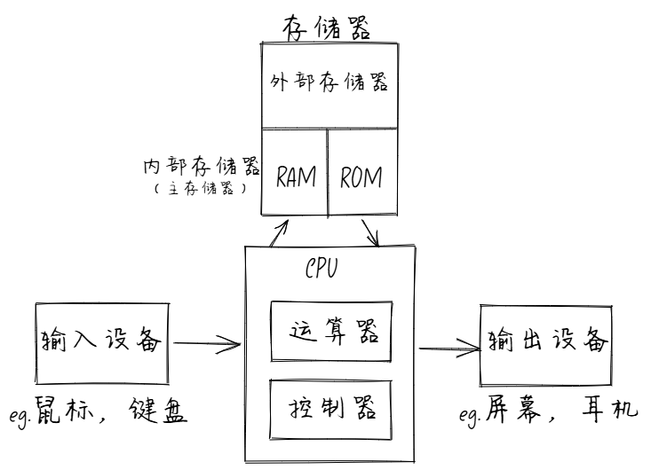
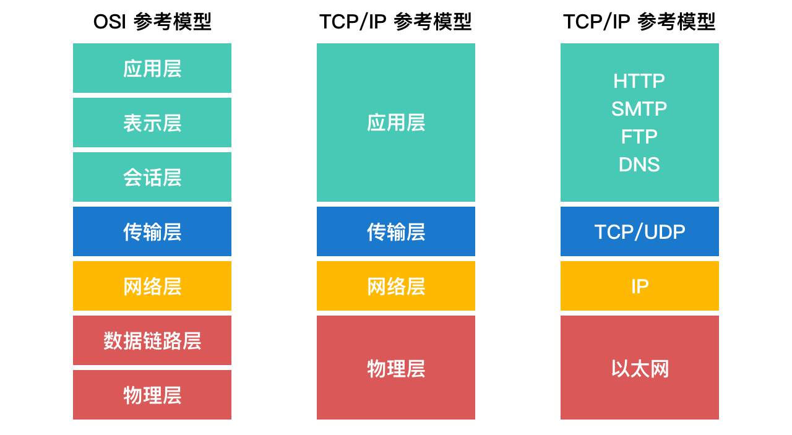

## 进程和线程的区别

**进程**是操作系统中一个正在运行的程序，每个进程都有自己的地址空间、内存、文件描述符等资源。

**线程**是进程中的一个执行单元，是 cpu 调度的最小单元，共享进程的资源，但有自己的独立执行流。

二者的区别

- 进程拥有独立的堆栈空间和数据段，需要分配独立的地址空间，开销大
- 线程开销小，切换快，没进程安全，从通信机制上看，线程可以共享数据段
- 进程中的任意一线程执行出错，都会导致整个进程的崩溃
- 线程是依附于进程的，而进程中使用多线程并行处理能提升运算效率
- 当一个进程关闭之后，操作系统会回收进程所占用的内存
- 进程之间的内容相互隔离

举例

- 浏览器中一个 tab 就是一个进程，进程中某个线程崩了，整个进程就会崩，但是这不会影响其他的进程，因此进程之间相对独立
- Nginx 或 Nodejs PM2 开启的多个 instance 是进程，每个 instance 之间不能共享内存数据
- JS 中 WebWorker 是一个线程，它可以和和主线程共享内存数据，独立运行不阻塞 UI

## 进程间的通信

进程间通信（Inter-Process Communication，IPC）是指在操作系统中，不同进程之间交换信息和数据的过程，常见的进程通信方式包括：

- 管道：用于单向或双向通信
- 消息队列：允许进程通过信息传递进行通信
- 共享内存：多个进程可以访问同一块内存区域
- 信号量：用于进程间的同步
- 套接字：用于网络通信

线程间通信与进程间通信类似，但由于线程之间共享进程的资源，线程间通信通常比进程间通信更高效

## 单核 CPU 如何实现并发

单核CPU 主要是通过时间片轮转和上下文切换来实现并发

时间片轮转

- CPU将时间划分为很小的时间片，通常是几十毫秒
- 每个进程、线程分配到一个时间片
- CPU轮流执行每个进程、线程的时间片
- 当一个时间片用完，CPU就会切换到下一个进程、线程

上下文切换

- 在切换进程、线程时，CPU需要保存当前进程的状态（上下文），包括
  - 程序计数器的值
  - 寄存器的值
  - 内存映射信息
- 加载下一个要执行的进程、线程的上下文

> 在任意时刻，CPU只能执行一个任务，由于切换速度非常快，给用户的感觉就像是在同时运行多个程序，所以这种机制被称为“伪并发”，若线程过多也不好，频繁的上下文切换会带来一定的性能开销，所以过多的线程反而会带来性能下降的问题

## CPU 调度算法有哪些？

- 先来先服务（First Come First Serve）
  - 最简单的调度算法
  - 进程按到达的顺序排队，先到达的先执行
  - 缺点：可能导致长时间的等待，特别是当一个长进程在队列前面时
- 短作业优先（Shortest Job First）
  - 优先执行预计运行时间最短的进程
  - 可以是非抢占式或是抢占式（shortest Remaining Time First，SRTF）
  - 可能导致“饥饿”现象，即长作业可能永远得不到执行
- 优先级调度（Priority Scheduling）
  - 每个进程分配一个优先级，优先级高的进程先执行
  - 也可能导致“饥饿”现象，通常使用老化（aging）技术来解决
- 轮转调度（Round Robin）
  - 每个进程分配一个固定的时间片，时间片用完后，进程被放到队列的末尾
  - 适用于时间共享系统
  - 时间片的大小对系统性能有很大影响
- 多级队列调度（Multilevel Queue Scheduling）
  - 将进程分成多个队列，每个队列有不同的优先级
  - 不同队列可以使用不同的调度算法
- 多级反馈队列调度（Multilevel Feedback Queue）
  - 允许进程在不同的队列之间移动
  - 根据进程的行为动态调整其优先级

## linux 如何查找你的进程占用的那个端口

使用 netstat 命令

```bash
# 查看所有端口占用情况
netstat -tunlp
# 查看特定端口，比如 8080
netstat -tunlp | grep 8080
```

- t - tcp 协议；u - udp 协议；n - 显示端口号；l - 仅显示监听端口；p - 显示进程信息

使用 lsof 命令

```bash
# 查看特定端口，比如 8080
lsof -i :8080
```

- i - 显示网络连接

## 单核服务器连接数超载了怎么办

- 优化代码和查询

  确保应用程序代码和数据库查询是高效的，以减少每个连接的资源消耗

- 使用负载均衡

  将流量分配到多个服务器上，以分散负载

- 增加连接池

  使用连接池来管理数据库连接，减少连接的创建和销毁开销

- 限制连接数

  配置服务器以限制每个客户端的最大连接数，以防止单个客户端占用过多资源

- 使用缓存

  利用缓存机制（如 Redis，Memcached）来减少对数据库的访问次数

## 请简述一个编译器的执行过程。前端有哪些常见的编译工具？

编译器的执行过程

1. 词法分析
   - 将源代码转换为一系列的标记（tokens），这些标记是编程语言的基本语法单位
2. 语法分析
   - 根据语言的语法规则，将标记序列转换为语法书（parse tree），也称为抽象语法树（AST）
3. 语义分析
   - 检查语法树是否符合语言的语义规则，例如类型检查，作用域检查等
4. 中间代码生成
   - 将语法树转换为中间代码，这种代码通常独立于机器
5. 代码优化
   - 对中间代码进行优化，以提高程序的执行效率
6. 目标代码生成
   - 将中间代码转换为目标机器代码
7. 代码生成后优化 - 对生成的目标代码进行进一步优化
   > 编译器的目的是将我们编写的源码转换为机器码（目标代码），以便计算机能够读懂执行

前端常见的编译工具

- Babel
  - 用于将现代 JavaScript 代码转换为向后兼容的版本
- TypeScript Compiler
  - 将 TypeScript 代码转换为 JavaScript
- Sass/SCSS
  - 将 Sass/SCSS 代码转换为 CSS
- Webpack
  - 用于打包 JavaScript 模块，并支持多种编译和转换插件

## 什么是编译型语言和解释型语言，他们有什么区别？

高级编程语言分为解释型语言和编译型语言

编译型语言

- 常见编译型语言：C，C++，Java，Go，Rust
- 执行方式：编译型语言的代码在运行期间由编译器一次性翻译成机器码，生成的机器码可以在目标机器上运行
- 优点：代码在运行前就已经被翻译成机器码，运行速度通常更快
- 缺点：需要编译步骤，开发和调试过程可能较慢

解释型语言

- 常见解释性语言：JavaScript，Python，Ruby，PHP
- 执行方式：解释型语言的代码在运行期间由解释器逐行翻译成机器码并执行。这意味着每次运行程序时，代码都需要被重新解释
- 优点：由于不需要编译成机器码，开发和调试过程通常更快，更灵活
- 缺点：运行速度通常比编译型语言慢，因为每次执行都需要进行翻译

编译型语言和解释型语言的区别

- 执行速度：编译型语言通常比解释型语言快，因为他们直接运行机器码
- 开发灵活性：解释型语言通常更灵活，适合快速开发和迭代
- 错误检测：编译型语言在编译阶就可以捕获更多的语法和类型错误，而解释型语言通常在运行时才发现错误

> 举个🌰：读一门外文著作，编译型语言就是给你将这本著作翻译成中文，然后你就可以直接看中文了。解释型语言就是给你一个翻译，一边看一边翻译，下次看仍需要翻译

JIT（Just-In-Time）编译

为了结合编译型和解释型语言的优点，JIT 随之诞生，可以理解为“即时编译”

- 执行方式：JIT 编译在程序运行时将部分代码编译成机器码，而不是逐行解释，这种编译方式在代码即将被执行时进行，因此得名“即时编译”
- 应用场景：现代 JavaScript 引擎（如 V8 引擎）通常使用 JIT 编译来提高性能，包括 Java 虚拟机（JVM）也会使用 JIT 编译来提高性能

## 简述 JS 垃圾回收的过程。用什么算法？

垃圾回收（Garbage Collection, GC）是自动管理内存的过程。JavaScript 引擎会自动检测不再使用的对象，并释放它们所占用的内存。常用的垃圾回收算法是标记-清除（Mark-and-Sweep）算法。

垃圾回收过程

1. 标记阶段

- 垃圾回收器会从根对象（如全局对象、局部变量）开始，遍历所有对象，标记所有可达的对象
- 可达对象：从根对象可以通过引用链访问到的对象

2. 清除阶段

- 标记阶段结束后，所有未被标记的对象被视为不可达对象
- 垃圾回收器会清除这些不可达对象，释放它们所占用的内存

常用算法

- 标记-清除
  - 最常用的垃圾回收算法
- 引用计数
  - 每个对象有一个引用计数器，当对象被引用时，计数器加1，当对象不再被引用时，计数器减1，当引用计数为 0 时，表示该对象不再被使用，可以被回收。无法解决循环引用的问题，如今已很少使用
- 分代回收
  - 现代 JavaScript 引擎通常使用分代回收策略，将内存分为新生代和老生代。新生代存储生命周期短的对象，老生代存储生命周期长的对象。不同代的对象使用不同的回收策略，以提高效率。

参考资料

- https://juejin.cn/post/7432127587918282792
- https://juejin.cn/post/6844904182512615432

## 什么是内存泄漏？如何排查？JS 内存泄漏的常见原因？

内存泄露是指在程序运行过程中，程序未能释放不再使用的内存空间，导致内存资源被浪费。

排查内存泄露

1. 使用内存分析工具
   - 浏览器开发者工具：Chrome 的 DevTools 提供了内存分析工具 Memory，可以监控内存使用情况
   - 也可以结合 setInterval 使用 console.memory 查看内存使用的快照
2. 代码审查
   - 检查代码中是否有未释放的事件监听器，定时器，全局变量，确保不再需要某对象时，即使解除引用
3. 性能监控
   - 监控应用程序的内存使用情况，观察是否有持续增长的趋势
   - 使用日志记录内存使用情况，帮助识别内存泄露的模式

JS 内存泄露的常见原因

1. 意外的全局变量
   - 忘记使用 var，let，const 声明变量时，变量会被挂载到全局对象上
2. 闭包
   - 闭包中引用了不再需要的外部变量，导致这些变量无法被垃圾回收
3. 未清理的 DOM 引用
   - 删除 DOM 元素时，未能清理相关的事件监听器或引用
4. 定时器和回调
   - 未能清理不再需要的 setInterval 或 setTimeout 回调

## 简述 JS 运行时的堆栈内存模型？

在 JS 运行时，内存管理主要依赖于堆（Heap）和栈（Stack）两种数据结构

栈（Stack）

- 特点：栈是一种后进先出（LIFO）的数据结构，用于存储函数调用和原始数据类型
- 用途：当函数被调用时，相关的执行上下文（包括局部变量，函数参数）会被压入栈中，当函数执行完毕后，栈顶的执行上下文会被弹出栈
- 限制：栈内存的空间大小通常十分有限，适合存储生命周期短，大小固定的数据（比如无限递归不断创建栈帧，会导致爆栈）

堆（Heap）

- 特点：堆是一种动态内存分配的，无序的数据结构，用于存储对象和复杂数据类型
- 用途：堆用于存储动态分配的内存，比如对象，数组，函数等
- 限制：堆内存的分配和释放速度较慢，容易导致内存碎片化

这里用一段 js 代码画图举例

```js
let a = 1
let obj = {
  name: 'Heap',
}

function foo() {
  let b = 2
  console.log(b)
  function bar() {
    let c = 3
    console.trace()
    console.log(c)
  }
  bar()
}

foo()
```


栈

- 调用栈用于跟踪程序执行的活动函数。每当一个函数被调用时，它的执行上下文会被推入调用栈。当函数执行完毕后，它的执行上下文会从调用栈中弹出。
- 在这个例子中，最初的调用栈会包含一个匿名的全局执行上下文（anonymous），然后是 foo 函数的执行上下文，最后是 bar 函数的执行上下文。
- 当 bar 函数执行完毕后，它的执行上下文会被弹出调用栈，然后 foo 函数的执行上下文也会被弹出调用栈，最后全局执行上下文也会被弹出调用栈。

堆

- 全局存储的 obj 对象，在栈中仅仅是一个引用地址，真正的对象存储在堆中。

## 冯·诺依曼架构是什么？

冯·诺依曼架构确定了现代计算机结构中的五大部件：

1. 输入设备: 键盘，鼠标，摄像头等
2. 输出设备: 显示器，打印机，扬声器等
3. 存储器: 计算机的记忆装置，主要存放数据和程序。分为内部存储器（内存/主存储器）和外部存储器（硬盘，光盘，U盘等）
   - 内存：也称之为主存储器，又分为随机存储器（RAM）和只读存储器（ROM）
     - RAM 存放的是计算机在通电运行的过程中即时的数据，计算机的内存容量就是指的 RAM 的容量。RAM 可读，可写，断电会数据丢失
     - ROM 存放的是每次计算机开机都需要处理的，固定不变的程序和数据，比如 BIOS 程序。ROM 可读，不可写，断电不会丢失
   - 外存：外存是硬盘，是计算机的辅助存储器，可以长期保存数据，断电不会丢失。当计算机需要从外存读取数据时，需要将数据从外存读取到内存中，然后才能下一步处理。根据介质不同，外存可分为软盘，硬盘，光盘。硬盘最为常见，硬盘又分为机械硬盘（HD）和固态硬盘（SSD）。
4. 运算器: 算术逻辑单元（ALU），负责执行算术和逻辑运算
5. 控制器: 控制整个计算机系统的工作流程，包括指令的执行顺序，数据传输等，运算器和控制器通常集成在一起，就是我们熟知的 CPU



> 图中的箭头流向是数据流向。数据从输入设备进入到计算机，存放在存储器中，控制器负责控制运算器对存储器中的数据进行运算，运算的结果再次放入存储器中，通过控制器将存储器中的计算结果输出到输出设备。

## 计算机内部为何使用二进制？

- 硬件实现简单：二进制只需要两个状态，通常用电压的高低来表示（如高电压表示 1，低电压表示 0）。这种简单的状态切换使得硬件电路设计更为简单和可靠
- 抗干扰能力强：在电路中，二进制的两个状态（0 和 1）可以通过明显的电压差来区分，这使得系统对噪声和干扰的容忍度更高，数据传输更稳定
- 逻辑运算方便：计算机的基本运算是逻辑运算，二进制系统与布尔代数非常契合，能够进行与，或，非等逻辑运算，简化了计算机的设计和操作
- 存储和处理效率高：二进制数据在计算机中可以直接存储和处理，避免了其他进制系统转换带来的复杂性和效率损失
- 历史和标准化：从计算机发展的早期，二进制就被广泛采用，形成了标准化的设计和技术积累，进一步推动了其普及和应用

## 二进制如何表示负数和小数？

表示负数
下面用 8 位二进制数 -2 举例

1. 求补码

```js
  - 2 的原码：0000 0010 // 原码就是最简单的表示方法
  - 2 的反码：1111 1101 // 反码是原码的反向
  - 2 的补码：1111 1110 // 补码是反码加 1
```

1111 1110 就是 -2 的二进制

2. 模减

```js
  - 模：2 ^ 8 = 256
  - 256 - 2 = 254
```

254 的二进制就是 -2 的二进制 1111 1110

表示小数
下面用 10.625 转换为二进制举例

1. 整数部分

- 将整数部分除以2，记录余数，直到商为0。余数的逆序即为二进制表示。

```js
  - 10 / 2 = 5 余 0
  - 5 / 2 = 2 余 1
  - 2 / 2 = 1 余 0
  - 1 / 2 = 0 余 1
```

逆序排列：1010

2. 小数部分

- 将小数部分乘以2，记录整数部分，直到小数部分为0或达到所需的精度。整数部分的顺序即为二进制表示。

```js
  - 0.625 * 2 = 1.25 取整 1
  - 0.25 * 2 = 0.5 取整 0
  - 0.5 * 2 = 1 取整 1
```

顺序排列：0.101

10.625 的二进制就是 1010.101

## 什么是虚拟内存，为何要使用虚拟内存？

什么是虚拟内存？

虚拟内存相对物理内存，它是一种计算机内存管理技术，它为每个进程提供了一个连续的地址空间，使得进程可以认为自己拥有一个完整的，连续的内存空间，而实际上，这个空间可能是分散的，并且部分可以存储在外存中

为什么使用虚拟内存？

1. 扩展内存容量：虚拟内存允许计算机使用硬盘空间来扩展物理内存的容量，即使物理内存不足，程序也可以运行，因为不常用的数据可以被交换到磁盘上
2. 内存保护：每个进程都有自己的虚拟地址空间，防止一个进程访问另一个进程的内存，提供了内存保护
3. 简化内存管理：程序员不需要担心物理内存的分配和管理，操作系统负责将虚拟地址映射到物理地址
4. 多任务处理：通过虚拟内存，多个进程可以同时运行，操作系统可以在它们之间切换，提供多任务处理能力
5. 程序加载和执行的灵活性：程序可以被分成多个部分，只有需要的部分才会被加载到内存中，减少了内存的使用

## 什么是 Unicode 编码？它和常见的 UTF-8 有什么关系？

- Unicode 俗称万国码，它为每个字符提供了一个唯一的数字标识，这个数字标识被称为码点。Unicode 的出现就是为了解决 ASCII 编码的局限性，ASCII 编码只能表示 128 个字符，全球各个国家的字符远不止 128 个，所以 Unicode 应运而生。

- Unicode 的定义了一个字符集和一系列编码方案（UTF-8，UTF-16，UTF-32），UTF-8 是 Unicode 最常用的编码方案，它是一种变长编码，根据不同的字符，使用不同的字节数来表示。对于 ASCII 字符，使用 1 个字节表示，与 ASCII 编码兼容

- GBK 编码是一种用于中文字符的编码标准，扩展了 GB2312 编码，支持简体和繁体中文字符。GBK 编码使用 2 个字节表示一个中文字符，适合中文环境，但不支持 Unicode

## 简述计算机网络的 OSI 模型

OSI（开放系统互联）模型是一个用于理解和实现网络协议的七层概念框架。每一层都有特定的功能，并与其直接上下的层进行通信。

1. 物理层(Physical Layer)：这是OSI模型的最低层，负责设备之间的物理连接，包括通过物理介质传输原始比特流。它涉及硬件组件，如电缆、交换机和网络接口卡。

2. 数据链路层(Data Link Layer)：负责节点到节点的数据传输以及错误检测和纠正，确保数据在物理链路上的可靠传输。它分为两个子层：媒体访问控制（MAC）层和逻辑链路控制（LLC）层。

3. 网络层(Network Layer)：负责数据的路由、转发和寻址，确定数据到达目的地的最佳物理路径。像IP（互联网协议）这样的协议在这一层运行。

4. 传输层(Transport Layer)：为应用程序提供端到端的通信服务，负责错误恢复、流量控制和确保完整的数据传输。像TCP（传输控制协议）和UDP（用户数据报协议）这样的协议在这一层运行。

5. 会话层(Session Layer)：管理应用程序之间的会话，建立、维护和终止应用程序之间的连接，负责会话的检查点和恢复。

6. 表示层(Presentation Layer)：负责数据的翻译、加密和压缩，确保数据以可用的格式呈现给应用层，充当网络和应用之间的翻译器。

7. 应用层(Application Layer)：这是OSI模型的最高层，直接为终端用户应用程序提供网络服务，负责电子邮件、文件传输和网页浏览等网络服务。像HTTP、FTP和SMTP这样的协议在这一层运行。



## 一个域名对应一个 ip 吗

一个域名不一定只对应一个 IP 地址，具体情况如下：

- 单个域名对应单个 IP 地址：这是最简单的情况，一个域名解析到一个固定的 IP 地址。
- 单个域名对应多个 IP 地址：这种情况通常用于负载均衡和高可用性。通过 DNS 轮询（Round Robin DNS），一个域名可以解析到多个 IP 地址，用户的请求会被分配到不同的服务器上。
- 多个域名对应单个 IP 地址：多个域名可以指向同一个 IP 地址，这在虚拟主机中很常见。通过服务器配置，服务器可以根据请求的域名来提供不同的内容。
- CDN（内容分发网络）：CDN 服务会根据用户的地理位置将域名解析到不同的 IP 地址，以提高访问速度和可靠性。

因此，域名和 IP 地址之间的关系可以是多对多的，具体取决于网络架构和配置。

## 数组和链表有什么区别？从内存结构上来说

- 数组：
  - 连续内存分配：数组在内存中是连续分配的，这意味着数组的所有元素在内存中是紧挨着的。
  - 随机访问：由于数组的连续性，可以通过索引直接访问任意元素，访问速度快，时间复杂度为 O(1)。
  - 固定大小：数组的大小在创建时就确定了，不能动态调整。
- 链表：
  - 非连续内存分配：链表的每个元素（称为节点）在内存中可以是分散的，每个节点通过指针指向下一个节点。
  - 顺序访问：访问链表中的元素需要从头节点开始，逐个遍历，访问速度较慢，时间复杂度为 O(n)。
  - 动态大小：链表可以动态调整大小，方便插入和删除操作。

