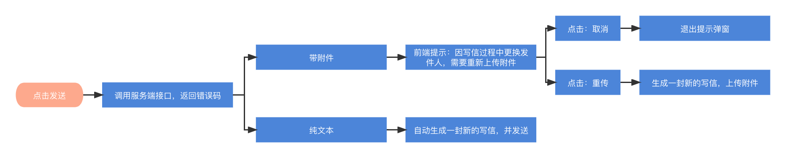
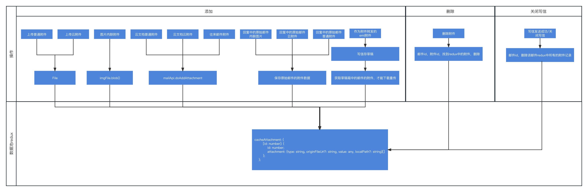
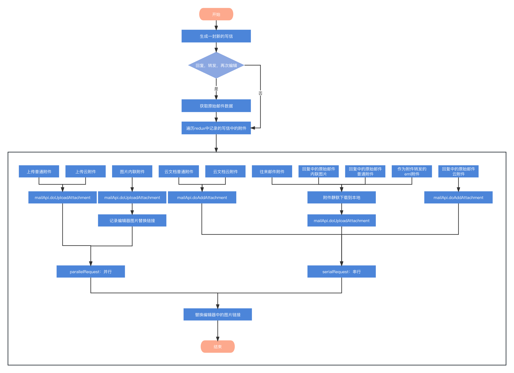

## [微前端](https://juejin.cn/post/6844904162509979662)
一种类似于微服务的架构，它将微服务的理念应用于浏览器端，即将 Web 应用由单一的单体应用转变为多个小型前端应用聚合为一的应用。各个前端应用还可以独立运行、独立开发、独立部署。微前端不是单纯的前端框架或者工具，而是一套架构体系，
* 运维层面的改造：Nginx 路由代理，简单，但是切换会触发刷线
* iframe嵌套：实现简单，天然隔离，但是SEO不友好，兼容性有问题
* NPM方案：在设计时需要将微应用打包成独立的 NPM 包，然后在主应用中引入和使用
* 动态 Script：根据导航进行微应用的切换，切换的过程会动态加载和执行 JS 和 CSS 资源
* Web Components：属于 W3C 的标准，符合微前端技术无关的特性，每个子应用有独立的js和css，需要改造历史代码，成本高
* [single-spa](https://zh-hans.single-spa.js.org/docs/getting-started-overview)
```js
// single-spa-config.js  
// 引入 single-spa 的 NPM 库包
import { registerApplication, start } from 'single-spa';  
  
// Simple usage  
// 简单使用方式，按顺序传递四个参数
registerApplication(  
  // 参数1：微应用名称标识
  'app2',  
  // 参数2：微应用加载逻辑 / 微应用对象，必须返回 Promise
  () => import('src/app2/main.js'),  
  // 参数3：微应用的激活条件
  (location) => location.pathname.startsWith('/app2'),  
  // 参数4：传递给微应用的 props 数据
  { some: 'value' }  
);  
  
// Config with more expressive API  
// 使用对象传递参数，更加清晰，易于阅读和维护，无须记住参数的顺序
registerApplication({  
  // name 参数
  name: 'app1',  
  // app 参数，必须返回 Promise
  app: () => import('src/app1/main.js'),  
  // activeWhen 参数
  activeWhen: '/app1',  
  // customProps 参数
  customProps: {  
    some: 'value',  
  }  
});  
  
start();
```
* [qiankun](https://qiankun.umijs.org/zh)： 对 single-spa 的二次封装，在 single-spa 的基础上提供了更加简单的 API 和配置项，使得开发者能更容易的实现微前端。

## [文件上传](https://juejin.cn/post/6980142557066067982)
* 大文件上传：async-pool 这个库提供的 asyncPool 函数来实现大文件的并发上传。相信有些小伙伴已经了解大文件上传的解决方案，在上传大文件时，为了提高上传的效率，我们一般会使用 Blob.slice 方法对大文件按照指定的大小进行切割，然后通过多线程进行分块上传，等所有分块都成功上传后，再通知服务端进行分块合并。

## UI标准化建设（css标准化、通用UI组件库）组件化（组件开发、npm包、单元测试、组件文档）
项目越来越大，团队越来越多，视觉规范化变得越来越重要。前端的UI标准化建设一般就是两个方向，css标准化和通用UI组件库的搭建。

#### css 标准化建设
具体来说，就是通过编码来表示一个个通用的css rule或者css声明的值，而设计师在视觉稿中标注对应的编码值，开发者只需要设置编码值即可完成css样式的设置。

* 提供全局 sass 变量。将设计同事提供的色卡、投影样式和圆角的编码表，写入 variables.scss。将文字样式等通用样式集，写入 mixin.scss。
* export.module.scss 将变量名导出，可以以Js的形式使用sass变量。
* 将 variables.scss 和 mixin.scss 收敛到统一的入口文件 common.scss 中。gatsby 配置项目中所有.scss 文件自动 import common.scss 。业务 scss 文件使用时无需手动写 import common.scss。

#### 历史代码颜色替换变量方案

1. 通过检索将整个项目中的色值（RGB、RGBA、十六进制）收集后给到UI同事。
2. UI同事对检索收集的所有色值映射到标准化定义的变量上。
3. 将UI映射规则转化为 js map。
```js
// 项目中所有 RGB、RGBA 映射为标准色值变量的 map
let rgbMap = [
  { color: "38,42,51", token: "Text-5" },
  { color: "168,170,173", token: "Text-2" },
  { color: "56,110,231", token: "Brand-6" },
  { color: "210,224,255", token: "Link-2" },
  { color: "240,240,240", token: "Fill-2_5" },
  //.....more....
];
// 项目中所有 十六进制色值 映射为标准色值变量的 map
const hexMap = [
  { token: "Brand-7", color: "#445FE5" },
  { token: "Brand-6", color: "#4C6AFF" },
  { token: "Brand-5", color: "#7088FF" },
  { token: "Brand-4", color: "#94A6FF" },
  { token: "Brand-3", color: "#B7C3FF" },
  //....more....
];
```
4. vscode 的扩展工具【Replace Rules】可以快速高效的按照正则匹配的规则替换色值。下面的代码是依据替换map 生成 Replace Rules 工具的 replacerules。
```js
// .tsx 文件替换色值变量
let exportToken = {
  "Brand-7": "brand7",
  "Brand-6": "brand6",
  //...more....
};

// 生成 【Replace Rules】工具 需要的 setting.json
let colorRules = {
  "replacerules.rules": {},
  "replacerules.rulesets": {
    "Remove lots of stuff": {
      rules: [],
    },
  },
};

const createRgbRules = () => {
  rgbMap.forEach((i) => {
    let rules =
      colorRules["replacerules.rulesets"]["Remove lots of stuff"].rules;
    let colorArr = i.color.split(",");
    const rgbCssKey = "Remove rgb(" + i.color + ") css";
    const rgbTskey = "Remove rgb(" + i.color + ") ts";
    const rgbaCssKey = "Remove rgba(" + i.color + ") css";

    colorRules["replacerules.rules"][rgbCssKey] = {
      find:
        "rgb\\(" +
        colorArr[0] +
        ",\\s*" +
        colorArr[1] +
        ",\\s*" +
        colorArr[2] +
        "\\)",
      replace: "$" + i.token,
      flags: "i",
      languages: ["css", "scss"],
    };
    colorRules["replacerules.rules"][rgbTskey] = {
      find:
        "(\"|')rgb\\(" +
        colorArr[0] +
        ",\\s*" +
        colorArr[1] +
        ",\\s*" +
        colorArr[2] +
        "\\)(\"|')",
      replace: "`${variables." + exportToken[i.token] + "}`",
      flags: "i",
      languages: ["typescript", "typescriptreact"],
    };
    colorRules["replacerules.rules"][rgbaCssKey] = {
      find:
        "rgba\\(" +
        colorArr[0] +
        ",\\s*" +
        colorArr[1] +
        ",\\s*" +
        colorArr[2] +
        ",\\s*([0-9.]+)\\)",
      replace: "rgba($color: $" + i.token + ", $alpha: $1)",
      flags: "i",
      languages: ["css", "scss"],
    };

    colorRules["replacerules.rulesets"]["Remove lots of stuff"].rules =
      rules.concat([rgbCssKey, rgbTskey, rgbaCssKey]);
  });
};

const createHexRules = () => {
  hexMap.forEach((i) => {
    let rules =
      colorRules["replacerules.rulesets"]["Remove lots of stuff"].rules;
    const hexCssKey = "Remove " + i.color + " css";
    const hexTskey = "Remove " + i.color + " ts";

    colorRules["replacerules.rules"][hexCssKey] = {
      find: i.color,
      replace: "$" + i.token,
      flags: "i",
      languages: ["css", "scss"],
    };
    colorRules["replacerules.rules"][hexTskey] = {
      find: "(\"|')" + i.color + "(\"|')",
      replace: "`${variables." + exportToken[i.token] + "}`",
      flags: "i",
      languages: ["typescript", "typescriptreact"],
    };

    colorRules["replacerules.rulesets"]["Remove lots of stuff"].rules =
      rules.concat([hexCssKey, hexTskey]);
  });
};

// 生成 colorRules
createRgbRules();
createHexRules();
```
5. 将生成的 replacerules 写入到 vscode 的 settings.json 中。同时为了快捷执行 Replace Rules 工具的替换命令，可以将替换命令配置快捷键。
```js
// settings.json
{
    "replacerules.rules": {
        "Remove rgb(38,42,51) css": {
            "find": "rgb\\(38,\\s*42,\\s*51\\)",
            "replace": "$Text-5",
            "flags": "i",
            "languages": [
                "css",
                "scss"
            ]
        },
        "Remove rgb(38,42,51) ts": {
            "find": "(\"|')rgb\\(38,\\s*42,\\s*51\\)(\"|')",
            "replace": "`${variables.text5}`",
            "flags": "i",
            "languages": [
                "typescript",
                "typescriptreact"
            ]
        },
        "Remove rgba(38,42,51) css": {
            "find": "rgba\\(38,\\s*42,\\s*51,\\s*([0-9.]+)\\)",
            "replace": "rgba($color: $Text-5, $alpha: $1)",
            "flags": "i",
            "languages": [
                "css",
                "scss"
            ]
        },
        "Remove #445FE5 css": {
            "find": "#445FE5",
            "replace": "$Brand-7",
            "flags": "i",
            "languages": [
                "css",
                "scss"
            ]
        },
        "Remove #445FE5 ts": {
            "find": "(\"|')#445FE5(\"|')",
            "replace": "`${variables.brand7}`",
            "flags": "i",
            "languages": [
                "typescript",
                "typescriptreact"
            ]
        }
        ......
    },
    "replacerules.rulesets": {
        "Remove lots of stuff": {
            "rules": [
                "Remove rgb(38,42,51) css",
                "Remove rgb(38,42,51) ts",
                "Remove rgba(38,42,51) css",
                "Remove #445FE5 css",
                "Remove #445FE5 ts"
                ......
            ]
        }
    }
}
```
```js
// keybindings.json
[
  {
    "key": "ctrl+shift+]",
    "command": "replacerules.runRuleset",
    "when": "editorTextFocus && !editorReadonly",
    "args": {
      "rulesetName": "Remove lots of stuff"
    }
  }
]
```

#### 通用UI组件库建设
大部分组件是基于antd的UI组件库定制化样式，个别比如说新手引导 Guide、icon 是自主开发的组件。

#### 组件文档生成
提供组件的介绍说明。提供组件调用的案例 usage，以及展示演示案例的源码。提供组件的属性列表 propTypes。但是，如果要把这些内容都通过 markdown 去写，不仅耗时，并且不利于维护。为了把更多的精力投入到开发更优质的组件当中，我们需要文档生成自动化。

在解析器中 react-docgen-typescript 是一个简单、功能强大并且社区活跃的工具。所以最后选择利用  react-docgen-typescript 的能力开发自动获取组件注释和类型的脚本，生成组件属性列表的表格。
另外，对于组件使用的案例，可以自动解析展示出案例的源码。采用遍历解析 React.children 生成源码。
组件描述部分支持 Markdown 语法，使用 react-markdown 插件解析展示 Markdown 的内容。

#### 组件库独立打包
为了方便维护，更是为了其他团队使用通用UI组件库，将通用UI组件从项目中独立，通过 rollup 实现独立的打包发布。主要实现的能力有：抽离对全局样式和api层方法的依赖，自动化打包发布脚本，antd类型导出，按需加载，css隔离。

## React 性能优化
* 加载时性能优化
  * 资源小一点
    * 条件编译，不同版本的包只引入当前包需要的模块
    * 模块的按需加载懒加载 @loadable/component
    * 模块的动态卸载
    * js拆分
    * css体积优化
    * 删除冗余代码、Tree Shaking
  * 请求少一点
    * 重复请求缓存结果
    * 非必要请求延迟加载
    * 可聚合请求接口改造
* 渲染时性能优化
  * 组件拆分
  * React.memo 避免不必要的函数组件渲染
  * 优化顶层组件组件的 prop/state，合理使用useMemo/useCallback
  * 邮箱列表、报表数据使用虚拟列表
* 开发阶段优化
  * fastdev 模式
  * DLL 处理第三方库，提升构建速度

#### 背景
* 100+子模块，上万组件，参与编译的源文件4w，项目运行期间加载资源总量超过50M。
* React架构，单页面，显隐控制，层级过深，上层状态的变动，导致 React 重新渲染，行成巨大的性能消耗。
* 重复的 HTTP 请求。
* 长期快速迭代中，大量的重复资源，大量的废弃的代码。

#### 数据驱动、指标先行
* 内存：利用 Electron 能力获取内容大小，并上报到埋点系统。
* HTTP请求数：api 层接口请求前统一处理，统计系统启动后15s/路由切换5s后，发起的请求数目。指标下降，意味着网路资源占用减少，不会阻塞关键接口的返回，避免页面长时间loading，同时也可以减少页面的无效渲染。
* 长任务数：new PerformanceObserver 统计大于 50ms 的任务会被记录为长任务，并上报到埋点系统。
* LCP/FCP时间：使用 Sentry 的指标，统计页面FCP（首次渲染时间：第一个内容元素对用户可见）LCP（主要内容何时对用户可见：页面中最大的可见元素在视窗内完全渲染出来的时间点）。

#### HTTP请求治理
统计应用初始化和模块切换的HTTP请求数，分析每个请求属于哪个业务，耗时多少。
* 重复请求：比如公共服务，比如权限，账号等接口，只需要应用启动的时候请求一次即可，可以使用缓存。缓存的机制，可以根据场景进行不同处理，比如有些接口一分钟缓存，有些数据可以应用生命周期只请求一次，主要取决于时效性。
* 非必要请求：与当前业务无关，延迟到对应模块加载。
* 可聚合请求：比如有些获取详情的接口，只能传id，如果想获取idlist的详情，只能多次请求，这类型可以合并为一个请求，让服务端接口支持传idlist。

最后，应用初始化请求从105个减少到49个。

#### 组件重复渲染治理
统计业务场景关键操作路径下的渲染次数，建立关键操作路径渲染次数指标。优化后渲染次数较少了30%。
* 组件拆分：颗粒度小了，依赖变的清晰，减少不必要的依赖。
* 优化顶层组件组件的 prop/state，合理使用useMemo/useCallback

#### 模块卸载
将长久不使用的模块进行卸载，释放内存。
* 模块的按需加载懒加载：@loadable/component
* 需要保持状态的组件，动态卸载：模块切换中，有些模块是需要永久缓存的，只是通过display:none 隐藏。每个模块加载都会被注册到redux中，设置最大允许缓存模块数目，当超过数目自动清除最久的模块。

#### 重复资源清理
由于业务迭代较快，大部分功能变更较多，很多旧代码未来及清理，故会造成系统的编译/运行负担，隔一段时间组织一次清理活动，对清理多的进行奖励。

#### js拆分
一共减少了15MB的js体积
* webpack optimization splitChunks 对各个模块进行分割，并提取出相同部分代码。
* 使用 babel-plugin-import 配置第三方库的按需加载，比如一些组件库，图标库、可视化引擎库。
* DLL 处理第三方库，提升构建速度：将一些字体、埋点 SDK、编辑器 tinymce 等单独打包，之后的构建过程，可以 Webpack externals 跳过这些依赖，直接 html.js 引入使用。
* 统一第三方库的版本，其他团队有的是通过npm包整合开发的，比如antd的版本可以共用一个，不需要不同团队多次引入打包。
* 条件编译，使用环境变量 process.env.BUILD_ISEDM 不同版本的包只引入当前包需要的模块。

#### css 体积优化
css 现状存在的问题
* 体积小的背景图片打包编译为base64，导致相同的图片被重复编译为base64打包。
* 有一些通用的样式集，重复使用，但没有提取为公共样式。
* 有部分sass @import  使用不规范，导致无用代码重复打包。
* 优化脚本逻辑
  * 第一步：fs.readFile 读取需要优化的css文件
  * 第二步：使用 postcss-sorting 对css属性进行排序
  * 第三步：使用 cssnano 去除空白和注释，方便匹配
  * 第四步：使用 postcss.parse 将 CSS 字符串解析为 PostCSS 的抽象语法树
  * 第五步：使用 root.walkDecls 变量 遍历 AST（抽象语法树）中的所有 CSS 声明（Declaration 节点）
    * 收集记录 background-image 的 base64 图片
    * 收集重复样式集
  * 第六步：过滤不符合条件的样式集：样式集出现次数大于propCount，属性数目大于propModlLeng，属性总长度大于allLeng
  * 第七步：格式化样式集，找个每个选择器最长的样式集。然后，遍历样式集，去除 Selector 长度大于 property
  * 第八步：使用自定义postcss插件 propertiesMerge 提取合并重复的样式集
    * 使用 root.walkRules 遍历所有的 css 声明，找到需要抽取的选择器的样式集，将样式集合并
    * 返回最新的 resultCss
  * 第九步：使用自定义postcss插件 base64Merge 提取合并重复的 base64 图片
    * 使用 root.walkRules 遍历所有的 css 声明，找到所有符合要求的base64图片删除
    * 返回最新的 resultCss
  * 第十步：cssnano 压缩，将优化后css写入文件
```js
// 优化css的脚本
const cssnanoPresetAdvanced = require('cssnano-preset-advanced');
const cssnano = require('cssnano');
const postcss = require('postcss');
const sorting = require('postcss-sorting');
const fs = require('fs');
const path = require('path');

const propertiesMerge = postcss.plugin('postcss-properties-merge', (replaceSelectorPropsMap, preRules) => root => {
    const replaceMapKeys = Object.keys(replaceSelectorPropsMap);
    return new Promise((resolve, reject) => {
        try {
            root.walkRules(rule => {
                if (replaceMapKeys.includes(rule.selector)) {
                    const cssString = rule.toString();
                    if (cssString.indexOf(replaceSelectorPropsMap[rule.selector]) !== -1) {
                        const modifiedCssString = cssString.replace(replaceSelectorPropsMap[rule.selector], '');
                        rule.replaceWith(modifiedCssString);
                        if (preRules[replaceSelectorPropsMap[rule.selector]]) {
                            preRules[replaceSelectorPropsMap[rule.selector]].push(rule.selector);
                        } else {
                            preRules[replaceSelectorPropsMap[rule.selector]] = [rule.selector];
                        }
                    }
                }
            });
            resolve();
        } catch (e) {
            reject(e);
        }
    });
});

const base64Merge = postcss.plugin('postcss-base64-merge', (selectorsBase64Map, preBase64Rules) => root => {
    const base64ReplaceMapKeys = Object.keys(selectorsBase64Map);
    return new Promise((resolve, reject) => {
        try {
            root.walkDecls(decl => {
                const currentSelector = decl.parent.selector;
                if (decl.prop === 'background-image' && base64ReplaceMapKeys.includes(currentSelector) && decl.value === selectorsBase64Map[currentSelector]) {
                    decl.remove();
                    if (preBase64Rules[selectorsBase64Map[currentSelector]]) {
                        preBase64Rules[selectorsBase64Map[currentSelector]].push(currentSelector);
                    } else {
                        preBase64Rules[selectorsBase64Map[currentSelector]] = [currentSelector];
                    }
                }
            });
            resolve();
        } catch (e) {
            reject(e);
        }
    });
});

const special = ['composes', '@import', '@extend', '@mixin', '@at-root'];
const positioning = ['position', 'top', 'right', 'bottom', 'left', 'z-index'];
const boxModel = [
    'display',
    'flex',
    'flex-basis',
    'flex-direction',
    'flex-flow',
    'flex-grow',
    'flex-shrink',
    'flex-wrap',
    'grid',
    'grid-area',
    'grid-auto-rows',
    'grid-auto-columns',
    'grid-auto-flow',
    'grid-gap',
    'grid-row',
    'grid-row-start',
    'grid-row-end',
    'grid-row-gap',
    'grid-column',
    'grid-column-start',
    'grid-column-end',
    'grid-column-gap',
    'grid-template',
    'grid-template-areas',
    'grid-template-rows',
    'grid-template-columns',
    'gap',
    'align-content',
    'align-items',
    'align-self',
    'justify-content',
    'justify-items',
    'justify-self',
    'order',
    'float',
    'clear',
    'box-sizing',
    'width',
    'min-width',
    'max-width',
    'height',
    'min-height',
    'max-height',
    'margin',
    'margin-top',
    'margin-right',
    'margin-bottom',
    'margin-left',
    'padding',
    'padding-top',
    'padding-right',
    'padding-bottom',
    'padding-left',
    'border',
    'border-color',
    'border-style',
    'border-width',
    'border-top',
    'border-top-color',
    'border-top-width',
    'border-top-style',
    'border-right',
    'border-right-color',
    'border-right-width',
    'border-right-style',
    'border-bottom',
    'border-bottom-color',
    'border-bottom-width',
    'border-bottom-style',
    'border-left',
    'border-left-color',
    'border-left-width',
    'border-left-style',
    'border-radius',
    'border-top-left-radius',
    'border-top-right-radius',
    'border-bottom-right-radius',
    'border-bottom-left-radius',
    'border-image',
    'border-image-source',
    'border-image-slice',
    'border-image-width',
    'border-image-outset',
    'border-image-repeat',
    'border-collapse',
    'border-spacing',
    'object-fit',
    'object-position',
    'overflow',
    'overflow-x',
    'overflow-y',
];
const typography = [
    'color',
    'font',
    'font-weight',
    'font-size',
    'font-family',
    'font-style',
    'font-variant',
    'font-size-adjust',
    'font-stretch',
    'font-effect',
    'font-emphasize',
    'font-emphasize-position',
    'font-emphasize-style',
    'font-smooth',
    'line-height',
    'direction',
    'letter-spacing',
    'white-space',
    'text-align',
    'text-align-last',
    'text-transform',
    'text-decoration',
    'text-emphasis',
    'text-emphasis-color',
    'text-emphasis-style',
    'text-emphasis-position',
    'text-indent',
    'text-justify',
    'text-outline',
    'text-wrap',
    'text-overflow',
    'text-overflow-ellipsis',
    'text-overflow-mode',
    'text-orientation',
    'text-shadow',
    'vertical-align',
    'word-wrap',
    'word-break',
    'word-spacing',
    'overflow-wrap',
    'tab-size',
    'hyphens',
    'unicode-bidi',
    'columns',
    'column-count',
    'column-fill',
    'column-gap',
    'column-rule',
    'column-rule-color',
    'column-rule-style',
    'column-rule-width',
    'column-span',
    'column-width',
    'page-break-after',
    'page-break-before',
    'page-break-inside',
    'src',
];
const visual = [
    'list-style',
    'list-style-position',
    'list-style-type',
    'list-style-image',
    'table-layout',
    'empty-cells',
    'caption-side',
    'background',
    'background-color',
    'background-image',
    'background-repeat',
    'background-position',
    'background-position-x',
    'background-position-y',
    'background-size',
    'background-clip',
    'background-origin',
    'background-attachment',
    'background-blend-mode',
    'outline',
    'outline-width',
    'outline-style',
    'outline-color',
    'outline-offset',
    'box-shadow',
    'box-decoration-break',
    'transform',
    'transform-origin',
    'transform-style',
    'backface-visibility',
    'perspective',
    'perspective-origin',
    'visibility',
    'cursor',
    'opacity',
    'filter',
    'isolation',
    'backdrop-filter',
    'mix-blend-mode',
];
const animation = [
    'transition',
    'transition-delay',
    'transition-timing-function',
    'transition-duration',
    'transition-property',
    'animation',
    'animation-name',
    'animation-duration',
    'animation-play-state',
    'animation-timing-function',
    'animation-delay',
    'animation-iteration-count',
    'animation-direction',
    'animation-fill-mode',
];
const misc = [
    'appearance',
    'content',
    'clip',
    'clip-path',
    'counter-reset',
    'counter-increment',
    'resize',
    'user-select',
    'nav-index',
    'nav-up',
    'nav-right',
    'nav-down',
    'nav-left',
    'pointer-events',
    'quotes',
    'touch-action',
    'will-change',
    'zoom',
    'fill',
    'fill-rule',
    'clip-rule',
    'stroke',
];
const order = [].concat(special, positioning, boxModel, typography, visual, animation, misc);

const cssFilePath = 'styles.e529496289897d581529.css';
const cssNewFilePath = 'styles-new.css';
const reportPath = 'style-report.json';

const selectorsBase64Map = {};
const replaceSelectorPropsMap = {};

const niceStyle = (propCount, propModlLeng, allLeng) => {
    return new Promise((resolve, reject) => {
        fs.readFile(cssFilePath, 'utf8', async(err, css) => {
            if (err) {
                console.error(err);
                return;
            }

            // 属性排序
            const sortResult = await postcss([
                sorting({
                    'properties-order': order,
                }),
            ]).process(css, {
                from: undefined,
            });

            // 去除空白，注释
            const miniResult = await postcss([cssnano]).process(sortResult, {
                from: undefined,
            });

            // 分析css代码
            const root = postcss.parse(miniResult);
            let currentSelector = ''; // 当前选择器
            let propertyList = [];
            const propertyCount = {}; // 整个css代码的样式集的出现次数
            const propertyModule = {}; // 整个css代码的样式集的选择器映射
            const base64Map = {};
            root.walkDecls(decl => {
                // 收集background-image 的 base64 图片
                if (decl.prop === 'background-image' && decl.value.indexOf('base64') !== -1 && decl.parent.type !== 'atrule' && decl.parent.parent.type !== 'atrule') {
                    if (base64Map[decl.value]) {
                        base64Map[decl.value].push(decl.parent.selector);
                    } else {
                        base64Map[decl.value] = [decl.parent.selector];
                    }
                }

                // 收集重复样式集
                const declValue = decl.value.indexOf('base64') !== -1 ? 'base64:aaaa' : decl.value;
                if (!currentSelector || currentSelector === decl.parent.selector) {
                    propertyList.push(`${decl.prop}:${declValue};`);
                } else {
                    propertyList = [`${decl.prop}:${declValue};`];
                }
                const reversedPropertyList = Array.from(propertyList).reverse();
                const propertyJoinStr = [];
                for (let i = 0; i < reversedPropertyList.length; i++) {
                    propertyJoinStr.push(reversedPropertyList[i] + (propertyJoinStr[i - 1] || ''));
                }
                propertyJoinStr.forEach(_ => {
                    if (propertyModule[_]) {
                        propertyModule[_].push({ selector: decl.parent.selector });
                    } else {
                        propertyModule[_] = [{ selector: decl.parent.selector }];
                    }

                    if (!propertyCount[_]) {
                        propertyCount[_] = 0;
                    }
                    // eslint-disable-next-line no-plusplus
                    propertyCount[_]++;
                });
                currentSelector = decl.parent.selector;
            });

            // 筛选符合替换条件的样式集
            const filterPropertyModule = {};
            const filterPropertyCount = {};
            Object.keys(propertyCount).forEach(_ => {
                if (propertyCount[_] > propCount && _.split(';').length > propModlLeng && _.length * propertyCount[_] > allLeng) {
                    filterPropertyModule[_] = propertyModule[_];
                    filterPropertyCount[_] = propertyCount[_];
                }
            });
            // 将筛选后的样式集，格式化为 {selector: property}，并且每个 selector 只存最长的 property
            const replaceSelectorMap = {};
            Object.keys(filterPropertyModule).forEach(props => {
                const selectors = filterPropertyModule[props];
                selectors.forEach(({ selector }) => {
                    if (replaceSelectorMap[selector]) {
                        if (replaceSelectorMap[selector].length < props.length) {
                            replaceSelectorMap[selector] = props;
                        }
                    } else {
                        replaceSelectorMap[selector] = props;
                    }
                });
            });
            // 去除 Selector 长度大于 property
            Object.keys(replaceSelectorMap).forEach(selec => {
                if (selec.length < replaceSelectorMap[selec].length) {
                    replaceSelectorPropsMap[selec] = replaceSelectorMap[selec];
                }
            });

            // 筛选重复使用的base64图片
            const repeatedBase64Map = {}; // 过滤出
            const repeatedBase64Count = {};
            Object.keys(base64Map).forEach(_ => {
                if (base64Map[_].length > 1) {
                    repeatedBase64Map[_] = base64Map[_];
                    repeatedBase64Count[_] = base64Map[_].length;
                }
            });
            // 将筛选后的样式集，格式化为 {selector: base64}，并且每个 selector 只存最长的 base64
            Object.keys(repeatedBase64Map).forEach(props => {
                const selectors = repeatedBase64Map[props];
                selectors.forEach(selector => {
                    if (selectorsBase64Map[selector]) {
                        if (selectorsBase64Map[selector].length < props.length) {
                            selectorsBase64Map[selector] = props;
                        }
                    } else {
                        selectorsBase64Map[selector] = props;
                    }
                });
            });

            // 写入报告文件
            fs.writeFile(reportPath, `${JSON.stringify(replaceSelectorPropsMap)} ${JSON.stringify(repeatedBase64Map)}`, 'utf8', _err => {
                if (_err) {
                    console.error(_err);
                    return;
                }
                console.log('报告已写入');
            });

            console.log('miniResult', miniResult.css.length);
            // 优化css代码
            // 删除提取重复的样式集
            const preRules = {};
            const replaceResult = await postcss([propertiesMerge(replaceSelectorPropsMap, preRules)]).process(miniResult, {
                from: undefined,
            });
            let preRulesStr = '';
            Object.keys(preRules).forEach(_ => {
                const selectorStr = preRules[_].join(',');
                preRulesStr += `${selectorStr}{${_}}`;
            });

            console.log('replaceResult', (preRulesStr + replaceResult.css).length);

            // 合并相同的base64图片
            const preBase64Rules = {};
            const base64MergeResult = await postcss([base64Merge(selectorsBase64Map, preBase64Rules)]).process(replaceResult.css, {
                from: undefined,
            });
            let preBase64RulesStr = '';
            Object.keys(preBase64Rules).forEach(_ => {
                const selectorStr = preBase64Rules[_].join(',');
                preBase64RulesStr += `${selectorStr}{background-image:${_};}`;
            });
            console.log('base64MergeResult', (preBase64RulesStr + preRulesStr + base64MergeResult.css).length);


            // css代码压缩优化
            const nanoResult = await postcss(cssnano({
                preset: cssnanoPresetAdvanced
            })).process(preBase64RulesStr + preRulesStr + base64MergeResult.css, {
                from: undefined,
            });
            resolve(nanoResult.css.length);
            // console.log(nanoResult.css.length);
            console.log('nanoResult', nanoResult.css.length);

            // 写入文件新的css文件
            fs.writeFile(cssNewFilePath, nanoResult.css, 'utf8', _err => {
                if (_err) {
                    console.error(_err);
                    return;
                }
                console.log('CSS文件已更新并压缩');
            });
        });
    })
}

// niceStyle(9, 3, 600);

module.exports = niceStyle;
```

## 多账号绑定附件重传
首先，多账号是邮箱客户端的基本能力，并且线上用户频繁反馈不能绑定个人邮箱账号的工单。另外，支持外贸通的售卖，具备支持外部邮箱能力后，外贸通可以售卖第三方邮箱客户。多账号的场景下，因为写信中上传的附件与发件人是绑定的，当切换发件人时，需要重新生成一封新写信，并对原始信件中的附件重新上传到当前发件人下。

1. **切换发件人发信的业务逻辑**

1. **附件管理：记录用户写信中添加、取消、删除的附件**

1. **附件重传逻辑**


## [暗黑主题](https://juejin.cn/post/7379960023407738892)
#### 难点
1. 迭代了三年的大型跨端项目
2. UI没有标准化规范，甚至没有标准的色值体系
3. css代码规范混乱，某个元素的样式被全局默认样式，行内样式，外部样式共同作用下，利用优先级关系来实现最后的展示效果。并且部分样式结合了很多业务逻辑，不同的场景下设置了不同的样式，需要梳理业务逻辑
4. antd 版本过低 & antd 高度定制

#### 方案调研
* mix-blend-mode 的 difference：DarkMode.js
* CSS-in-JS：React-styled-components
* sass 变量 + mixin
* Less + 类名
* zougt/some-loader-utils + sass
* css3 Variables

#### 亮点
* postcss-custom-properties 来解决 css Variables 的兼容性问题
* 检测系统主题
```js
if (window.matchMedia('(prefers-color-scheme: dark)').matches) {
    className = 'lx-theme-dark';
}
```
* 渐进式可控优化：ant-allow-dark、extheme


## [中英文](https://juejin.cn/post/7390339205984141366)
1. 读取 git commit 中的增量代码文件路径
```js
const getGitResult = command =>  new Promise((res, rej) => {    
    // eslint-disable-next-line consistent-return    
    exec(command, (err, stdout) => {      
        if (err) {        
            return rej(err);      
        }      
        res(stdout.trim());    
    });  
});

preHead = await getGitResult(`git rev-parse HEAD~${argv.order}`); 
const curHead = await getGitResult('git rev-parse HEAD');  
// 获取所有发生变化的文件
const diffFiles = await getGitResult(`git diff --name-only ${curHead} ${preHead}`);  
const files = diffFiles.split(/\n/);  
```
2. 文案替换
```js
const res = await jscodeshift(transformPath, filepath, options);    
```

## [fastdev](https://juejin.cn/post/7390188382212587556)
jscodeshift：jscodeshift 是一个基于 codemod 理念的 JavaScript/TypeScript 重构工具，其原理是将 JS/TS 代码解析为抽象语法树（Abstract Syntax Tree，AST），并提供一系列用于访问和修改 AST 的 API 以实现自动化的代码重构。使用 jscodeshift 可以进行一系列代码转换操作，比如替换变量名、修改函数调用、重构类定义等。它可以帮助开发人员快速而准确地进行大规模的代码修改，尤其适用于需要对遗留代码进行更新或者升级的情况。

## 快照 PageSpy
https://pagespy.huolala.cn/

## [动态表单form-generator](https://juejin.cn/post/6971351044412407822)
#### <vue-form-generator :schema="schema" />
1. 将 schema 转换为表单组件，支持动态渲染。schema 会被复制一份给 formConfCopy。先 renderFrom 生成 <el-form></el-form>
```js
render(h) {
  return renderFrom.call(this, h)
}

function renderFrom(h) {
  const { formConfCopy } = this

  return (
    <el-row gutter={formConfCopy.gutter}>
      <el-form
        size={formConfCopy.size}
        label-position={formConfCopy.labelPosition}
        disabled={formConfCopy.disabled}
        label-width={`${formConfCopy.labelWidth}px`}
        ref={formConfCopy.formRef}
        // model不能直接赋值 https://github.com/vuejs/jsx/issues/49#issuecomment-472013664
        props={{ model: this[formConfCopy.formModel] }}
        rules={this[formConfCopy.formRules]}
      >
        {renderFormItem.call(this, h, formConfCopy.fields)}
        {formConfCopy.formBtns && formBtns.call(this, h)}
      </el-form>
    </el-row>
  )
}
```
2. renderFormItem
```js
// 布局 & renderFormItem
const layouts = {
  colFormItem(h, scheme) {
    const config = scheme.__config__
    const listeners = buildListeners.call(this, scheme)

    let labelWidth = config.labelWidth ? `${config.labelWidth}px` : null
    if (config.showLabel === false) labelWidth = '0'
    return (
      <el-col span={config.span}>
        <el-form-item label-width={labelWidth} prop={scheme.__vModel__}
          label={config.showLabel ? config.label : ''}>
          <render conf={scheme} {...{ on: listeners }} />
        </el-form-item>
      </el-col>
    )
  },
  rowFormItem(h, scheme) {
    let child = renderChildren.apply(this, arguments)
    if (scheme.type === 'flex') {
      child = <el-row type={scheme.type} justify={scheme.justify} align={scheme.align}>
              {child}
            </el-row>
    }
    return (
      <el-col span={scheme.span}>
        <el-row gutter={scheme.gutter}>
          {child}
        </el-row>
      </el-col>
    )
  }
}
// renderFormItem
function renderFormItem(h, elementList) {
  return elementList.map(scheme => {
    const config = scheme.__config__
    const layout = layouts[config.layout]

    if (layout) {
      return layout.call(this, h, scheme)
    }
    throw new Error(`没有与${config.layout}匹配的layout`)
  })
}
```
3. 表单元素 <render conf={scheme} {...{ on: listeners }} />
```js
import { deepClone } from '@/utils/index'

const componentChild = {}
/**
 * 将./slots中的文件挂载到对象componentChild上
 * 文件名为key，对应JSON配置中的__config__.tag
 * 文件内容为value，解析JSON配置中的__slot__
 */
const slotsFiles = require.context('./slots', false, /\.js$/)
const keys = slotsFiles.keys() || []
keys.forEach(key => {
  const tag = key.replace(/^\.\/(.*)\.\w+$/, '$1')
  const value = slotsFiles(key).default
  componentChild[tag] = value
})

function vModel(dataObject, defaultValue) {
  dataObject.props.value = defaultValue

  dataObject.on.input = val => {
    this.$emit('input', val)
  }
}

function mountSlotFlies(h, confClone, children) {
  const childObjs = componentChild[confClone.__config__.tag]
  if (childObjs) {
    Object.keys(childObjs).forEach(key => {
      const childFunc = childObjs[key]
      if (confClone.__slot__ && confClone.__slot__[key]) {
        children.push(childFunc(h, confClone, key))
      }
    })
  }
}

function emitEvents(confClone) {
  ['on', 'nativeOn'].forEach(attr => {
    const eventKeyList = Object.keys(confClone[attr] || {})
    eventKeyList.forEach(key => {
      const val = confClone[attr][key]
      if (typeof val === 'string') {
        confClone[attr][key] = event => this.$emit(val, event)
      }
    })
  })
}

function buildDataObject(confClone, dataObject) {
  Object.keys(confClone).forEach(key => {
    const val = confClone[key]
    if (key === '__vModel__') {
      vModel.call(this, dataObject, confClone.__config__.defaultValue)
    } else if (dataObject[key]) {
      dataObject[key] = { ...dataObject[key], ...val }
    } else {
      dataObject.attrs[key] = val
    }
  })

  // 清理属性
  clearAttrs(dataObject)
}

function clearAttrs(dataObject) {
  delete dataObject.attrs.__config__
  delete dataObject.attrs.__slot__
  delete dataObject.attrs.__methods__
}

function makeDataObject() {
  return {
    attrs: {},
    props: {},
    nativeOn: {},
    on: {},
    style: {}
  }
}

export default {
  props: {
    conf: {
      type: Object,
      required: true
    }
  },
  render(h) {
    const dataObject = makeDataObject()
    const confClone = deepClone(this.conf)
    const children = []

    // 如果slots文件夹存在与当前tag同名的文件，则执行文件中的代码
    mountSlotFlies.call(this, h, confClone, children)

    // 将字符串类型的事件，发送为消息
    emitEvents.call(this, confClone)

    // 将json表单配置转化为vue render可以识别的 “数据对象（dataObject）”
    buildDataObject.call(this, confClone, dataObject)

    return h(this.conf.__config__.tag, dataObject, children)
  }
}
```
#### 表单生成器拖拽生成json
[Vue.Draggable](https://github.com/SortableJS/Vue.Draggable)

#### 表单生成vue代码
1. vueTemplate：遍历 scheme 拼接 html template 代码
```js
const html = vueTemplate(makeUpHtml(this.formData, type))

function vueTemplate(str) {
  return `<template>
    <div>
      ${str}
    </div>
  </template>`
}

function buildFormTemplate(scheme, child, type) {
  let labelPosition = ''
  if (scheme.labelPosition !== 'right') {
    labelPosition = `label-position="${scheme.labelPosition}"`
  }
  const disabled = scheme.disabled ? `:disabled="${scheme.disabled}"` : ''
  let str = `<el-form ref="${scheme.formRef}" :model="${scheme.formModel}" :rules="${scheme.formRules}" size="${scheme.size}" ${disabled} label-width="${scheme.labelWidth}px" ${labelPosition}>
      ${child}
      ${buildFromBtns(scheme, type)}
    </el-form>`
  if (someSpanIsNot24) {
    str = `<el-row :gutter="${scheme.gutter}">
        ${str}
      </el-row>`
  }
  return str
}

/**
 * 组装html代码。【入口函数】
 * @param {Object} formConfig 整个表单配置
 * @param {String} type 生成类型，文件或弹窗等
 */
function makeUpHtml(formConfig, type) {
  const htmlList = []
  confGlobal = formConfig
  // 判断布局是否都沾满了24个栅格，以备后续简化代码结构
  someSpanIsNot24 = formConfig.fields.some(item => item.__config__.span !== 24)
  // 遍历渲染每个组件成html
  formConfig.fields.forEach(el => {
    htmlList.push(layouts[el.__config__.layout](el))
  })
  const htmlStr = htmlList.join('\n')
  // 将组件代码放进form标签
  let temp = buildFormTemplate(formConfig, htmlStr, type)
  // dialog标签包裹代码
  if (type === 'dialog') {
    temp = dialogWrapper(temp)
  }
  confGlobal = null
  return temp
}

const layouts = {
  colFormItem(scheme) {
    const config = scheme.__config__
    let labelWidth = ''
    let label = `label="${config.label}"`
    if (config.labelWidth && config.labelWidth !== confGlobal.labelWidth) {
      labelWidth = `label-width="${config.labelWidth}px"`
    }
    if (config.showLabel === false) {
      labelWidth = 'label-width="0"'
      label = ''
    }
    const required = !ruleTrigger[config.tag] && config.required ? 'required' : ''
    const tagDom = tags[config.tag] ? tags[config.tag](scheme) : null
    let str = `<el-form-item ${labelWidth} ${label} prop="${scheme.__vModel__}" ${required}>
        ${tagDom}
      </el-form-item>`
    str = colWrapper(scheme, str)
    return str
  },
  rowFormItem(scheme) {
    const config = scheme.__config__
    const type = scheme.type === 'default' ? '' : `type="${scheme.type}"`
    const justify = scheme.type === 'default' ? '' : `justify="${scheme.justify}"`
    const align = scheme.type === 'default' ? '' : `align="${scheme.align}"`
    const gutter = scheme.gutter ? `:gutter="${scheme.gutter}"` : ''
    const children = config.children.map(el => layouts[el.__config__.layout](el))
    let str = `<el-row ${type} ${justify} ${align} ${gutter}>
      ${children.join('\n')}
    </el-row>`
    str = colWrapper(scheme, str)
    return str
  }
}

const tags = {
  'el-input': el => {
    const {
      tag, disabled, vModel, clearable, placeholder, width
    } = attrBuilder(el)
    const maxlength = el.maxlength ? `:maxlength="${el.maxlength}"` : ''
    const showWordLimit = el['show-word-limit'] ? 'show-word-limit' : ''
    const readonly = el.readonly ? 'readonly' : ''
    const prefixIcon = el['prefix-icon'] ? `prefix-icon='${el['prefix-icon']}'` : ''
    const suffixIcon = el['suffix-icon'] ? `suffix-icon='${el['suffix-icon']}'` : ''
    const showPassword = el['show-password'] ? 'show-password' : ''
    const type = el.type ? `type="${el.type}"` : ''
    const autosize = el.autosize && el.autosize.minRows
      ? `:autosize="{minRows: ${el.autosize.minRows}, maxRows: ${el.autosize.maxRows}}"`
      : ''
    let child = buildElInputChild(el)

    if (child) child = `\n${child}\n` // 换行
    return `<${tag} ${vModel} ${type} ${placeholder} ${maxlength} ${showWordLimit} ${readonly} ${disabled} ${clearable} ${prefixIcon} ${suffixIcon} ${showPassword} ${autosize} ${width}>${child}</${tag}>`
  },
}
```

2. vueScript：遍历 scheme 拼接 data rule method 等
```js
const script = vueScript(makeUpJs(this.formData, type))

function vueScript(str) {
  return `<script>
    ${str}
  </script>`
}

/**
 * 组装js 【入口函数】
 * @param {Object} formConfig 整个表单配置
 * @param {String} type 生成类型，文件或弹窗等
 */
function makeUpJs(formConfig, type) {
  confGlobal = formConfig = deepClone(formConfig)
  const dataList = []
  const ruleList = []
  const optionsList = []
  const propsList = []
  const methodList = mixinMethod(type)
  const uploadVarList = []
  const created = []

  formConfig.fields.forEach(el => {
    buildAttributes(el, dataList, ruleList, optionsList, methodList, propsList, uploadVarList, created)
  })

  const script = buildexport(
    formConfig,
    type,
    dataList.join('\n'),
    ruleList.join('\n'),
    optionsList.join('\n'),
    uploadVarList.join('\n'),
    propsList.join('\n'),
    methodList.join('\n'),
    created.join('\n')
  )
  confGlobal = null
  return script
}

// js整体拼接
function buildexport(conf, type, data, rules, selectOptions, uploadVar, props, methods, created) {
  const str = `${exportDefault}{
  ${inheritAttrs[type]}
  components: {},
  props: [],
  data () {
    return {
      ${conf.formModel}: {
        ${data}
      },
      ${conf.formRules}: {
        ${rules}
      },
      ${uploadVar}
      ${selectOptions}
      ${props}
    }
  },
  computed: {},
  watch: {},
  created () {
    ${created}
  },
  mounted () {},
  methods: {
    ${methods}
  }
}`
  return str
}
```
3. cssStyle: 将 scheme 中的css 拼接
```js
const css = cssStyle(makeUpCss(this.formData))

export function cssStyle(cssStr) {
  return `<style>
    ${cssStr}
  </style>`
}

function makeUpCss(conf) {
  const cssList = []
  conf.fields.forEach(el => addCss(cssList, el))
  return cssList.join('\n')
}

function addCss(cssList, el) {
  const css = styles[el.__config__.tag]
  css && cssList.indexOf(css) === -1 && cssList.push(css)
  if (el.__config__.children) {
    el.__config__.children.forEach(el2 => addCss(cssList, el2))
  }
}

const styles = {
  'el-rate': '.el-rate{display: inline-block; vertical-align: text-top;}',
  'el-upload': '.el-upload__tip{line-height: 1.2;}'
}
```
4. 组合代码
```js
generateCode() {
  const { type } = this.generateConf
  this.AssembleFormData()
  const html = vueTemplate(makeUpHtml(this.formData, type))
  const script = vueScript(makeUpJs(this.formData, type))
  const css = cssStyle(makeUpCss(this.formData))
  return beautifier.html(html + script + css, beautifierConf.html)
}
```
5. 下载vue代码
```js
import { saveAs } from 'file-saver' //https://www.npmjs.com/package/file-saver

execDownload(data) {
  const codeStr = this.generateCode()
  const blob = new Blob([codeStr], { type: 'text/plain;charset=utf-8' }) //vue文本转化为二进制流
  saveAs(blob, data.fileName)
},
```